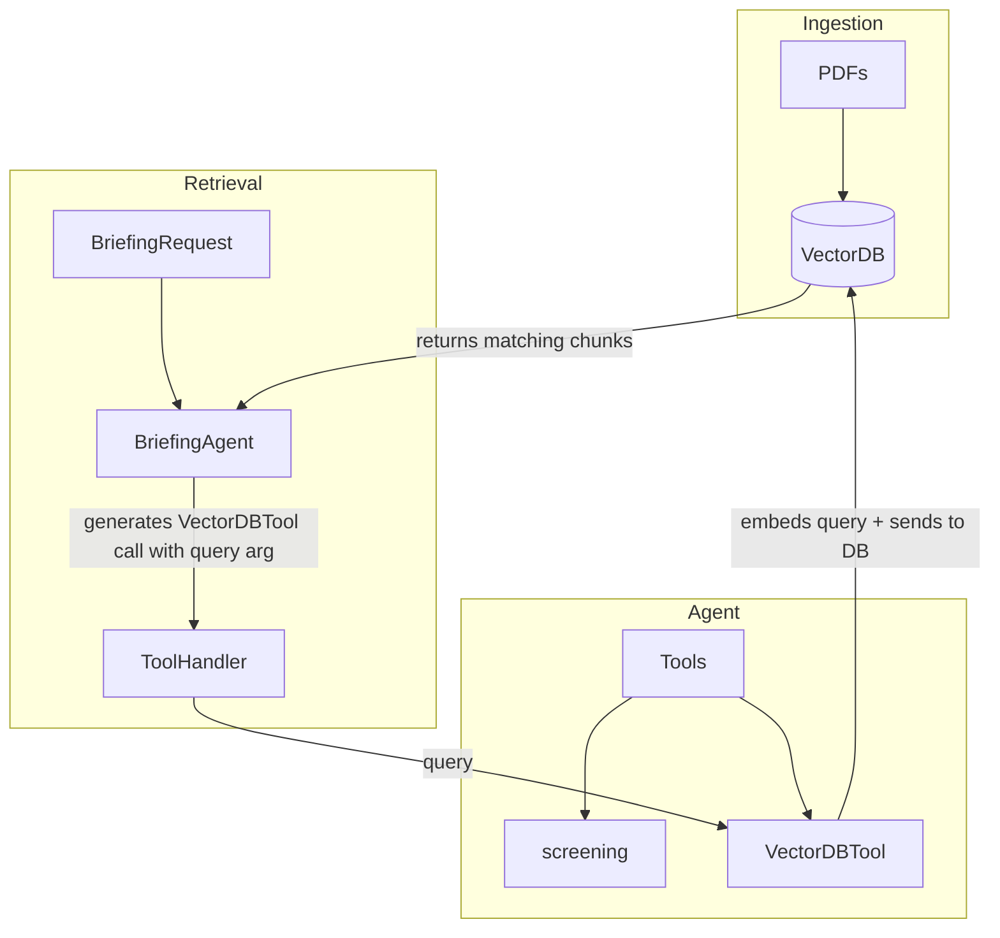

# Agentic RAG Arch

## High level Arch

```mermaid
graph TB

  subgraph Ingestion
  PDFs --> VectorDB[(VectorDB)] 
  end

  subgraph AgentConfig["Agent"]
  Tools --> Tool1["screening"]
  Tools --> VectorDBTool
  end

  subgraph Retrieval
  BriefingRequest --> Agent[BriefingAgent]
  Agent --> |"generates VectorDBTool call with query arg"| ToolHandler  
  ToolHandler --> |"query"|VectorDBTool
  VectorDBTool --> |"embeds query + sends to DB"|VectorDB 
  VectorDB --> |returns matching chunks| Agent
  end
  
```

