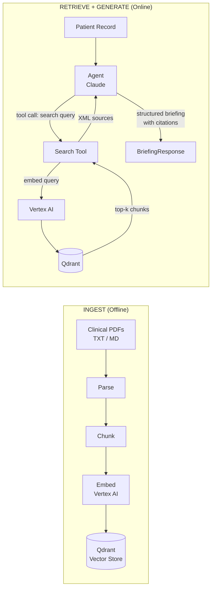
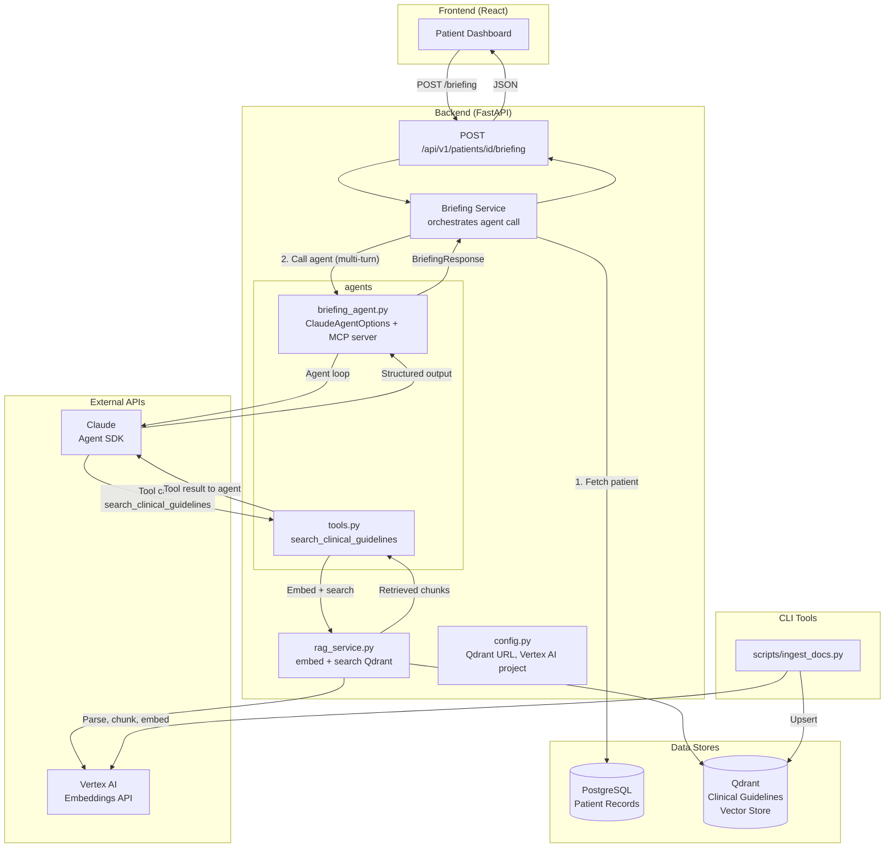
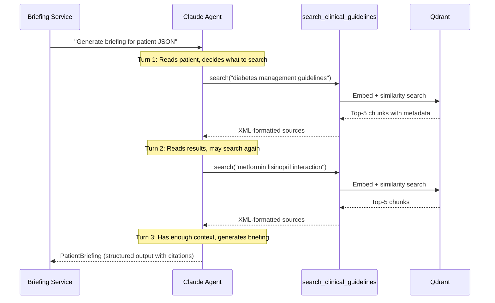
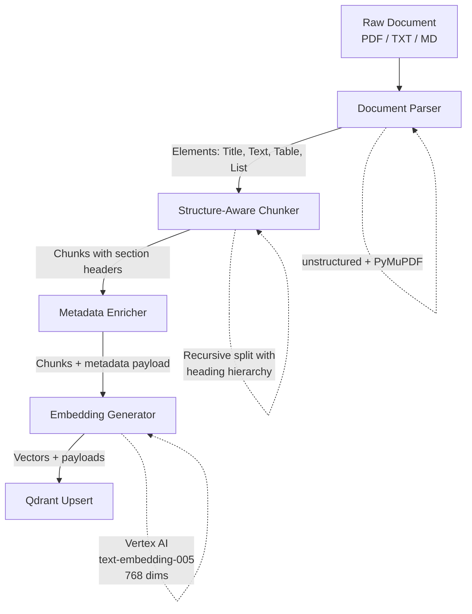
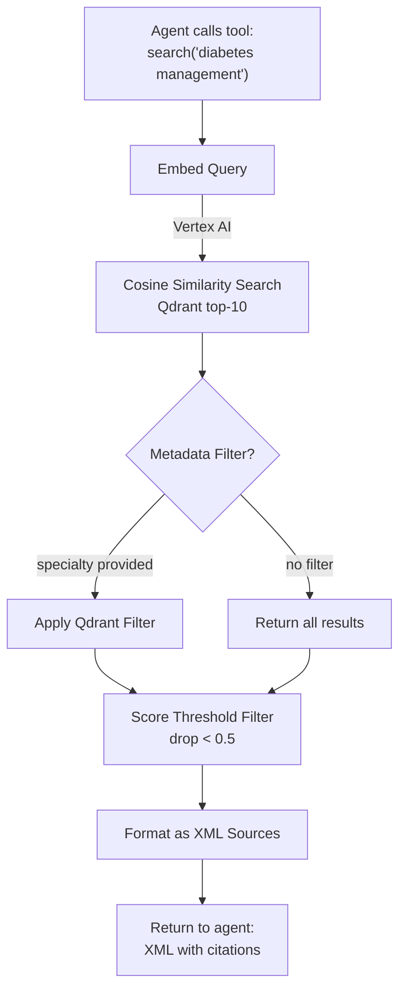

# RAG System Architecture

> **Status:** Planning
> **Branch:** feat/rag
> **Worktree:** build-ai-agents-rag

**Goal:** Give the AI Doctor Assistant agent a vector search **tool** so it can retrieve and cite real clinical guidelines when generating patient briefings — transforming the agent from a single-turn reasoner into a multi-turn tool-using agent.

**Why this matters:** Without RAG, the agent hallucinates clinical details or gives generic advice. With RAG, every flag, every severity assessment, every suggested action traces back to a specific guideline. This also marks the architectural shift from `max_turns=2` (no tools) to `max_turns=4` (agent with tools) — the agent now *reasons about what it needs to know*.

---

## 1. Fundamentals — What is RAG and Why

### 1.1 The Problem RAG Solves

LLMs have fundamental limitations that are especially dangerous in a medical context:

- **Knowledge cutoff.** Training data is stale — new drug warnings, updated guidelines, and revised protocols aren't in the model's weights.
- **Confident hallucination.** LLMs fabricate details (dosages, contraindications, drug interactions) with the same confidence as real knowledge. In medicine, this is a safety failure.
- **No source traceability.** Without citations, clinicians can't verify claims or assess evidence quality.
- **Fine-tuning is not the answer.** It's expensive, doesn't solve staleness, and can't be updated incrementally when a single guideline changes.

RAG solves all four: the agent retrieves from a curated, up-to-date knowledge base and cites specific sources.

### 1.2 How RAG Works (Two Phases)

**INGEST (offline):** Parse documents → chunk into sections → generate embeddings → store in vector DB.

**RETRIEVE + GENERATE (online):** Agent calls search tool → gets relevant chunks with scores → reasons with evidence → cites sources in output.



### 1.3 What Makes RAG Hard

- **Chunking.** Wrong boundaries = lost context = wrong answers. "Administer 5mg" is meaningless without knowing which drug, condition, and patient population.
- **Retrieval quality.** Garbage in → garbage out. If the search returns irrelevant chunks, the agent generates nonsense grounded in irrelevant evidence.
- **"Lost in the middle" problem.** LLMs tend to ignore information in the middle of long contexts. Chunk ordering and limiting matters.
- **Evaluation.** Non-deterministic system — same query can return different results after re-indexing. Requires dedicated eval infrastructure.

### 1.4 Agent-Tool RAG vs Preprocessing RAG

Two fundamentally different architectures:

**Preprocessing RAG:** Retrieve chunks *before* the agent call, inject them into the prompt. The agent is passive — it receives pre-selected context and reasons over it. Simple, but limited.

**Agent-Tool RAG (our approach):** The agent has a search tool and decides *when* and *what* to search. The agent is active. It can make multiple searches, refine queries, and cross-reference results.

**Why agent-tool is better for us:** A patient with unusual lab combinations might need the agent to search for specific drug-lab interactions that a preprocessing step wouldn't anticipate. The agent *reasons about what it needs to know*, then searches for it. A patient on metformin with declining eGFR? The agent can search "metformin renal dosing" — a query that only makes sense after the agent has analyzed the patient record.

---

## 2. Requirements

### 2.1 Functional Requirements

| ID | Requirement | Priority |
|----|-------------|----------|
| F1 | Ingest PDF clinical guidelines (multi-column, tables, headers) | Must |
| F2 | Ingest plain text protocols and drug interaction data | Must |
| F3 | Chunk documents preserving section hierarchy and clinical context | Must |
| F4 | Generate embeddings via Vertex AI and store in Qdrant | Must |
| F5 | Vector search exposed as agent tool via `@tool` + `create_sdk_mcp_server()` | Must |
| F6 | Agent uses multi-turn reasoning (`max_turns=4`) to call search tool | Must |
| F7 | Agent generates briefing grounded in retrieved evidence with citations | Must |
| F8 | CLI script for batch document ingestion | Must |
| F9 | Metadata filtering (specialty, recency, document type) in search | Should |
| F10 | Hybrid search (semantic + BM25) for exact medical terminology | Should |
| F11 | Cross-encoder reranking for precision | Could |

### 2.2 Non-Functional Requirements

| ID | Requirement | Target |
|----|-------------|--------|
| NF1 | Tool call latency (embed + search) | < 500ms P95 |
| NF2 | End-to-end briefing with RAG | < 15s (multi-turn + LLM) |
| NF3 | Support up to 1000 documents in vector store | V1 target |
| NF4 | Never log patient data to console | Hard rule (CLAUDE.md) |
| NF5 | Flags sourced from RAG get `source: "ai"` | V1 convention |
| NF6 | Retrieval recall for critical queries | > 80% on eval set |

### 2.3 Out of Scope (Deferred)

| Feature | Deferred to |
|---------|-------------|
| API endpoint for document upload | V2 |
| SSE streaming | V2 |
| Langfuse observability of tool calls | V2 (hooks infrastructure exists) |
| Multi-tenant access control | V2 |
| Fine-tuned embedding model | V2 |
| Additional tools (drug interaction DB, lab threshold checker) | Later iterations |

---

## 3. Architecture — System Overview

This is the big change. The agent is no longer a single-turn reasoner. It now has a tool, operates in a loop, and decides what to search.



### Key Architectural Decisions

1. **Vector search as AGENT TOOL (not preprocessing).** The agent calls `mcp__briefing__search_clinical_guidelines` when it needs clinical context. It decides what to search based on patient data. It can call the tool multiple times. `max_turns=4` gives enough room for: think → search → receive → generate.

2. **`agents/` directory comes alive.** `briefing_agent.py` holds agent config, MCP server setup, and `generate_briefing()`. `tools.py` holds `@tool` decorated functions. This follows the V2 structure planned in PLAN-ITERATION-3.md.

3. **Vertex AI embeddings (Google Cloud).** Model: `text-embedding-005` or `gemini-embedding-001` (768–3072 dims). Uses existing GCP credits. `google-cloud-aiplatform` Python SDK.

4. **Qdrant in Docker** alongside PostgreSQL in docker-compose.

5. **CLI-first ingestion.** `scripts/ingest_docs.py` for batch loading clinical guidelines.

---

## 4. The Agent-Tool Architecture (Core Change)

This section explains how the agent evolves from single-turn to multi-turn with tools. This is the most important section architecturally.

### 4.1 Current Architecture (V1 — What We're Changing FROM)

From `backend/src/services/briefing_service.py` (lines 90–103):

```python
# V1: Single-turn, no tools
options = ClaudeAgentOptions(
    system_prompt=SYSTEM_PROMPT,
    model=settings.ai_model,
    output_format={
        "type": "json_schema",
        "schema": PatientBriefing.model_json_schema(),
    },
    max_turns=2,  # No tools, just reasoning
    permission_mode="bypassPermissions",
)

async for message in query(prompt=patient_json, options=options):
    if isinstance(message, ResultMessage):
        briefing = PatientBriefing.model_validate(message.structured_output)
```

### 4.2 New Architecture (RAG — What We're Changing TO)

```python
# NEW: agents/tools.py
from claude_agent_sdk import tool

@tool(
    "search_clinical_guidelines",
    "Search clinical guidelines, drug interactions, and protocols. "
    "Returns relevant passages with source citations.",
    {
        "query": str,          # What to search for
        "specialty": str,      # Optional: filter by specialty
        "max_results": int,    # How many chunks to return (default 5)
    }
)
async def search_clinical_guidelines(args: dict) -> dict:
    results = await rag_service.search(
        query=args["query"],
        specialty=args.get("specialty"),
        limit=args.get("max_results", 5),
    )
    formatted = format_as_xml_sources(results)
    return {"content": [{"type": "text", "text": formatted}]}


# NEW: agents/briefing_agent.py
from claude_agent_sdk import create_sdk_mcp_server, ClaudeAgentOptions, query

briefing_tools = create_sdk_mcp_server(
    name="briefing",
    version="1.0.0",
    tools=[search_clinical_guidelines],
)

SYSTEM_PROMPT = """You are a clinical decision support assistant.
You have access to a search tool for clinical guidelines.

For each patient:
1. Review the patient record
2. Search for relevant clinical guidelines for their conditions
3. Search for drug interactions if they have multiple medications
4. Generate a briefing grounded in the retrieved evidence
5. Cite sources using [source_id] for every clinical claim

If the search returns no relevant guidelines, state this explicitly.
Do NOT make clinical claims without source backing."""

options = ClaudeAgentOptions(
    system_prompt=SYSTEM_PROMPT,
    model=settings.ai_model,
    mcp_servers={"briefing": briefing_tools},
    allowed_tools=["mcp__briefing__search_clinical_guidelines"],
    output_format={
        "type": "json_schema",
        "schema": PatientBriefing.model_json_schema(),
    },
    max_turns=4,
    permission_mode="bypassPermissions",
)
```

### 4.3 Agent Flow (Multi-Turn Loop)



### 4.4 Why Agent-Tool Over Preprocessing

| Aspect | Preprocessing | Agent-Tool (Our Choice) |
|--------|--------------|------------------------|
| Who decides what to search | Code (static rules) | Agent (dynamic reasoning) |
| Multiple searches | Complex to implement | Agent naturally does multiple calls |
| Query refinement | Not possible | Agent can refine based on first results |
| Unexpected combinations | Missed by static rules | Agent spots and investigates |
| Simplicity | Simpler code | Simpler mental model ("agent has a search tool") |
| Latency | Single retrieval, faster | Multiple tool calls, slightly slower |
| V2 readiness | Need to rewrite for tools | Already tool-based, just add more tools |

---

## 5. The Ingestion Pipeline (Offline)



### 5.1 Document Parsing

- **Library:** `unstructured` with PyMuPDF backend
- Gives element-level metadata (Title, NarrativeText, Table, ListItem)
- Critical for medical PDFs with multi-column layouts and tables
- `pdfplumber` as fallback for complex table extraction

### 5.2 Chunking Strategy

- **Primary:** Structure-aware chunking using document elements
  - Each chunk = one section/subsection
  - Section heading hierarchy prepended: `[Guideline > Chapter > Section]`
  - Max chunk size: 800 tokens
  - Tables kept as single chunks (never split a drug interaction table)
- **Fallback:** Recursive character splitting (800 tokens, 150 overlap)
- **Why this matters for medical text:** "Administer 5mg" is meaningless without knowing which drug, condition, patient population. Section headers ARE the clinical context.

### 5.3 Metadata Enrichment

Each chunk gets a rich payload for filtering and traceability:

```python
payload = {
    "text": chunk_text,
    "document_id": "ada-standards-2025",
    "document_title": "ADA Standards of Care in Diabetes — 2025",
    "section_path": "Chapter 9 > Pharmacologic Approaches > Metformin",
    "specialty": "endocrinology",
    "document_type": "clinical_guideline",
    "conditions": ["type_2_diabetes"],
    "drugs": ["metformin"],
    "publication_date": "2025-01-01",
    "chunk_index": 3,
    "total_chunks": 28,
}
```

### 5.4 Embedding Generation

- **Model:** Vertex AI `text-embedding-005` (768 dims) or `gemini-embedding-001` (up to 3072 dims, truncatable)
- Uses existing GCP credits via `google-cloud-aiplatform` SDK
- `gemini-embedding-001` is #1 on MTEB (~68%) — best quality available
- **Critical rule:** Never mix embedding models. Switching models = full re-embed of entire corpus.

### 5.5 Vector Storage (Qdrant)

- Collection: `clinical_guidelines`
- Vectors: 768 dims (or 1024/3072 depending on Vertex model choice), cosine distance
- HNSW: m=16, ef_construct=100
- Payload indexes on: `document_type`, `specialty`, `conditions`, `drugs`, `publication_date`

---

## 6. The Retrieval Pipeline (Inside the Tool)

This is what happens when the agent calls `search_clinical_guidelines`.



### 6.1 Search Function

```python
# rag_service.py
async def search(
    query: str,
    specialty: str | None = None,
    limit: int = 5,
) -> list[RetrievalResult]:
    # 1. Embed query via Vertex AI
    query_vector = await embed_text(query)

    # 2. Build Qdrant filter (if specialty provided)
    query_filter = build_filter(specialty=specialty)

    # 3. Search
    results = qdrant_client.search(
        collection_name="clinical_guidelines",
        query_vector=query_vector,
        query_filter=query_filter,
        score_threshold=0.5,
        limit=limit,
    )

    # 4. Convert to RetrievalResult
    return [to_retrieval_result(r, idx) for idx, r in enumerate(results)]
```

### 6.2 XML Formatting (What the Agent Sees)

The tool returns results as XML — a format Claude handles well for structured source references:

```xml
<clinical_guidelines>
  <source id="1" document="ADA Standards 2025" section="Metformin" score="0.89">
    Metformin remains the preferred initial pharmacologic agent for type 2
    diabetes. Dose adjustment is required when eGFR falls below 45 mL/min.
  </source>
  <source id="2" document="FDA Label: Metformin HCl" section="Warnings" score="0.82">
    Lactic acidosis: Warn patients against excessive alcohol intake.
    Contraindicated in patients with eGFR below 30 mL/min/1.73m2.
  </source>
</clinical_guidelines>
```

The agent then cites these as `[1]`, `[2]` in the briefing output.

---

## 7. Data Design

### 7.1 Qdrant Collection Schema

```
Collection: clinical_guidelines
├── Vector: 768 dims (Vertex AI text-embedding-005), cosine distance
├── Payload fields (all indexed where noted):
│   ├── text: string
│   ├── document_id: keyword (indexed)
│   ├── document_title: string
│   ├── section_path: string
│   ├── specialty: keyword (indexed)
│   ├── document_type: keyword (indexed)
│   ├── conditions: keyword[] (indexed)
│   ├── drugs: keyword[] (indexed)
│   ├── publication_date: datetime (indexed)
│   ├── chunk_index: integer
│   └── total_chunks: integer
└── HNSW Index: m=16, ef_construct=100
```

### 7.2 Docker Compose Addition

```yaml
services:
  qdrant:
    image: qdrant/qdrant:v1.12.1
    container_name: build_ai_agents_qdrant
    ports:
      - "6333:6333"   # REST API
      - "6334:6334"   # gRPC
    volumes:
      - qdrant_data:/qdrant/storage
    restart: unless-stopped
```

### 7.3 New Pydantic Models

New file: `backend/src/models/rag.py`

```python
from datetime import date
from pydantic import BaseModel


class DocumentChunk(BaseModel):
    text: str
    document_id: str
    document_title: str
    section_path: str
    specialty: str
    document_type: str
    conditions: list[str]
    drugs: list[str]
    publication_date: date
    chunk_index: int
    total_chunks: int


class RetrievalResult(BaseModel):
    chunk: DocumentChunk
    score: float
    source_id: int
```

### 7.4 New Backend File Structure

```
backend/src/
├── agents/                          # ← NOW POPULATED
│   ├── __init__.py
│   ├── briefing_agent.py            # Agent config, MCP server, generate_briefing()
│   └── tools.py                     # @tool search_clinical_guidelines
├── services/
│   ├── briefing_service.py          # ← MODIFIED: delegates to agents/briefing_agent.py
│   ├── rag_service.py               # ← NEW: embed + search Qdrant
│   ├── patient_service.py           # unchanged
│   └── __init__.py
├── models/
│   ├── rag.py                       # ← NEW: DocumentChunk, RetrievalResult
│   ├── orm.py                       # unchanged
│   ├── schemas.py                   # unchanged
│   └── __init__.py
├── config.py                        # ← MODIFIED: add Qdrant + Vertex AI settings
└── ...
```

---

## 8. Starter Clinical Guidelines (Freely Available)

These guidelines match the seed patient data in `backend/seed.py`:

| Guideline | Source | Format | Matches Seed Patients |
|-----------|--------|--------|----------------------|
| ADA Standards of Care in Diabetes (2025) | American Diabetes Association | Free PDF (diabetesjournals.org) | Patients with diabetes |
| JNC 8 Hypertension Guidelines | JAMA Network | Free PDF | Patients with hypertension |
| ACC/AHA Cholesterol Guidelines (2018) | American College of Cardiology | Free PDF (acc.org) | Patients on statins |
| KDIGO CKD Guidelines | Kidney Disease: Improving Global Outcomes | Free PDF (kdigo.org) | Patients with CKD/abnormal labs |
| WHO Essential Medicines List | World Health Organization | Free PDF (who.int) | General drug reference |
| FDA Drug Labels (DailyMed) | NIH / NLM | Free structured text (dailymed.nlm.nih.gov) | All patients on medications |

**Start with 3–5 guidelines** matching the seed patients (Maria Garcia: diabetes + hypertension + CKD Stage 3). Ingest them with the CLI script. The agent will search these when generating briefings.

---

## 9. Why TDD for RAG — And What to Test

### 9.1 Why TDD is Critical for RAG

1. **Non-deterministic outputs.** Same query can return different results after re-indexing. Tests catch silent regression.
2. **Cascading failures.** Bad chunking → bad retrieval → bad generation. Tests at each stage catch problems early.
3. **Medical safety.** A missed contraindication or wrong dosage is a safety failure, not a UX bug.
4. **Refactoring confidence.** Change chunking strategy or switch embedding models → tests verify quality held.

### 9.2 Test Layers

```
Layer 1: Parsing
├── PDF with tables → table content extracted correctly
├── Multi-column PDF → columns not interleaved
├── Section headers → correctly identified
└── Empty/corrupt PDF → clean error

Layer 2: Chunking
├── Drug interaction table → never split across chunks
├── Every chunk → starts with section path prefix
├── No chunk → exceeds max token limit
└── Contraindications list → stays in single chunk

Layer 3: Embedding + Storage
├── Upserted points → correct payload fields
├── Payload indexes → exist for filterable fields
├── Collection dimension → matches model dimension
└── Duplicate ingestion → updates, not duplicates

Layer 4: Tool Integration
├── Agent calls tool → receives XML-formatted results
├── Tool with specialty filter → filters correctly
├── Tool with no results → returns "no guidelines found"
└── Tool call → completes within 500ms

Layer 5: End-to-End
├── Patient with diabetes → briefing cites diabetes guidelines
├── Patient on multiple meds → agent searches for interactions
├── Briefing citations → reference real source IDs
└── No relevant guidelines → agent states explicitly
```

### 9.3 Testing Strategy

- **Unit tests:** Mock Qdrant (`QdrantClient(":memory:")`), mock Vertex AI embeddings
- **Integration tests:** Real Qdrant (Docker), real embeddings on 5–10 test docs
- **Agent tests:** Mock `query()` itself (pattern from existing test infrastructure)

---

## 10. Common Anti-Patterns to Avoid

| Anti-Pattern | Symptom | Prevention |
|-------------|---------|------------|
| Naive chunking without context | "As mentioned above" — context cut off | Structure-aware chunking, prepend section headers |
| Too many small chunks | Fragmented, incoherent answers | Min 200 tokens, parent-doc retrieval |
| Too few large chunks | Noise drowns signal | Max 800 tokens, contextual compression |
| No metadata filtering | Outdated guidelines, wrong specialty | Rich payload metadata, filter in tool |
| "Lost in the middle" | LLM ignores middle chunks | Limit to 5–10 chunks, most relevant first |
| No "I don't know" | Hallucinated when KB has no info | Score threshold + prompt instruction |
| Single search for complex patient | Misses conditions | Agent naturally does multiple tool calls |
| Mixed embedding models | Garbage retrieval | Document active model, full re-embed on switch |
| No regression tests | Silent degradation | Eval suite, run after every re-index |

---

## 11. Implementation Phases

| Phase | What | Verification | Size |
|-------|------|-------------|------|
| **Phase 0** | Docker Compose + Qdrant | `docker compose up`, dashboard at :6333 | S |
| **Phase 1** | Document parser + chunker | Unit tests: correct elements, chunk boundaries | M |
| **Phase 2** | Vertex AI embedding + Qdrant upsert | Integration test: embed + upsert 5 docs | M |
| **Phase 3** | CLI ingest script + download starter guidelines | `python scripts/ingest_docs.py` works | M |
| **Phase 4** | RAG service (embed + search) | Unit tests: correct chunks for queries | M |
| **Phase 5** | Agent tool (`@tool search_clinical_guidelines`) | Tool returns XML sources | M |
| **Phase 6** | Agent upgrade (briefing_agent.py, multi-turn) | Agent calls tool, generates briefing with citations | L |
| **Phase 7** | Integrate into briefing service + router | E2E: POST /briefing returns RAG-augmented briefing | M |
| **Phase 8** | Evaluation suite | 50 query-chunk pairs, precision@5 > 0.6, recall@10 > 0.8 | M |

### Dependency Graph

```
Phase 0 (Qdrant) ────────────────→ Phase 2 (Embedding + Storage)
Phase 1 (Parser + Chunker) ─────→ Phase 3 (CLI + Guidelines)
Phase 2 + Phase 1 ──────────────→ Phase 4 (RAG Service)
Phase 4 ─────────────────────────→ Phase 5 (Agent Tool)
Phase 5 ─────────────────────────→ Phase 6 (Agent Upgrade)
Phase 6 ─────────────────────────→ Phase 7 (Integration)
Phase 7 ─────────────────────────→ Phase 8 (Eval)
```

Phases 0 and 1 are independent — they can be done in parallel.

---

## 12. Tradeoffs & Decisions (ADR-style)

| Decision | Chosen | Over | Rationale |
|----------|--------|------|-----------|
| Vector store | Qdrant (Docker) | pgvector, ChromaDB | Rich filtering, payload indexes, gRPC bulk, Rust perf |
| Embedding | Vertex AI (GCP) | Voyage, OpenAI, local | Existing GCP credits, gemini-embedding-001 is #1 MTEB |
| RAG integration | **Agent tool** | Preprocessing | Agent decides what to search; multi-turn reasoning; V2-ready |
| Agent turns | max_turns=4 | 2 (current), unlimited | Enough for think→search→search→generate. Bounded to prevent runaway |
| Chunking | Structure-aware | Fixed-size, semantic | Medical text needs section hierarchy |
| Ingestion | CLI batch script | API endpoint | V1 simplicity |
| Search | Dense cosine (V1) | Hybrid, BM25-only | Simplest start; hybrid in Phase 2 |

---

## 13. Success Criteria

- [ ] Qdrant running in Docker alongside PostgreSQL
- [ ] 3–5 clinical guideline PDFs ingested via CLI script
- [ ] Agent tool `search_clinical_guidelines` works in isolation
- [ ] Agent calls tool during briefing generation (multi-turn, max_turns=4)
- [ ] Briefing includes citations tracing to real guideline sources
- [ ] Tool call latency < 500ms P95
- [ ] All tests pass: `uv run pytest`
- [ ] Eval suite: 50+ test queries, precision@5 > 0.6, recall@10 > 0.8
