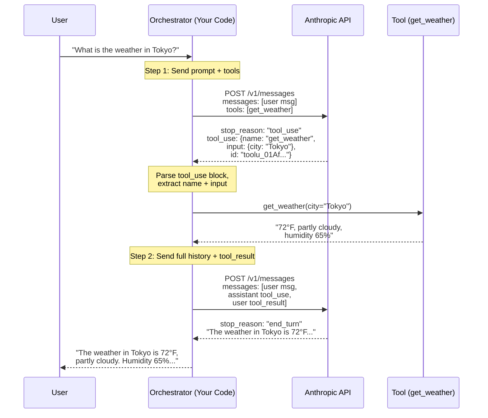
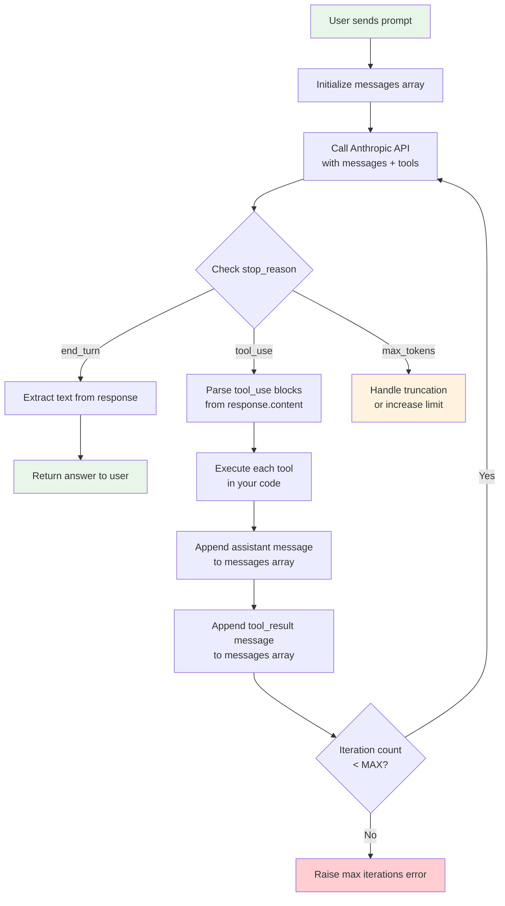
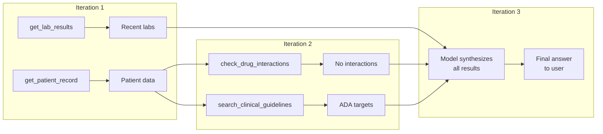

# Tool Use and the Agentic Loop

**Part 3 of 7: Agent Architecture & AI Model Internals Series**
**AI Doctor Assistant Project**

---

## Table of Contents

1. [What Is Tool Use?](#1-what-is-tool-use)
2. [Tool Definitions -- JSON Schema](#2-tool-definitions----json-schema)
3. [The Two-Step Dance](#3-the-two-step-dance)
4. [The Agentic Loop](#4-the-agentic-loop)
5. [tool_choice -- Controlling Tool Selection](#5-tool_choice----controlling-tool-selection)
6. [Multiple Tools](#6-multiple-tools)
7. [Comparison: Anthropic vs OpenAI vs Gemini](#7-comparison-anthropic-vs-openai-vs-gemini)
8. [What Agent Frameworks Do](#8-what-agent-frameworks-do)

---

## Learning Objectives

After reading this document, you will be able to:

- Explain why the model generates JSON rather than executing code, and what role your code plays as the orchestrator
- Write tool definitions using JSON Schema including nested objects, arrays, and enums
- Trace the full request/response cycle of a two-step tool call using the Anthropic Messages API
- Explain how `tool_use_id` links tool calls to tool results and why results use `role: "user"`
- Implement a minimal agentic loop that handles N sequential tool calls
- Compare `tool_choice` modes (`auto`, `any`, specific, `none`) and choose the right one for a given scenario
- Describe how parallel tool use works when the model calls multiple tools in a single turn
- Compare tool use API shapes across Anthropic, OpenAI, and Google Gemini
- Articulate what agent frameworks automate and when raw API calls are the better choice

---

## 1. What Is Tool Use?

### The Mental Model That Changes Everything

Here is the single most important sentence in this entire document:

**The model does not execute code. It generates structured JSON that describes what it wants to do. Your code is the orchestrator -- you execute the tool and feed the result back.**

This is counterintuitive. When you see a model "search the web" or "read a file," it feels like the model is doing those things. It is not. The model is producing a JSON object that says "I would like to call the `search_web` function with these arguments." Your application code receives that JSON, actually performs the web search, and then sends the search results back to the model in a follow-up API call. The model then uses those results to formulate its final answer.

This separation is fundamental to understanding everything in this document:

```
The model is the DECISION ENGINE  --  it decides WHAT to do
Your code is the ORCHESTRATOR     --  it actually DOES the thing
```

### The Full Flow

Let us trace what happens when a user asks "What is the weather in Tokyo?" and your application has defined a `get_weather` tool:

```
                            YOUR APPLICATION
                    ┌──────────────────────────────┐
                    │                              │
  ┌──────┐         │   ┌────────────────────┐     │        ┌───────────┐
  │      │  "What  │   │                    │     │        │           │
  │ User │  is the ──► │  Orchestrator Code │     │        │  Claude   │
  │      │  weather │   │                    │     │        │  API      │
  └──────┘  in      │   └───────┬────────────┘     │        │           │
            Tokyo?" │           │                  │        └───────────┘
                    │           │                  │
                    │     Step 1: Send prompt      │
                    │     + tool definitions       │
                    │           │                  │
                    │           ├─────────────────────────►
                    │           │                  │   Model returns:
                    │           │                  │   tool_use block
                    │           │  ◄──────────────────  { name: "get_weather",
                    │           │                  │      input: { city: "Tokyo" } }
                    │           │                  │
                    │     Step 2: YOUR code        │
                    │     calls the real            │
                    │     weather API               │
                    │           │                  │
                    │     ┌─────▼──────────┐       │
                    │     │  get_weather() │       │   (This is YOUR function,
                    │     │  city="Tokyo"  │       │    not the model's)
                    │     └─────┬──────────┘       │
                    │           │                  │
                    │     Step 3: Send the         │
                    │     tool result back          │
                    │           │                  │
                    │           ├─────────────────────────►
                    │           │                  │   Model returns:
                    │           │  ◄──────────────────  "It's 72°F in Tokyo,
                    │           │                  │     partly cloudy."
                    │           │                  │
                    │     Step 4: Return final      │
                    │     answer to user            │
                    │           │                  │
  ┌──────┐         │   ┌───────▼────────────┐     │
  │      │  ◄────────── │  Display answer   │     │
  │ User │         │   └────────────────────┘     │
  │      │         │                              │
  └──────┘         └──────────────────────────────┘
```

Count the API calls: there are **two**. The first sends the user's prompt along with tool definitions. The second sends the tool execution result. The model is stateless between calls -- your code maintains the conversation history and sends it with each request.

### Why Not Let the Model Execute Code Directly?

This architecture is intentional, not a limitation. There are strong reasons for the separation:

**Security.** If the model could execute arbitrary code, a prompt injection could run `rm -rf /` on your server. By routing all actions through your orchestrator, you control what actually happens. Your code validates inputs, enforces permissions, rate-limits calls, and logs everything.

**Reliability.** Your code handles network errors, timeouts, retries, and fallbacks. The model does not need to understand TCP backoff or HTTP status codes. It just says what it wants; your code handles the messy reality.

**Auditability.** Every tool call flows through your code. You can log every invocation, measure latency, count costs, and build dashboards. You have a complete record of every action the AI decided to take.

**Composability.** Your tools can be anything: database queries, API calls, file reads, Kubernetes commands, calculations. The model does not need drivers or SDKs for any of these. It just describes what it wants in JSON.

```
AI DOCTOR EXAMPLE:
In V1, the AI Doctor Assistant does NOT use tool use at all.
The briefing service sends the full patient record to Claude
and gets back a structured briefing (using output_format, not tools).

In V2, tools would enable the agent to:
  - Pull specific lab results from the database
  - Look up drug interaction databases
  - Query clinical guidelines
  - Retrieve the patient's visit history on demand

The model would DECIDE which data to pull. Your FastAPI backend
would EXECUTE the database queries and return the results.
```

### Tool Use vs Structured Output

These are related but different features. It is important not to confuse them:

| Feature | Purpose | Model Behavior |
|---------|---------|----------------|
| **Tool use** | Model requests an action to be performed | Generates `tool_use` content block, expects `tool_result` back |
| **Structured output** | Model returns its final answer in a specific format | Generates JSON matching a schema as its response |

Tool use is a **mid-conversation mechanism** -- the model pauses to request information. Structured output is a **response format constraint** -- the model's final answer conforms to a schema.

The AI Doctor V1 uses structured output (the briefing matches `PatientBriefing` schema). It does not use tool use because the full patient record is provided upfront -- the model does not need to fetch additional data.

---

## 2. Tool Definitions -- JSON Schema

### What JSON Schema Is

Before diving into tool definitions, you need to understand **JSON Schema**. This is not something Anthropic invented. JSON Schema is an **IETF standard** (Internet Engineering Task Force) for describing the structure of JSON data. It has been around since 2009 and is used across the industry for API validation, configuration files, form generation, and code generation.

The core idea: JSON Schema is JSON that describes other JSON.

```json
{
  "type": "object",
  "properties": {
    "name": { "type": "string" },
    "age": { "type": "integer", "minimum": 0 }
  },
  "required": ["name"]
}
```

This schema says: "I expect a JSON object with a `name` property (string, required) and an optional `age` property (integer, must be >= 0)."

Every major programming language has JSON Schema libraries. Pydantic (which the AI Doctor backend uses) can generate JSON Schema from Python models automatically via `Model.model_json_schema()`.

### Anatomy of a Tool Definition

When you send tools to the Anthropic Messages API, each tool is an object with three fields:

```json
{
  "name": "get_weather",
  "description": "Get the current weather for a city. Returns temperature, conditions, humidity, and wind speed.",
  "input_schema": {
    "type": "object",
    "properties": {
      "city": {
        "type": "string",
        "description": "The city name, e.g. 'Tokyo' or 'San Francisco'"
      }
    },
    "required": ["city"]
  }
}
```

Let us break down each field:

**`name`** (string, required) -- A unique identifier for the tool. Must match `[a-zA-Z0-9_-]+`. The model will use this name when it decides to call the tool. Choose descriptive, verb-noun names: `get_weather`, `search_patients`, `calculate_bmi`.

**`description`** (string, required in practice) -- A natural language description of what the tool does. This is arguably the most important field because it is how the model decides whether to use this tool. Be specific about what the tool returns. Bad: "Weather tool." Good: "Get the current weather for a city. Returns temperature in Fahrenheit, sky conditions, humidity percentage, and wind speed in mph."

**`input_schema`** (object, required) -- A JSON Schema object describing the tool's parameters. The model uses this schema to generate valid input JSON. The schema constrains the model's output so you can parse it predictably.

### How the Model Uses the Schema

When you send tool definitions, the model incorporates them into its understanding of what actions are available. During generation, the schema acts as a **constraint on the model's output**. If a property is typed as `"type": "integer"`, the model will generate an integer, not a string. If an enum is defined, the model will pick from those values.

This is not magic -- it is the same mechanism as structured output. The model's token generation is guided by the schema so that the resulting JSON is valid according to the specification you provided.

### Simple Schema: Primitives

The most basic tools have flat schemas with primitive types:

```json
{
  "name": "calculate_bmi",
  "description": "Calculate Body Mass Index from weight and height",
  "input_schema": {
    "type": "object",
    "properties": {
      "weight_kg": {
        "type": "number",
        "description": "Patient weight in kilograms"
      },
      "height_cm": {
        "type": "number",
        "description": "Patient height in centimeters"
      }
    },
    "required": ["weight_kg", "height_cm"]
  }
}
```

Supported primitive types in JSON Schema:

| Type | JSON Example | Notes |
|------|-------------|-------|
| `string` | `"Tokyo"` | Any UTF-8 string |
| `number` | `72.5` | Integer or floating point |
| `integer` | `42` | Whole numbers only |
| `boolean` | `true` | `true` or `false` |
| `null` | `null` | Explicitly null |

### Enums: Constraining to Specific Values

When a parameter should be one of a fixed set of values, use `enum`:

```json
{
  "name": "get_lab_results",
  "description": "Retrieve lab results for a patient, optionally filtered by category",
  "input_schema": {
    "type": "object",
    "properties": {
      "patient_id": {
        "type": "string",
        "description": "The unique patient identifier"
      },
      "category": {
        "type": "string",
        "enum": ["metabolic", "hematology", "lipids", "thyroid", "all"],
        "description": "Lab category to filter by. Use 'all' for everything."
      },
      "sort_by": {
        "type": "string",
        "enum": ["date_asc", "date_desc", "name"],
        "description": "How to sort results"
      }
    },
    "required": ["patient_id"]
  }
}
```

Enums serve two purposes: they tell the model exactly what values are valid, and they make your tool handler's input predictable. You do not need to parse free-form text -- you can switch on a known set of values.

### Nested Objects

Real-world tools often need structured input:

```json
{
  "name": "schedule_appointment",
  "description": "Schedule a follow-up appointment for a patient",
  "input_schema": {
    "type": "object",
    "properties": {
      "patient_id": { "type": "string" },
      "appointment": {
        "type": "object",
        "properties": {
          "date": {
            "type": "string",
            "description": "ISO 8601 date, e.g. '2025-03-15'"
          },
          "time": {
            "type": "string",
            "description": "24h format, e.g. '14:30'"
          },
          "duration_minutes": {
            "type": "integer",
            "description": "Appointment duration in minutes"
          },
          "type": {
            "type": "string",
            "enum": ["follow_up", "lab_review", "annual_physical", "urgent"]
          }
        },
        "required": ["date", "time", "type"]
      },
      "notes": {
        "type": "string",
        "description": "Additional notes for the appointment"
      }
    },
    "required": ["patient_id", "appointment"]
  }
}
```

The model will generate a nested JSON object matching this schema:

```json
{
  "patient_id": "P-001",
  "appointment": {
    "date": "2025-03-15",
    "time": "14:30",
    "duration_minutes": 30,
    "type": "follow_up"
  },
  "notes": "Review HbA1c results and adjust metformin dosage"
}
```

### Arrays

Parameters can be arrays of primitives or objects:

```json
{
  "name": "check_drug_interactions",
  "description": "Check for interactions between a list of medications",
  "input_schema": {
    "type": "object",
    "properties": {
      "medications": {
        "type": "array",
        "items": { "type": "string" },
        "description": "List of medication names to check for interactions"
      },
      "severity_filter": {
        "type": "string",
        "enum": ["all", "major", "moderate_and_above"],
        "description": "Minimum interaction severity to return"
      }
    },
    "required": ["medications"]
  }
}
```

Arrays of objects work too:

```json
{
  "name": "record_vitals",
  "description": "Record a set of vital sign measurements for a patient",
  "input_schema": {
    "type": "object",
    "properties": {
      "patient_id": { "type": "string" },
      "readings": {
        "type": "array",
        "items": {
          "type": "object",
          "properties": {
            "vital": {
              "type": "string",
              "enum": ["blood_pressure", "heart_rate", "temperature", "spo2", "weight"]
            },
            "value": { "type": "string" },
            "unit": { "type": "string" }
          },
          "required": ["vital", "value"]
        }
      }
    },
    "required": ["patient_id", "readings"]
  }
}
```

### Description Quality Matters

The `description` fields at both the tool level and the property level are critically important. The model uses them to decide:

1. **Whether** to use this tool (tool-level description)
2. **What values** to pass (property-level descriptions)

Compare these two property descriptions for a `date` field:

```
Bad:  "description": "date"
Good: "description": "The date to search from, in ISO 8601 format (YYYY-MM-DD). Defaults to today if not provided."
```

The good description tells the model the format, gives an example, and explains the default behavior. This reduces malformed inputs and unnecessary tool call retries.

```
AI DOCTOR EXAMPLE:
In the AI Doctor backend, Pydantic models already define schemas.
If you were to expose a tool for fetching patient data, you could
generate the input_schema directly from the Pydantic model:

  from src.models.schemas import PatientBriefing
  schema = PatientBriefing.model_json_schema()

This is exactly what the briefing service does for structured output --
the same mechanism works for tool input schemas.
```

---

## 3. The Two-Step Dance

### What Actually Happens Over the Wire

We have test scripts in this repository that demonstrate tool use against the live Anthropic API. Let us walk through them step by step to see exactly what the HTTP requests and responses look like.

> **Reference:** `scripts/test-tool-call-opus.sh` and `scripts/test-tool-call-opus-step2.sh` in this repository.

### Step 1: Send Prompt + Tools

The first script (`scripts/test-tool-call-opus.sh`) sends a single user message along with a tool definition:

```bash
curl -s https://api.anthropic.com/v1/messages \
  -H "content-type: application/json" \
  -H "x-api-key: $ANTHROPIC_API_KEY" \
  -H "anthropic-version: 2023-06-01" \
  -d '{
    "model": "claude-opus-4-6",
    "max_tokens": 1024,
    "tools": [
      {
        "name": "get_weather",
        "description": "Get current weather for a city",
        "input_schema": {
          "type": "object",
          "properties": {
            "city": { "type": "string" }
          },
          "required": ["city"]
        }
      }
    ],
    "messages": [
      { "role": "user", "content": "What is the weather in Tokyo?" }
    ]
  }'
```

The request body has four key fields:

- **`model`**: Which Claude model to use
- **`max_tokens`**: Maximum tokens in the response
- **`tools`**: Array of tool definitions (the model can see these but not execute them)
- **`messages`**: The conversation history

The response comes back looking like this:

```json
{
  "id": "msg_01XYZ...",
  "type": "message",
  "role": "assistant",
  "content": [
    {
      "type": "text",
      "text": "Let me check the current weather in Tokyo for you."
    },
    {
      "type": "tool_use",
      "id": "toolu_01AfFd5Jr6znpJU5qvzGou4f",
      "name": "get_weather",
      "input": {
        "city": "Tokyo"
      }
    }
  ],
  "model": "claude-opus-4-6",
  "stop_reason": "tool_use",
  "usage": {
    "input_tokens": 365,
    "output_tokens": 68
  }
}
```

Three critical things to notice:

**1. `stop_reason: "tool_use"`** -- The model stopped generating because it wants to use a tool. This is not `"end_turn"` (which means the model is done talking). This is the model saying "I need you to execute something before I can continue."

**2. The `content` array has two blocks** -- A `text` block (the model's preamble) and a `tool_use` block (the actual tool invocation). The model can include text alongside tool calls. Sometimes it explains its reasoning before calling a tool.

**3. The `tool_use` block has an `id`** -- `"toolu_01AfFd5Jr6znpJU5qvzGou4f"`. This ID is generated by the API and will be used in step 2 to link the tool result back to this specific tool call. The format is always `toolu_` followed by a unique string.

### Step 2: Execute Tool, Send Result

Now your code must:

1. Parse the `tool_use` block from the response
2. Actually execute the tool (call a weather API, query a database, whatever)
3. Send the result back to the model in a follow-up API call

The second script (`scripts/test-tool-call-opus-step2.sh`) demonstrates this. Pay close attention to the `messages` array -- it contains the **entire conversation history**:

```bash
curl -s https://api.anthropic.com/v1/messages \
  -H "content-type: application/json" \
  -H "x-api-key: $ANTHROPIC_API_KEY" \
  -H "anthropic-version: 2023-06-01" \
  -d '{
    "model": "claude-opus-4-6",
    "max_tokens": 1024,
    "tools": [
      {
        "name": "get_weather",
        "description": "Get current weather for a city",
        "input_schema": {
          "type": "object",
          "properties": {
            "city": { "type": "string" }
          },
          "required": ["city"]
        }
      }
    ],
    "messages": [

      {"role": "user", "content": "What is the weather in Tokyo?"},

      {"role": "assistant", "content": [
        {
          "type": "text",
          "text": "\n\nLet me check the current weather in Tokyo for you."
        },
        {
          "type": "tool_use",
          "id": "toolu_01AfFd5Jr6znpJU5qvzGou4f",
          "name": "get_weather",
          "input": {"city": "Tokyo"}
        }
      ]},

      {"role": "user", "content": [
        {
          "type": "tool_result",
          "tool_use_id": "toolu_01AfFd5Jr6znpJU5qvzGou4f",
          "content": "72°F (22°C), partly cloudy, humidity 65%, wind 8 mph NW"
        }
      ]}

    ]
  }'
```

### The Messages Array -- Dissected

This is the heart of the two-step dance. Let us examine each message:

```
Message 1: role: "user"
  The original user prompt.
  "What is the weather in Tokyo?"

Message 2: role: "assistant"
  The model's response from Step 1 -- copied VERBATIM.
  Contains both the text preamble and the tool_use block.
  You MUST include this exactly as the API returned it.

Message 3: role: "user"
  The tool result. Your code executed get_weather("Tokyo")
  and got "72°F (22°C), partly cloudy, humidity 65%, wind 8 mph NW".
  You wrap this in a tool_result content type.
```

### The tool_use_id Linking Mechanism

The `tool_use_id` in message 3 matches the `id` in the `tool_use` block from message 2:

```
tool_use block:   "id": "toolu_01AfFd5Jr6znpJU5qvzGou4f"
                                    │
                                    │  must match exactly
                                    │
tool_result:      "tool_use_id": "toolu_01AfFd5Jr6znpJU5qvzGou4f"
```

This linking is essential when there are multiple tool calls in a single response (which we will cover in section 6). Each tool result must link back to the specific tool call it answers.

### Why tool_result Uses role: "user"

Notice that the tool result message has `role: "user"`, not a separate `role: "tool"`. This is because the Anthropic Messages API maintains strict **user/assistant alternation**:

```
user       → "What is the weather in Tokyo?"
assistant  → [text + tool_use]
user       → [tool_result]              ← role is "user", not "tool"
assistant  → "The weather in Tokyo is..."
```

The model does not need a special role to distinguish tool results from human messages. The `type: "tool_result"` content type inside the `user` message is sufficient. This keeps the API simple -- only two roles, strict alternation.

### The Final Response

After receiving the tool result, the model responds with its final answer:

```json
{
  "id": "msg_02ABC...",
  "type": "message",
  "role": "assistant",
  "content": [
    {
      "type": "text",
      "text": "The current weather in Tokyo is 72°F (22°C) with partly cloudy skies. The humidity is at 65%, and there's a light northwest wind at 8 mph. It's a pleasant day in Tokyo!"
    }
  ],
  "stop_reason": "end_turn",
  "usage": {
    "input_tokens": 478,
    "output_tokens": 52
  }
}
```

Now `stop_reason` is `"end_turn"` -- the model is done. No more tool calls needed. Your orchestrator can return this text to the user.

### The Statelessness Principle

Notice that Step 2 re-sends **everything**: the original user message, the assistant's tool_use response, and the tool result. There is no session ID, no server-side state, no "continue the conversation" endpoint. The model is stateless.

This is the comment from the actual test script:

```
# Notice: we resend EVERYTHING — original user message, assistant's tool_use
# response, and the tool_result. There is NO session ID. The model is stateless.
```

Every API call is self-contained. Your code maintains the conversation history. This has implications:

- **Token cost**: You pay for all previous messages on every call (we address this in Document 03 on prompt caching)
- **Simplicity**: No server-side session management, no WebSocket connections, no "conversation expired" errors
- **Reproducibility**: Given the same messages array, you get the same behavior (modulo temperature randomness)

### Mermaid: The Two-Step Dance



---

## 4. The Agentic Loop

### From Two Steps to N Steps

The two-step dance handles a single tool call. But real-world agents often need multiple tool calls to answer a question. Consider: "Compare today's weather in Tokyo and New York, then tell me which city is warmer."

The model might:

1. Call `get_weather(city="Tokyo")`
2. Call `get_weather(city="New York")`
3. Compare the results and answer

This requires extending the two-step pattern into a **loop** that continues calling the API until the model says it is done.

### The Core Algorithm

The agentic loop is surprisingly simple. Here is the pseudocode:

```python
def run_agent(user_prompt: str, tools: list[dict]) -> str:
    """Run an agentic loop until the model stops requesting tools."""

    messages = [{"role": "user", "content": user_prompt}]

    while True:
        # Call the API with full conversation history
        response = client.messages.create(
            model="claude-opus-4-6",
            max_tokens=4096,
            tools=tools,
            messages=messages,
        )

        # Check if the model is done
        if response.stop_reason == "end_turn":
            # Extract text from the response
            return "".join(
                block.text for block in response.content
                if block.type == "text"
            )

        # The model wants to use tools -- process each tool_use block
        # First, append the assistant's full response to history
        messages.append({
            "role": "assistant",
            "content": response.content,  # includes tool_use blocks
        })

        # Execute each tool and collect results
        tool_results = []
        for block in response.content:
            if block.type == "tool_use":
                # YOUR code executes the tool
                result = execute_tool(block.name, block.input)
                tool_results.append({
                    "type": "tool_result",
                    "tool_use_id": block.id,
                    "content": str(result),
                })

        # Append tool results as a user message
        messages.append({
            "role": "user",
            "content": tool_results,
        })

        # Loop continues -- next iteration sends updated history to API
```

That is the entire agent. About 30 lines of actual logic. Everything else -- frameworks, SDKs, abstractions -- builds on top of this loop.

### Understanding the Loop Iteration by Iteration

Let us trace through the "compare weather" example:

```
Iteration 1:
  messages: [user: "Compare weather in Tokyo and New York..."]
  API call → response contains:
    tool_use: get_weather(city="Tokyo")
    tool_use: get_weather(city="New York")
  stop_reason: "tool_use"

  Execute both tools:
    get_weather("Tokyo")     → "72°F, partly cloudy"
    get_weather("New York")  → "58°F, overcast"

  Append to messages:
    assistant: [tool_use blocks]
    user: [tool_result for Tokyo, tool_result for New York]

Iteration 2:
  messages: [user prompt, assistant tool calls, user tool results]
  API call → response contains:
    text: "Tokyo is warmer at 72°F compared to New York at 58°F..."
  stop_reason: "end_turn"

  Return the text to user. Done.
```

The loop ran twice. In more complex scenarios, it might run 5, 10, or even 20 times. The model keeps requesting tools until it has enough information to answer.

### The Messages Array Grows

With each iteration, the messages array grows:

```
After iteration 1:
  messages = [
    { role: "user",      content: "Compare weather..." },
    { role: "assistant", content: [tool_use, tool_use] },
    { role: "user",      content: [tool_result, tool_result] },
  ]

After iteration 2 (if more tools needed):
  messages = [
    { role: "user",      content: "Compare weather..." },
    { role: "assistant", content: [tool_use, tool_use] },
    { role: "user",      content: [tool_result, tool_result] },
    { role: "assistant", content: [tool_use] },
    { role: "user",      content: [tool_result] },
  ]

After iteration 3 (model gives final answer):
  → stop_reason: "end_turn", return text
```

This growing messages array has implications for token cost (you re-send everything each time) and context window limits. Document 03 on prompt caching addresses the cost dimension.

### When Does the Loop Stop?

The loop terminates when the API response has `stop_reason: "end_turn"`. This means the model has decided it has enough information and is giving its final answer.

Other stop reasons you might see:

| stop_reason | Meaning | What to do |
|-------------|---------|------------|
| `"end_turn"` | Model is done, final answer ready | Return the text content to user |
| `"tool_use"` | Model wants to use one or more tools | Execute tools, send results, loop again |
| `"max_tokens"` | Response hit the max_tokens limit | Increase max_tokens or handle truncation |
| `"stop_sequence"` | A custom stop sequence was hit | Handle based on your stop sequence logic |

### Error Handling: What If a Tool Fails?

Tools fail. APIs time out. Databases go down. Files are missing. Your orchestrator must handle these failures gracefully.

The correct approach is to **send the error back to the model as a tool result**. Do not crash. Do not retry silently. Tell the model what happened and let it decide what to do next.

```python
def execute_tool(name: str, input_data: dict) -> dict:
    """Execute a tool and return the result or error."""
    try:
        if name == "get_weather":
            return {"result": fetch_weather(input_data["city"])}
        elif name == "get_lab_results":
            return {"result": query_labs(input_data["patient_id"])}
        else:
            return {"error": f"Unknown tool: {name}"}
    except TimeoutError:
        return {"error": f"Tool '{name}' timed out after 10 seconds"}
    except Exception as e:
        return {"error": f"Tool '{name}' failed: {str(e)}"}
```

When you send an error as the tool result, the model can:

- Try a different approach
- Ask the user for clarification
- Acknowledge the failure and work with what it has
- Try calling the same tool again with different parameters

You can also use the `is_error` flag in the tool result to explicitly signal failure:

```json
{
  "type": "tool_result",
  "tool_use_id": "toolu_01AfFd5Jr6znpJU5qvzGou4f",
  "content": "Error: Weather API returned HTTP 503 (Service Unavailable)",
  "is_error": true
}
```

The `is_error` flag tells the model this is an error, not a valid result. The model will typically acknowledge the error and adjust its approach.

### Safety: Max Iterations

An unbounded loop is dangerous. What if the model keeps calling tools forever? Always set a maximum iteration count:

```python
MAX_ITERATIONS = 25

def run_agent(user_prompt: str, tools: list[dict]) -> str:
    messages = [{"role": "user", "content": user_prompt}]

    for iteration in range(MAX_ITERATIONS):
        response = client.messages.create(
            model="claude-opus-4-6",
            max_tokens=4096,
            tools=tools,
            messages=messages,
        )

        if response.stop_reason == "end_turn":
            return extract_text(response)

        # ... process tool calls ...

    # If we get here, the agent exceeded the iteration limit
    raise AgentLoopError(
        f"Agent did not complete within {MAX_ITERATIONS} iterations"
    )
```

Choose a limit that makes sense for your use case. A simple Q&A agent might cap at 5 iterations. A complex research agent might allow 25. The Claude Agent SDK uses `max_turns` for this purpose.

### The Agentic Loop



### A Complete Python Implementation

Here is a production-ready agentic loop using the Anthropic Python SDK:

```python
"""Minimal agentic loop using the Anthropic Python SDK."""

import anthropic


def run_agent(
    prompt: str,
    tools: list[dict],
    system: str | None = None,
    model: str = "claude-opus-4-6",
    max_tokens: int = 4096,
    max_iterations: int = 10,
) -> str:
    """Run an agentic loop that handles tool calls."""
    client = anthropic.Anthropic()

    messages = [{"role": "user", "content": prompt}]

    for _iteration in range(max_iterations):
        kwargs = {
            "model": model,
            "max_tokens": max_tokens,
            "tools": tools,
            "messages": messages,
        }
        if system:
            kwargs["system"] = system

        response = client.messages.create(**kwargs)

        # Done -- model gave final answer
        if response.stop_reason == "end_turn":
            return "".join(
                block.text
                for block in response.content
                if hasattr(block, "text")
            )

        # Model hit token limit without finishing
        if response.stop_reason == "max_tokens":
            return "".join(
                block.text
                for block in response.content
                if hasattr(block, "text")
            ) + "\n[Response truncated]"

        # Process tool calls
        assistant_content = []
        tool_results = []

        for block in response.content:
            if block.type == "text":
                assistant_content.append({
                    "type": "text",
                    "text": block.text,
                })
            elif block.type == "tool_use":
                assistant_content.append({
                    "type": "tool_use",
                    "id": block.id,
                    "name": block.name,
                    "input": block.input,
                })

                # Execute the tool
                result = dispatch_tool(block.name, block.input)
                tool_results.append({
                    "type": "tool_result",
                    "tool_use_id": block.id,
                    "content": str(result),
                })

        # Maintain user/assistant alternation
        messages.append({"role": "assistant", "content": assistant_content})
        messages.append({"role": "user", "content": tool_results})

    raise RuntimeError(f"Agent loop exceeded {max_iterations} iterations")


def dispatch_tool(name: str, input_data: dict) -> str:
    """Route tool calls to their implementations."""
    handlers = {
        "get_weather": handle_get_weather,
        "get_stock_price": handle_get_stock_price,
        "search_web": handle_search_web,
    }

    handler = handlers.get(name)
    if handler is None:
        return f"Error: Unknown tool '{name}'"

    try:
        return handler(**input_data)
    except Exception as e:
        return f"Error executing {name}: {e}"


def handle_get_weather(city: str) -> str:
    """Stub: replace with real weather API call."""
    return f"Weather in {city}: 72°F, partly cloudy"


def handle_get_stock_price(symbol: str) -> str:
    """Stub: replace with real stock API call."""
    return f"{symbol}: $150.25 (+1.2%)"


def handle_search_web(query: str) -> str:
    """Stub: replace with real search API call."""
    return f"Top result for '{query}': [example result]"
```

The dispatch pattern -- mapping tool names to handler functions -- is exactly what frameworks automate. But as you can see, the raw implementation is not complex.

---

## 5. tool_choice -- Controlling Tool Selection

### The Problem

By default, the model decides whether to use a tool or respond directly. Usually this is what you want. But sometimes you need more control:

- You want to **force** the model to use a specific tool (for data extraction pipelines)
- You want the model to use **any** tool, but not respond without one (for workflows that require structured output)
- You want to **disable** tools temporarily (to get a plain-text response even though tools are defined)

The `tool_choice` parameter gives you this control.

### The Four Modes

#### Mode 1: `auto` (Default)

```json
{
  "tool_choice": { "type": "auto" }
}
```

The model decides freely. It might use a tool, or it might respond directly with text. This is the default if you omit `tool_choice` entirely.

**Use case:** General-purpose assistants where the model should judge when tools are helpful.

**Example:** A chatbot with a `search_web` tool. If the user asks "What is 2 + 2?", the model should answer directly (no tool needed). If the user asks "What is the current stock price of AAPL?", the model should call the tool.

#### Mode 2: `any`

```json
{
  "tool_choice": { "type": "any" }
}
```

The model **must** call at least one tool. It cannot respond with text alone. But it chooses which tool to call from the available set.

**Use case:** Pipelines where every interaction must produce structured data. Form-filling workflows. Data extraction.

**Example:** You have tools `classify_intent` and `extract_entities`. You always want one of them called -- never a free-text response.

#### Mode 3: Specific Tool

```json
{
  "tool_choice": { "type": "tool", "name": "get_weather" }
}
```

The model **must** call this specific tool. No choice, no free-text response. This is the most restrictive mode.

**Use case:** Forcing a particular action. For example, in a pipeline where the first step must always extract entities, regardless of what the model "thinks" it should do.

**Example:** You want every user message to be routed through a `classify_request` tool before any other processing:

```python
# First call: force classification
response = client.messages.create(
    model="claude-opus-4-6",
    max_tokens=1024,
    tools=all_tools,
    tool_choice={"type": "tool", "name": "classify_request"},
    messages=messages,
)

# Now the model MUST call classify_request
classification = extract_tool_result(response)

# Second call: auto mode with classification context
messages.append(...)  # add classification to history
response = client.messages.create(
    model="claude-opus-4-6",
    max_tokens=1024,
    tools=all_tools,
    tool_choice={"type": "auto"},  # model decides freely now
    messages=messages,
)
```

#### Mode 4: `none` (Disable Tools)

```json
{
  "tool_choice": { "type": "none" }
}
```

Tools are defined but disabled for this call. The model will respond with text only, ignoring all tools. This is equivalent to not sending the `tools` parameter at all, but it lets you keep tool definitions in your code without removing them.

**Use case:** Getting a text summary after a series of tool-augmented interactions. Or temporarily bypassing tools for testing.

### Comparison Table

| Mode | Model must use tool? | Model picks which tool? | Text-only response allowed? | When to use |
|------|---------------------|------------------------|---------------------------|-------------|
| `auto` | No | Yes | Yes | General assistants, most use cases |
| `any` | Yes | Yes | No | Data extraction pipelines |
| `tool` (specific) | Yes (specific one) | No (forced) | No | First-step classification, forced actions |
| `none` | No (disabled) | N/A | Yes (only option) | Summaries, testing, temporary bypass |

### tool_choice and the Agentic Loop

An important detail: `tool_choice` applies per API call, not globally. In an agentic loop, you might use different modes at different stages:

```python
def run_pipeline(user_input: str):
    # Step 1: Force classification (specific tool)
    response = call_api(
        messages=[{"role": "user", "content": user_input}],
        tool_choice={"type": "tool", "name": "classify_request"},
    )
    classification = extract_result(response)

    # Step 2: Process based on classification (auto mode)
    # ... add classification to messages ...
    response = call_api(
        messages=updated_messages,
        tool_choice={"type": "auto"},
    )

    # Step 3: Generate summary (no tools)
    response = call_api(
        messages=final_messages,
        tool_choice={"type": "none"},
    )
```

This pattern -- force a tool in early steps, then let the model decide freely -- is common in multi-step pipelines.

---

## 6. Multiple Tools

### Defining Multiple Tools

Real applications rarely have just one tool. The model receives a toolbox and picks the right tool based on the user's request. Here is an example with five tools:

```python
tools = [
    {
        "name": "get_patient_record",
        "description": "Retrieve the full patient record including demographics, conditions, medications, labs, and allergies",
        "input_schema": {
            "type": "object",
            "properties": {
                "patient_id": {"type": "string", "description": "The patient ID (e.g. P-001)"}
            },
            "required": ["patient_id"],
        },
    },
    {
        "name": "get_lab_results",
        "description": "Get lab results for a patient, optionally filtered by category and date range",
        "input_schema": {
            "type": "object",
            "properties": {
                "patient_id": {"type": "string"},
                "category": {
                    "type": "string",
                    "enum": ["metabolic", "hematology", "lipids", "thyroid", "all"],
                },
                "since_days": {
                    "type": "integer",
                    "description": "Only return labs from the last N days",
                },
            },
            "required": ["patient_id"],
        },
    },
    {
        "name": "check_drug_interactions",
        "description": "Check for known interactions between a list of medications. Returns severity and description of each interaction.",
        "input_schema": {
            "type": "object",
            "properties": {
                "medications": {
                    "type": "array",
                    "items": {"type": "string"},
                    "description": "List of medication names",
                },
            },
            "required": ["medications"],
        },
    },
    {
        "name": "search_clinical_guidelines",
        "description": "Search clinical practice guidelines (e.g., ADA diabetes guidelines, AHA hypertension guidelines) for recommendations",
        "input_schema": {
            "type": "object",
            "properties": {
                "query": {"type": "string", "description": "The clinical question to search for"},
                "source": {
                    "type": "string",
                    "enum": ["ada", "aha", "uspstf", "nice", "all"],
                    "description": "Guideline source to search",
                },
            },
            "required": ["query"],
        },
    },
    {
        "name": "calculate_risk_score",
        "description": "Calculate a clinical risk score (e.g., ASCVD 10-year risk, CHA2DS2-VASc, Wells score)",
        "input_schema": {
            "type": "object",
            "properties": {
                "score_type": {
                    "type": "string",
                    "enum": ["ascvd", "cha2ds2_vasc", "wells_dvt", "wells_pe", "framingham"],
                },
                "parameters": {
                    "type": "object",
                    "description": "Key-value pairs of clinical parameters needed for the score",
                },
            },
            "required": ["score_type", "parameters"],
        },
    },
]
```

When you send these five tools with a user message, the model reads all the descriptions and picks the right one (or ones) based on context:

```
User: "What medications is patient P-001 on, and do any of them interact?"

Model's reasoning:
  1. I need the patient record to see medications → get_patient_record
  2. Once I have medications, I should check interactions → check_drug_interactions
```

### How the Model Picks Tools

The model uses three signals to select tools:

1. **Tool name** -- Descriptive names help the model match intent to action
2. **Tool description** -- The natural language description is the primary signal
3. **Parameter descriptions** -- Help the model understand what inputs are expected

The model does not pick tools randomly or by index. It genuinely reasons about which tool is appropriate for the task. Better descriptions lead to better tool selection.

### Parallel Tool Use: Multiple Tools in One Turn

The model can call multiple tools in a single response. When it determines that two tool calls are independent (neither depends on the other's result), it emits multiple `tool_use` blocks:

```json
{
  "role": "assistant",
  "content": [
    {
      "type": "text",
      "text": "Let me look up the weather in both cities for you."
    },
    {
      "type": "tool_use",
      "id": "toolu_01AAA...",
      "name": "get_weather",
      "input": { "city": "Tokyo" }
    },
    {
      "type": "tool_use",
      "id": "toolu_01BBB...",
      "name": "get_weather",
      "input": { "city": "New York" }
    }
  ],
  "stop_reason": "tool_use"
}
```

Your orchestrator must handle this correctly. Execute all tool calls (potentially in parallel), and send all results back in a single `user` message:

```json
{
  "role": "user",
  "content": [
    {
      "type": "tool_result",
      "tool_use_id": "toolu_01AAA...",
      "content": "72°F, partly cloudy"
    },
    {
      "type": "tool_result",
      "tool_use_id": "toolu_01BBB...",
      "content": "58°F, overcast"
    }
  ]
}
```

Both `tool_result` blocks go in the same `user` message. The `tool_use_id` links each result to its corresponding call.

### Parallel Execution in Python

Since the tool calls are independent, you can execute them concurrently:

```python
import asyncio


async def execute_tools_parallel(tool_calls: list[dict]) -> list[dict]:
    """Execute multiple tool calls concurrently."""

    async def execute_one(call: dict) -> dict:
        result = await async_dispatch_tool(call["name"], call["input"])
        return {
            "type": "tool_result",
            "tool_use_id": call["id"],
            "content": str(result),
        }

    results = await asyncio.gather(
        *[execute_one(call) for call in tool_calls]
    )
    return list(results)
```

This is a significant optimization. If each tool call takes 500ms, sequential execution of 3 calls takes 1.5 seconds. Parallel execution takes 500ms.

### Multi-Step, Multi-Tool Example

Here is a more complex scenario showing how the model chains tool calls across iterations:

```
User: "Review patient P-001's diabetes management and check if their
       current medications have any interactions."

Iteration 1 (model calls two tools in parallel):
  → get_patient_record(patient_id="P-001")
  → get_lab_results(patient_id="P-001", category="metabolic", since_days=90)

Iteration 2 (model has patient data, now checks interactions):
  → check_drug_interactions(medications=["metformin", "lisinopril", "atorvastatin"])
  → search_clinical_guidelines(query="HbA1c target for type 2 diabetes", source="ada")

Iteration 3 (model has all data, gives final answer):
  stop_reason: "end_turn"
  "Based on Patient P-001's records:
   - HbA1c is 7.8%, above the ADA target of <7%
   - No significant drug interactions found
   - Recommend: consider metformin dose increase or adding a second agent
   - Next screening: retinal exam overdue (last done 14 months ago)"
```

Three iterations, six tool calls, one coherent answer. The model decided which tools to call, in what order, with what parameters. Your code executed them.

### Mermaid: Multi-Tool Agentic Flow



```
AI DOCTOR EXAMPLE:
The multi-tool pattern above is exactly what the AI Doctor V2 agent
might look like. Instead of sending the full patient record upfront
(as V1 does), V2 could give the agent tools to:

  1. get_patient_record  — pull demographics + conditions
  2. get_lab_results     — query specific lab categories
  3. check_drug_interactions — external drug database lookup
  4. search_clinical_guidelines — guideline-aware recommendations

The agent would decide what data it needs, fetch it incrementally,
and synthesize a briefing. This is more flexible than V1 (which
sends everything upfront) but also more complex and more API calls.

For V1, the "no tools" approach is the right call: the patient record
is small enough to send in full, and one API call is simpler, faster,
and cheaper than a multi-turn agentic loop.
```

---

## 7. Comparison: Anthropic vs OpenAI vs Gemini

### Same Concept, Different API Shapes

All major LLM providers support tool use (also called "function calling"). The core concept is identical: you define tools, the model requests to use them, you execute and return results. But the API shapes differ in ways that matter when building cross-provider applications or switching providers.

### Side-by-Side: Tool Definition

**Anthropic (Claude)**

```json
{
  "name": "get_weather",
  "description": "Get current weather for a city",
  "input_schema": {
    "type": "object",
    "properties": {
      "city": { "type": "string" }
    },
    "required": ["city"]
  }
}
```

**OpenAI (GPT-4)**

```json
{
  "type": "function",
  "function": {
    "name": "get_weather",
    "description": "Get current weather for a city",
    "parameters": {
      "type": "object",
      "properties": {
        "city": { "type": "string" }
      },
      "required": ["city"]
    }
  }
}
```

**Google (Gemini)**

```json
{
  "function_declarations": [
    {
      "name": "get_weather",
      "description": "Get current weather for a city",
      "parameters": {
        "type": "OBJECT",
        "properties": {
          "city": { "type": "STRING" }
        },
        "required": ["city"]
      }
    }
  ]
}
```

### Side-by-Side: Model Response (Tool Call)

**Anthropic** -- Tool calls are content blocks inside the `content` array:

```json
{
  "role": "assistant",
  "content": [
    { "type": "text", "text": "Let me check..." },
    {
      "type": "tool_use",
      "id": "toolu_01AfFd5Jr6znpJU5qvzGou4f",
      "name": "get_weather",
      "input": { "city": "Tokyo" }
    }
  ],
  "stop_reason": "tool_use"
}
```

**OpenAI** -- Tool calls are a separate field, not in `content`:

```json
{
  "role": "assistant",
  "content": "Let me check...",
  "tool_calls": [
    {
      "id": "call_abc123",
      "type": "function",
      "function": {
        "name": "get_weather",
        "arguments": "{\"city\": \"Tokyo\"}"
      }
    }
  ],
  "finish_reason": "tool_calls"
}
```

**Google Gemini** -- Uses `function_call` parts:

```json
{
  "candidates": [{
    "content": {
      "role": "model",
      "parts": [
        { "text": "Let me check..." },
        {
          "functionCall": {
            "name": "get_weather",
            "args": { "city": "Tokyo" }
          }
        }
      ]
    },
    "finishReason": "STOP"
  }]
}
```

### Side-by-Side: Tool Result

**Anthropic** -- Tool result is a content type inside a `user` message:

```json
{
  "role": "user",
  "content": [
    {
      "type": "tool_result",
      "tool_use_id": "toolu_01AfFd5Jr6znpJU5qvzGou4f",
      "content": "72°F, partly cloudy"
    }
  ]
}
```

**OpenAI** -- Tool result has its own `role: "tool"`:

```json
{
  "role": "tool",
  "tool_call_id": "call_abc123",
  "content": "72°F, partly cloudy"
}
```

**Google Gemini** -- Uses `function_response` parts:

```json
{
  "role": "user",
  "parts": [
    {
      "functionResponse": {
        "name": "get_weather",
        "response": {
          "content": "72°F, partly cloudy"
        }
      }
    }
  ]
}
```

### Comprehensive Comparison Table

| Aspect | Anthropic (Claude) | OpenAI (GPT-4) | Google (Gemini) |
|--------|-------------------|-----------------|-----------------|
| **Schema field name** | `input_schema` | `parameters` (nested in `function`) | `parameters` (nested in `function_declarations`) |
| **Schema types** | Standard JSON Schema types (`string`, `number`) | Standard JSON Schema types | Uppercase types (`STRING`, `NUMBER`, `OBJECT`) |
| **Tool call location** | `content` array (content block) | `tool_calls` array (separate field) | `parts` array (content part) |
| **Tool call ID format** | `toolu_XXXX...` | `call_XXXX...` | Not explicitly IDed (matched by name) |
| **Arguments format** | Parsed JSON object (`input`) | JSON string (`arguments`) -- must `json.loads()` | Parsed JSON object (`args`) |
| **Stop reason** | `stop_reason: "tool_use"` | `finish_reason: "tool_calls"` | `finishReason: "STOP"` (same as normal) |
| **Result role** | `role: "user"` with `tool_result` type | `role: "tool"` | `role: "user"` with `functionResponse` |
| **Result linking** | `tool_use_id` field | `tool_call_id` field | `name` field |
| **Parallel tool calls** | Multiple `tool_use` blocks in `content` | Multiple entries in `tool_calls` | Multiple `functionCall` parts |
| **Error signaling** | `is_error: true` in tool_result | Return error text in content | Return error in response object |

### Key Differences That Bite You

**OpenAI returns arguments as a JSON string.** In the OpenAI response, `arguments` is a string like `"{\"city\": \"Tokyo\"}"`, not a parsed object. You must call `json.loads()` on it. Anthropic and Gemini return parsed objects.

**Anthropic keeps tool calls in content blocks.** This is elegant -- the model's text and tool calls coexist in the same `content` array. OpenAI separates them into `content` (text) and `tool_calls` (calls). This means different parsing logic for each provider.

**Gemini links results by tool name, not by ID.** Anthropic and OpenAI use explicit IDs (`toolu_XXX`, `call_XXX`) to link results to calls. Gemini uses the function name, which can be ambiguous if the model calls the same function twice in one turn.

**Anthropic uses `role: "user"` for results; OpenAI uses `role: "tool"`.** This affects message array construction. With Anthropic, tool results must maintain user/assistant alternation. With OpenAI, `tool` messages are a third role that can appear between assistant and user messages.

### Abstraction Layers

If you need to support multiple providers, you have two options:

1. **Write a thin adapter** that normalizes the three APIs into a common interface
2. **Use a framework** like LiteLLM, LangChain, or the Vercel AI SDK that abstracts the differences

For the AI Doctor project (which uses Claude exclusively), there is no need for provider abstraction. But understanding the differences helps when reading documentation, tutorials, or open-source code that may target a different provider.

---

## 8. What Agent Frameworks Do

### The Spectrum of Abstraction

You have seen that the agentic loop is about 30 lines of code. So why do agent frameworks exist? Because a production agent needs more than a loop:

```
┌─────────────────────────────────────────────────────────────────────┐
│                     WHAT A PRODUCTION AGENT NEEDS                    │
│                                                                     │
│  ┌──────────────┐  ┌──────────────┐  ┌───────────────────────────┐ │
│  │  Core Loop   │  │  Tool Mgmt   │  │  Conversation Management  │ │
│  │              │  │              │  │                           │ │
│  │  - API calls │  │  - Register  │  │  - System prompt          │ │
│  │  - stop_reason│  │  - Validate  │  │  - Message history        │ │
│  │  - Iteration │  │  - Dispatch  │  │  - Context window mgmt    │ │
│  │    limits    │  │  - Error wrap│  │  - Token counting          │ │
│  └──────────────┘  └──────────────┘  └───────────────────────────┘ │
│                                                                     │
│  ┌──────────────┐  ┌──────────────┐  ┌───────────────────────────┐ │
│  │  Streaming   │  │  Observ.     │  │  Safety                   │ │
│  │              │  │              │  │                           │ │
│  │  - SSE/WSS  │  │  - Logging   │  │  - Input validation       │ │
│  │  - Partial  │  │  - Tracing   │  │  - Output filtering       │ │
│  │    tool use │  │  - Metrics   │  │  - Rate limiting          │ │
│  │  - Chunked  │  │  - Cost      │  │  - Permission checks      │ │
│  │    delivery │  │    tracking  │  │  - Sandboxing             │ │
│  └──────────────┘  └──────────────┘  └───────────────────────────┘ │
└─────────────────────────────────────────────────────────────────────┘
```

Frameworks package these concerns so you do not reinvent them. But they vary enormously in scope.

### The Three Levels

#### Level 1: Raw API (anthropic Python SDK)

You write the loop yourself. You handle everything manually.

```python
import anthropic

client = anthropic.Anthropic()
response = client.messages.create(
    model="claude-opus-4-6",
    max_tokens=4096,
    tools=tools,
    messages=messages,
)
# You handle stop_reason, tool dispatch, message history, errors, etc.
```

**Pros:** Full control. No abstraction leaks. You understand every line. Minimal dependencies.

**Cons:** You rewrite boilerplate for every project. No built-in streaming+tool_use handling. No built-in observability.

#### Level 2: Agent SDK (Claude Agent SDK)

A thin SDK that automates the loop and tool dispatch but stays close to the API.

```python
from claude_agent_sdk import ClaudeAgentOptions, query, ResultMessage

options = ClaudeAgentOptions(
    system_prompt="You are a helpful assistant.",
    model="claude-opus-4-6",
    output_format={"type": "json_schema", "schema": MySchema.model_json_schema()},
    max_turns=10,
)

async for message in query(prompt="Analyze this data", options=options):
    if isinstance(message, ResultMessage):
        print(message.structured_output)
```

**Pros:** Loop handled for you. Structured output built in. Close to the API -- easy to reason about. Permission model for tools.

**Cons:** Claude-specific (not multi-provider). Opinionated about tool registration.

#### Level 3: Framework (LangChain, LlamaIndex, CrewAI)

A comprehensive framework with chains, agents, memory, retrievers, and multi-provider support.

```python
from langchain.agents import create_tool_calling_agent
from langchain_anthropic import ChatAnthropic
from langchain.tools import tool

@tool
def get_weather(city: str) -> str:
    """Get the current weather for a city."""
    return fetch_weather(city)

llm = ChatAnthropic(model="claude-opus-4-6")
agent = create_tool_calling_agent(llm, [get_weather], prompt)
result = agent.invoke({"input": "Weather in Tokyo?"})
```

**Pros:** Multi-provider. Rich ecosystem. Pre-built integrations (vector stores, databases, APIs). Memory management. Evaluation tools.

**Cons:** Heavy abstraction. Debugging requires understanding the framework internals. Version churn. Learning curve. Performance overhead.

### Comparison Table

| Concern | Raw API | Agent SDK | Framework |
|---------|---------|-----------|-----------|
| **Loop automation** | Manual | Automatic | Automatic |
| **Tool registration** | Dict/JSON | SDK-specific decorator | Framework decorator (`@tool`) |
| **Tool dispatch** | Manual `if/elif` | Automatic routing | Automatic routing |
| **System prompt** | Manual in API call | `system_prompt` param | Prompt templates |
| **Streaming** | Manual SSE parsing | Built-in async iteration | Built-in with callbacks |
| **Structured output** | Manual JSON Schema | `output_format` param | Output parsers |
| **Multi-provider** | No (per-provider SDK) | No (Claude only) | Yes (LLM abstraction) |
| **Memory/history** | Manual array management | Managed per session | Multiple memory backends |
| **Observability** | Manual logging | Built-in (basic) | Callback system + integrations |
| **Learning curve** | Low (just HTTP/SDK) | Low-medium | Medium-high |
| **Bundle size** | Minimal (one SDK) | Small | Large (many dependencies) |
| **Debugging** | Read your code | Read SDK + your code | Read framework + your code |
| **Vendor lock-in** | Provider-specific API | Claude-specific | Abstract (but framework-locked) |

### What Each Framework Automates

Let us be specific about what popular frameworks handle:

**Claude Agent SDK** (used by AI Doctor):

- The agentic loop (call API, check stop_reason, dispatch tools, repeat)
- Tool registration via decorators or configuration
- Structured output via `output_format`
- Permission model (`bypassPermissions`, `askUser`, `acceptEdits`)
- Async iteration over messages (`async for message in query(...)`)

**LangChain**:

- Everything above, plus:
- Multi-provider LLM abstraction (swap Claude for GPT-4 by changing one line)
- Prompt template system with variable injection
- Memory backends (buffer, summary, vector store, conversation window)
- Retrieval-augmented generation (RAG) pipelines
- Output parsers (JSON, Pydantic, regex, structured)
- Evaluation framework (LLM-as-judge, exact match, etc.)

**LlamaIndex**:

- Focused on data ingestion and retrieval:
- Document loaders (PDF, HTML, databases, APIs)
- Index construction (vector, keyword, knowledge graph)
- Query engines that combine retrieval with LLM reasoning
- Tool use through query engine wrappers

**CrewAI**:

- Multi-agent orchestration:
- Define multiple agents with different roles
- Agents collaborate on tasks, delegating to each other
- Sequential and hierarchical process flows
- Built on LangChain under the hood

### When to Use What

```
┌──────────────────────────────────────────────────────────┐
│                  DECISION TREE                           │
│                                                          │
│  Do you need multi-provider support?                     │
│    YES → LangChain or LiteLLM                           │
│    NO  ↓                                                │
│                                                          │
│  Do you need multi-agent collaboration?                  │
│    YES → CrewAI or custom multi-agent loop               │
│    NO  ↓                                                │
│                                                          │
│  Do you need RAG (retrieval-augmented generation)?       │
│    YES → LlamaIndex (retrieval) + Agent SDK (reasoning) │
│    NO  ↓                                                │
│                                                          │
│  Do you need full control and minimal dependencies?      │
│    YES → Raw API (anthropic SDK)                         │
│    NO  ↓                                                │
│                                                          │
│  Use the Claude Agent SDK.                               │
│  It handles the loop, tools, and structured output       │
│  without the overhead of a full framework.               │
└──────────────────────────────────────────────────────────┘
```

### AI Doctor: Why Claude Agent SDK

The AI Doctor Assistant uses the Claude Agent SDK for briefing generation. Here is why:

```
AI DOCTOR EXAMPLE:
The briefing service (backend/src/services/briefing_service.py) uses
the Claude Agent SDK with these specific features:

  options = ClaudeAgentOptions(
      system_prompt=SYSTEM_PROMPT,      # Clinical decision support prompt
      model=settings.ai_model,          # claude-opus-4-6
      output_format={                   # Structured output (NOT tool use)
          "type": "json_schema",
          "schema": PatientBriefing.model_json_schema(),
      },
      max_turns=2,                      # Safety: limit agentic loop
      permission_mode="bypassPermissions",  # No human-in-the-loop
  )

  async for message in query(prompt=patient_json, options=options):
      if isinstance(message, ResultMessage):
          briefing = PatientBriefing.model_validate(message.structured_output)

Why the Agent SDK and not raw API?
  - Handles the loop automatically (max_turns=2)
  - Built-in structured output via output_format
  - Async iteration pattern fits FastAPI's async handlers
  - Permission model prevents unintended tool execution in V1

Why not LangChain?
  - AI Doctor uses ONLY Claude -- no multi-provider need
  - No RAG in V1 -- patient data comes from our database, not documents
  - No complex chains -- single prompt → structured response
  - Fewer dependencies = smaller attack surface for a medical app
  - Easier debugging: SDK internals are simpler than LangChain's

Why not raw API?
  - SDK handles edge cases (CLI connection errors, process failures)
  - Structured output parsing is built in
  - max_turns safety limit prevents runaway loops
  - Less boilerplate = less code to maintain

The Claude Agent SDK is the right level of abstraction for V1:
enough automation to avoid reinventing the wheel, minimal enough
to understand exactly what is happening.
```

### The Framework Trap

A common mistake is reaching for the heaviest framework before understanding the underlying mechanics. If you have read this document, you understand:

1. Tool use is JSON in, JSON out, with your code in the middle
2. The agentic loop is ~30 lines of logic
3. Tool definitions are JSON Schema
4. Everything links via `tool_use_id`

With this understanding, you can make an informed choice about abstraction level. You can also debug any framework -- because you know what it is doing under the hood.

The trap: using LangChain because "everyone uses it" without understanding what `stop_reason: "tool_use"` means. When something breaks (and it will), you need to reason at the API level, not the framework level.

### Streaming and Tool Use Combined

One area where frameworks genuinely help is combining streaming with tool use. When streaming is enabled, the model's response arrives token by token. But tool_use blocks must be parsed as complete JSON objects before you can execute the tool.

The challenge:

```
Stream tokens arrive:
  "Let" "me" "check" "the" "weather" "."
  [tool_use block starts]
  {"type":"tool_use","id":"toolu_..." ← partial JSON, can't parse yet
  ...,"name":"get_weather","input":{"city":"Tokyo"}} ← now complete

You must:
  1. Stream text tokens to the user in real time
  2. Buffer tool_use block tokens until the block is complete
  3. Execute the tool
  4. Resume streaming with a new API call
```

Handling this manually is error-prone. Agent SDKs and frameworks handle it for you, buffering partial tool blocks and emitting them as complete objects.

In V1 of the AI Doctor, we do not use streaming (sync POST endpoint with a frontend spinner). This avoids the complexity entirely. V2 may add streaming, at which point the Claude Agent SDK's async iteration will handle the buffering automatically.

---

## Summary

Tool use is the mechanism that transforms a language model from a text generator into an agent that can take actions in the world. But the key insight is that the model never actually acts -- it produces structured JSON requests, and your code performs the actions.

```
┌─────────────────────────────────────────────────────────────────┐
│                     KEY TAKEAWAYS                               │
│                                                                 │
│  1. The model generates tool_use JSON, YOUR code executes it    │
│                                                                 │
│  2. Tool definitions use JSON Schema (an IETF standard)         │
│     - input_schema constrains what the model generates          │
│     - Descriptions are critically important for tool selection  │
│                                                                 │
│  3. The two-step dance:                                         │
│     Step 1: prompt + tools → tool_use (stop_reason: "tool_use") │
│     Step 2: tool_result → final answer (stop_reason: "end_turn")│
│                                                                 │
│  4. The agentic loop generalizes to N steps:                    │
│     while stop_reason != "end_turn": execute tools, loop        │
│                                                                 │
│  5. tool_choice controls selection:                             │
│     auto | any | specific tool | none                           │
│                                                                 │
│  6. Models can call multiple tools in parallel                  │
│     (multiple tool_use blocks in one response)                  │
│                                                                 │
│  7. All major providers support tool use with different         | 
│     API shapes (content blocks vs tool_calls vs parts)          │
│                                                                 │
│  8. Frameworks automate the loop, but understanding the raw     │
│     mechanics makes you a better debugger                       │
└─────────────────────────────────────────────────────────────────┘
```

---

## Next Steps

> **Next:** Proceed to [03-PROMPT-CACHING-AND-OPTIMIZATION.md](./03-PROMPT-CACHING-AND-OPTIMIZATION.md) to learn how prompt caching reduces the token cost of the growing messages array in agentic loops, how to structure your prompts for cache hits, and how to measure and optimize the cost of multi-turn tool use conversations. The growing messages array we discussed in Section 4 becomes expensive fast -- caching is the primary mitigation.
