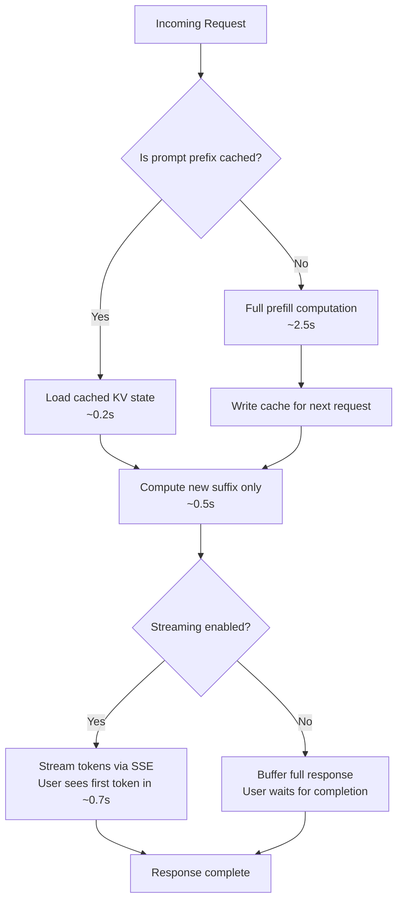

# Prompt Caching and Optimization

**Part 4 of 7: Agent Architecture & AI Model Internals Series**
**AI Doctor Assistant Project**

---

## Table of Contents

1. [The Stateless Problem](#the-stateless-problem)
2. [KV Cache — What the GPU Actually Stores](#kv-cache--what-the-gpu-actually-stores)
3. [Prompt Caching — The API Feature](#prompt-caching--the-api-feature)
4. [Cost Optimization Strategies](#cost-optimization-strategies)
5. [Latency Optimization](#latency-optimization)

---

## Learning Objectives

After reading this document, you will understand:

- Why every API call to an LLM reprocesses the entire conversation from scratch
- How the internal KV cache works during inference and why it converts O(N^2) generation into O(N)
- The difference between the GPU's internal KV cache and Anthropic's API-level prompt caching feature
- How `cache_control` breakpoints work, what prefix-based matching means, and what breaks the cache
- Practical cost optimization strategies: message ordering, model selection, token budgeting
- Latency optimization techniques: streaming, prompt caching, model tiering

---

## The Stateless Problem

### Every API Call Starts from Zero

Here is the critical insight that surprises most developers when they first work with LLM APIs: **every single API call reprocesses the entire conversation from scratch.** There is no persistent server-side memory between requests. The API is stateless.

When you send a chat completion request, you include every message in the conversation history. The model reads the system prompt, reads every user message, reads every assistant response, and then generates the next token. It does this from the very beginning, every single time.

This is fundamentally different from a database connection or a WebSocket, where the server maintains state between interactions. With an LLM API, the server forgets everything the moment the response is complete.

### The Growing Message Array

Consider a multi-turn conversation with the AI Doctor Assistant. Each turn, the full message array is sent:

```
Turn 1:  System prompt + User message 1
         ─────────────────────────────
         ~2,000 tokens processed

Turn 2:  System prompt + User message 1 + Assistant response 1 + User message 2
         ─────────────────────────────────────────────────────────────────────────
         ~4,500 tokens processed

Turn 3:  System prompt + User message 1 + Assistant response 1
         + User message 2 + Assistant response 2 + User message 3
         ─────────────────────────────────────────────────────────
         ~7,200 tokens processed

         ...

Turn 50: System prompt + ALL 49 previous messages + User message 50
         ───────────────────────────────────────────────────────────
         ~120,000 tokens processed
```

Every turn, you re-send (and re-pay for) everything that came before. The cost and latency scale linearly with conversation length.

### Visualizing the Cost Growth

```
Cost per turn (proportional to input tokens processed):

Turn  │ Input Tokens  │ Cost (illustrative)
──────┼───────────────┼─────────────────────
  1   │ ██            │ $0.006
  2   │ ████          │ $0.014
  3   │ ██████        │ $0.022
  5   │ ██████████    │ $0.038
 10   │ ████████████████████ │ $0.076
 20   │ ████████████████████████████████████████ │ $0.152
 50   │ (off the chart)                          │ $0.380

Cumulative cost = sum of ALL turns, not just the last one.
```

For a 50-turn conversation, you have not only paid for turn 50's 120K tokens. You have paid for turn 1's 2K tokens, turn 2's 4.5K tokens, turn 3's 7.2K tokens, and so on. The **cumulative cost** across all turns follows a quadratic curve, even though each individual turn's cost grows linearly.

```
Cumulative tokens processed across all turns:

  Turns:  1      5      10      20       50
  Tokens: 2K    18K    76K    304K    1,900K

  Without optimization, a 50-turn conversation processes
  roughly 1.9 MILLION tokens total across all API calls.
```

This is the core economic problem with LLM applications. Two features address it at different levels: the GPU's internal **KV cache** (inference optimization) and Anthropic's **prompt caching** (API optimization). They solve different problems. Both matter.

---

## KV Cache -- What the GPU Actually Stores

This section explains what happens inside the model during inference. Understanding the KV cache is essential for grasping why inference works the way it does, why context windows have hard limits, and why prompt caching at the API level is so effective.

### Attention Computation Refresher

The core mechanism of a Transformer model is **self-attention**. During inference, every token "looks at" every previous token to decide what comes next. More precisely:

For each token position, the model computes three vectors from the token's embedding:

- **Query (Q)** -- "What am I looking for?"
- **Key (K)** -- "What do I contain?"
- **Value (V)** -- "What information do I carry?"

The attention score between two tokens is computed by taking the dot product of one token's Query with another token's Key. High dot product means high relevance. These scores are then used to create a weighted sum of Value vectors, which becomes the output of the attention layer.

```
For token at position i:

  Q_i = W_Q * embedding_i    (what this token is looking for)
  K_i = W_K * embedding_i    (what this token represents)
  V_i = W_V * embedding_i    (what information this token carries)

  Attention(Q_i, K, V) = softmax(Q_i * K^T / sqrt(d_k)) * V

  Where K = [K_1, K_2, ..., K_i]  (keys of ALL tokens up to position i)
        V = [V_1, V_2, ..., V_i]  (values of ALL tokens up to position i)
```

The key insight: to compute attention for token i, you need the K and V vectors for **every token from 1 to i**. This is what makes the KV cache so important.

### The Problem Without KV Cache

Imagine generating a sequence of 5 tokens without any caching. The model generates one token at a time (autoregressive generation), and each new token needs attention over all previous tokens:

```
WITHOUT KV CACHE — Recompute everything at each step:

Step 1: Generate token 1
  Compute K₁, V₁ from token 1
  Attention: Q₁ attends to [K₁] with [V₁]
  Output: token 1
  Work: 1 K,V computation

Step 2: Generate token 2
  Recompute K₁, V₁ from token 1     ← WASTED (already did this)
  Compute K₂, V₂ from token 2
  Attention: Q₂ attends to [K₁, K₂] with [V₁, V₂]
  Output: token 2
  Work: 2 K,V computations

Step 3: Generate token 3
  Recompute K₁, V₁ from token 1     ← WASTED
  Recompute K₂, V₂ from token 2     ← WASTED
  Compute K₃, V₃ from token 3
  Attention: Q₃ attends to [K₁, K₂, K₃] with [V₁, V₂, V₃]
  Output: token 3
  Work: 3 K,V computations

Step 4: Generate token 4
  Recompute K₁, V₁                  ← WASTED
  Recompute K₂, V₂                  ← WASTED
  Recompute K₃, V₃                  ← WASTED
  Compute K₄, V₄
  Work: 4 K,V computations

Step 5: Generate token 5
  Recompute K₁, V₁                  ← WASTED
  Recompute K₂, V₂                  ← WASTED
  Recompute K₃, V₃                  ← WASTED
  Recompute K₄, V₄                  ← WASTED
  Compute K₅, V₅
  Work: 5 K,V computations

Total K,V computations: 1 + 2 + 3 + 4 + 5 = 15 = O(N²)
```

For generating N tokens, you do 1+2+3+...+N = N(N+1)/2 K,V computations. That is O(N^2). For a 1000-token response, that is roughly 500,000 K,V computations instead of the 1,000 that are actually unique.

### The Solution: KV Cache

The fix is simple in concept: **store the K and V vectors after computing them, and reuse them for subsequent tokens.**

```
WITH KV CACHE — Compute once, store, reuse:

Step 1: Generate token 1
  Compute K₁, V₁ from token 1
  Cache: K_cache = [K₁],  V_cache = [V₁]
  Attention: Q₁ attends to K_cache with V_cache
  Output: token 1
  New K,V computations: 1

Step 2: Generate token 2
  Load K_cache = [K₁], V_cache = [V₁]         ← FROM CACHE (free)
  Compute K₂, V₂ from token 2                  ← only the NEW token
  Cache: K_cache = [K₁, K₂],  V_cache = [V₁, V₂]
  Attention: Q₂ attends to K_cache with V_cache
  Output: token 2
  New K,V computations: 1

Step 3: Generate token 3
  Load K_cache = [K₁, K₂], V_cache = [V₁, V₂]    ← FROM CACHE
  Compute K₃, V₃ from token 3
  Cache: K_cache = [K₁, K₂, K₃],  V_cache = [V₁, V₂, V₃]
  Attention: Q₃ attends to K_cache with V_cache
  Output: token 3
  New K,V computations: 1

Step 4: Generate token 4
  Load from cache, compute K₄, V₄, append to cache
  New K,V computations: 1

Step 5: Generate token 5
  Load from cache, compute K₅, V₅, append to cache
  New K,V computations: 1

Total K,V computations: 1 + 1 + 1 + 1 + 1 = 5 = O(N)
```

The total K,V computations drop from O(N^2) to O(N). Each step only computes the K,V for the single new token, then loads everything else from GPU memory.

### Visualizing KV Cache Growth

The KV cache grows linearly with sequence length. Each new token adds one row to the K matrix and one row to the V matrix:

```
KV Cache in GPU Memory (one attention head, one layer):

After token 1:
  K_cache: [ K₁ ]              V_cache: [ V₁ ]
            ─────                         ─────
            d_k cols                      d_v cols

After token 2:
  K_cache: [ K₁ ]              V_cache: [ V₁ ]
           [ K₂ ]                        [ V₂ ]

After token 3:
  K_cache: [ K₁ ]              V_cache: [ V₁ ]
           [ K₂ ]                        [ V₂ ]
           [ K₃ ]                        [ V₃ ]

After token N:
  K_cache: [ K₁ ]              V_cache: [ V₁ ]
           [ K₂ ]                        [ V₂ ]
           [ K₃ ]                        [ V₃ ]
           [ .. ]                         [ .. ]
           [ Kₙ ]                        [ Vₙ ]

  Each matrix: N rows x d_k (or d_v) columns
  Memory per layer per head: 2 * N * d_k * sizeof(float16)
  Total across all layers and heads: 2 * N * d_model * n_layers * sizeof(float16)
```

### Memory Implications

For a large model, the KV cache consumes significant GPU memory. This is the primary reason context windows have hard limits.

```
KV Cache Memory Estimation:

  Given:
    - d_model = 8192 (model dimension)
    - n_layers = 80  (transformer layers)
    - n_heads = 64   (attention heads)
    - d_k = d_model / n_heads = 128 (key/value dimension per head)
    - dtype = float16 (2 bytes per element)

  Per token KV cache:
    K per token: n_layers * n_heads * d_k * 2 bytes
               = 80 * 64 * 128 * 2 = 1,310,720 bytes = 1.25 MB
    V per token: same = 1.25 MB
    Total per token: 2.5 MB

  For 200K context window:
    200,000 * 2.5 MB = 500 GB (!)

  This is why:
    - Long context windows require multi-GPU setups
    - Techniques like GQA (Grouped-Query Attention) reduce KV cache size
    - Context window limits are fundamentally memory limits
```

Modern models use **Grouped-Query Attention (GQA)** or **Multi-Query Attention (MQA)** to share K,V heads across multiple Q heads, which reduces the KV cache size significantly (often by 4-8x). But the fundamental principle remains: KV cache grows linearly with sequence length, and this linear growth is what constrains context windows.

### The Two-Phase Inference Pattern

When you send a request to an LLM API, inference happens in two phases:

```
┌──────────────────────────────────────────────────────────────┐
│                    PHASE 1: PREFILL                           │
│                                                               │
│  Process the ENTIRE input prompt in parallel                  │
│                                                               │
│  Input: [system prompt] + [conversation history] + [new msg]  │
│                                                               │
│  ┌─────┐ ┌─────┐ ┌─────┐ ┌─────┐ ┌─────┐ ... ┌─────┐       │
│  │ t₁  │ │ t₂  │ │ t₃  │ │ t₄  │ │ t₅  │     │ tₙ  │       │
│  └──┬──┘ └──┬──┘ └──┬──┘ └──┬──┘ └──┬──┘     └──┬──┘       │
│     │       │       │       │       │            │           │
│     ▼       ▼       ▼       ▼       ▼            ▼           │
│  Compute K,V for ALL input tokens simultaneously              │
│  (GPU parallelism — this is fast per token)                   │
│                                                               │
│  Result: KV cache populated for entire input                  │
│  Latency: proportional to input length (TTFT)                │
└──────────────────────────────────────────────────────────────┘
                           │
                           ▼
┌──────────────────────────────────────────────────────────────┐
│                  PHASE 2: DECODE (Autoregressive)            │
│                                                               │
│  Generate output tokens ONE AT A TIME                        │
│                                                               │
│  Step 1: Use full KV cache → generate token (n+1)            │
│          Append K_{n+1}, V_{n+1} to cache                    │
│                                                               │
│  Step 2: Use updated KV cache → generate token (n+2)         │
│          Append K_{n+2}, V_{n+2} to cache                    │
│                                                               │
│  Step 3: Use updated KV cache → generate token (n+3)         │
│          Append K_{n+3}, V_{n+3} to cache                    │
│                                                               │
│  ... continues until stop token or max_tokens                │
│                                                               │
│  Each step: load cache, compute 1 new K,V, run attention     │
│  Latency: ~constant per token (cache makes this efficient)   │
└──────────────────────────────────────────────────────────────┘
```

**Time to First Token (TTFT)** is dominated by Phase 1 (prefill). The longer your input prompt, the longer you wait for the first output token. **Tokens per second** during generation is determined by Phase 2 (decode), which is roughly constant per token thanks to the KV cache.

This two-phase pattern is why prompt caching at the API level (discussed next) reduces latency so dramatically: it lets the provider skip or accelerate the prefill phase for the cached portion of the prompt.

### Why This Matters for Application Developers

Even though you never directly interact with the KV cache (it is entirely managed by the inference server), understanding it explains several practical behaviors:

1. **Why long prompts are slower**: The prefill phase processes every input token. More input = longer TTFT.
2. **Why context windows have hard limits**: KV cache memory grows linearly, and GPUs have finite memory.
3. **Why streaming helps perceived latency**: Streaming returns tokens as they are generated in the decode phase, so users see output before generation completes.
4. **Why prompt caching reduces latency**: The provider can reuse a previously computed KV cache for the prompt prefix, skipping prefill for that portion.
5. **Why token counting matters**: You pay for every input token because every token gets a K,V entry that must be computed and stored during prefill.

---

## Prompt Caching -- The API Feature

Now we move from internal GPU mechanics to an API-level feature. **Prompt caching** is a feature offered by Anthropic (and other providers) that caches the processed representation of a prompt prefix on their servers, so subsequent requests with the same prefix skip the expensive prefill computation for that portion.

This is a fundamentally different mechanism from the internal KV cache, even though both involve caching computed attention states. The internal KV cache exists within a single request. Prompt caching exists across requests.

### How It Works

When you include `cache_control` markers in your API request, Anthropic's servers:

1. Process the prompt up to the cache breakpoint
2. Store the computed state (essentially, the KV cache for that prefix) on their servers
3. On the next request, if the prefix matches exactly, load the stored state instead of recomputing it
4. Only process the new tokens that come after the cached prefix

```
Request 1 (cache MISS — writes the cache):

  ┌─────────────────────────────────────────┐
  │  System Prompt (2,000 tokens)           │ ← cache_control: ephemeral
  │  Tool Definitions (3,000 tokens)        │ ← cache_control: ephemeral
  ├─────────────────────────────────────────┤
  │  User Message 1 (200 tokens)            │
  └─────────────────────────────────────────┘

  Processing:
  [====== COMPUTE (5,000 tokens) ======][== COMPUTE (200 tokens) ==]
                  ↓
         Cache this prefix
         (stored on Anthropic servers for 5 minutes)


Request 2 (cache HIT — reads from cache):

  ┌─────────────────────────────────────────┐
  │  System Prompt (2,000 tokens)           │ ← SAME as request 1
  │  Tool Definitions (3,000 tokens)        │ ← SAME as request 1
  ├─────────────────────────────────────────┤
  │  User Message 1 (200 tokens)            │ ← SAME
  │  Assistant Response 1 (500 tokens)      │
  │  User Message 2 (150 tokens)            │ ← NEW
  └─────────────────────────────────────────┘

  Processing:
  [====== LOADED FROM CACHE (5,000 tokens) ======][== COMPUTE (850 tokens) ==]
                                                    ↑
                                            Only compute the new suffix
```

### Prefix-Based Matching

This is the key insight that determines how you structure your prompts for optimal caching. The cache operates on **prefixes**, not exact matches.

**What "prefix-based" means:**
- The cache stores everything from the start of the prompt up to a `cache_control` breakpoint
- On the next request, Anthropic checks if the beginning of the new prompt matches a stored prefix
- If the prefix matches, the cached state is loaded; only the suffix (new content) is computed
- Any change in the prefix invalidates the cache for everything after the change

```
Prefix Matching Rules:

  CACHE HIT:
  ┌──────────────────────────────┬────────────────────┐
  │     Cached Prefix            │   New Suffix       │
  │  (identical to cache entry)  │  (anything new)    │
  └──────────────────────────────┴────────────────────┘
  ✓ Same system prompt + Same tools + any new messages = HIT


  CACHE MISS:
  ┌──────────────────────────────┬────────────────────┐
  │   Modified Prefix            │   New Suffix       │
  │  (even 1 character changed)  │                    │
  └──────────────────────────────┴────────────────────┘
  ✗ Changed system prompt = MISS (must reprocess everything)
  ✗ Changed tool order = MISS
  ✗ Changed tool definitions = MISS
```

**What preserves the cache:**
- Same system prompt, same tools, same message prefix, with new messages appended at the end
- This is the natural pattern of a conversation (you add new turns at the end)

**What breaks the cache:**
- Changing any character in the system prompt
- Reordering tools
- Adding or removing tools
- Modifying any message that appears before the cached portion
- Changing the model (cache is per-model)

### Request Format

Here is the exact API request format for prompt caching with the Anthropic API:

```json
{
  "model": "claude-sonnet-4-20250514",
  "max_tokens": 1024,
  "system": [
    {
      "type": "text",
      "text": "You are a medical AI assistant. You analyze patient records and generate clinical briefings. You must flag drug interactions, abnormal lab values, and potential diagnoses that require attention. Always cite specific values from the patient record. Never fabricate clinical data.",
      "cache_control": { "type": "ephemeral" }
    }
  ],
  "tools": [
    {
      "name": "lookup_drug_interaction",
      "description": "Check for interactions between two medications",
      "input_schema": {
        "type": "object",
        "properties": {
          "drug_a": { "type": "string" },
          "drug_b": { "type": "string" }
        },
        "required": ["drug_a", "drug_b"]
      }
    },
    {
      "name": "get_lab_reference_range",
      "description": "Get normal reference range for a lab value",
      "input_schema": {
        "type": "object",
        "properties": {
          "lab_name": { "type": "string" }
        },
        "required": ["lab_name"]
      },
      "cache_control": { "type": "ephemeral" }
    }
  ],
  "messages": [
    {
      "role": "user",
      "content": "Analyze this patient record: [patient data here]"
    }
  ]
}
```

Notice the placement of `cache_control` markers:

1. **On the system message** -- caches the system prompt
2. **On the last tool** -- caches system prompt + all tools as a combined prefix

The markers define breakpoints. Everything up to and including a breakpoint is eligible for caching. You can place breakpoints at multiple levels to create nested cache prefixes.

### Cache Pricing

Prompt caching has a specific cost structure:

```
Pricing Model (per million tokens):

  ┌──────────────────────┬───────────┬──────────────┬──────────────┐
  │  Token Type          │  Sonnet   │  Haiku       │  Opus        │
  ├──────────────────────┼───────────┼──────────────┼──────────────┤
  │  Regular Input       │  $3.00    │  $0.80       │  $15.00      │
  │  Cache Write (1.25x) │  $3.75    │  $1.00       │  $18.75      │
  │  Cache Read (0.10x)  │  $0.30    │  $0.08       │  $1.50       │
  │  Output              │  $15.00   │  $4.00       │  $75.00      │
  └──────────────────────┴───────────┴──────────────┴──────────────┘

  The economics:
  - First request: pay 1.25x for the cached prefix (cache write)
  - Subsequent requests: pay 0.10x for the cached prefix (cache read)
  - Breakeven: after just 2 requests (1.25 + 0.10 < 1.00 + 1.00)
  - After 10 requests with same prefix: 1.25 + (9 * 0.10) = 2.15x
    vs 10 * 1.00 = 10x without caching
    That is a 78% cost reduction.
```

### Cache TTL and Behavior

- **TTL**: 5 minutes (ephemeral cache)
- The cache is **automatically extended** each time it is read
- If no request hits the cache within 5 minutes, it expires
- There is no way to manually invalidate or extend the cache
- The minimum cacheable prefix is 1,024 tokens (for Claude Sonnet) or 2,048 tokens (for Haiku)

```
Cache Lifecycle:

  Time 0:00  Request 1 → Cache WRITE (prefix stored, TTL = 5 min)
  Time 1:30  Request 2 → Cache READ (TTL reset to 5 min from now)
  Time 3:00  Request 3 → Cache READ (TTL reset to 5 min from now)
  Time 7:30  Request 4 → Cache READ (TTL reset to 5 min from now)
  Time 13:00 (no requests for 5+ minutes) → Cache EXPIRED
  Time 14:00 Request 5 → Cache MISS → Cache WRITE (new entry)
```

### Response Headers

The API response includes cache usage information:

```json
{
  "usage": {
    "input_tokens": 150,
    "output_tokens": 340,
    "cache_creation_input_tokens": 5000,
    "cache_read_input_tokens": 0
  }
}
```

- `cache_creation_input_tokens`: tokens written to cache (you pay 1.25x for these)
- `cache_read_input_tokens`: tokens read from cache (you pay 0.10x for these)
- `input_tokens`: tokens processed normally (not cached)

On a cache hit, the response looks like:

```json
{
  "usage": {
    "input_tokens": 850,
    "output_tokens": 420,
    "cache_creation_input_tokens": 0,
    "cache_read_input_tokens": 5000
  }
}
```

> **AI DOCTOR EXAMPLE:** In the AI Doctor Assistant, the system prompt and tool definitions are identical across all patient briefing requests. By placing `cache_control` breakpoints on the system prompt and tools, every briefing request after the first one reads from cache. With a system prompt of ~2,000 tokens and tool definitions of ~3,000 tokens, each subsequent request saves 5,000 tokens at the 0.10x rate instead of 1.00x. For 100 briefings per day, this reduces the input cost for the system prefix from $1.50 to $0.19 (87% savings on that portion).

---

## Cost Optimization Strategies

Cost optimization for LLM applications is not about squeezing every penny from a single request. It is about designing your entire request pipeline so that the aggregate cost across thousands of requests is sustainable. The following strategies are ordered by impact, from highest to lowest.

### Strategy 1: Maximize Cache Hit Rate Through Message Ordering

The single most impactful optimization is structuring your messages so that the cacheable prefix is as large and stable as possible.

**The golden rule: put stable content first, variable content last.**

```
OPTIMAL message ordering for cache hits:

  ┌──────────────────────────────────────┐
  │  1. System Prompt                    │ ← Constant across all requests
  │     (instructions, persona, rules)   │    cache_control: ephemeral
  ├──────────────────────────────────────┤
  │  2. Tool Definitions                 │ ← Constant across all requests
  │     (function schemas)               │    cache_control: ephemeral
  ├──────────────────────────────────────┤
  │  3. Static Context                   │ ← Changes per patient, but stable
  │     (patient record, reference data) │    within a conversation
  │                                      │    cache_control: ephemeral
  ├──────────────────────────────────────┤
  │  4. Conversation History             │ ← Grows each turn, but prefix
  │     (previous turns)                 │    is stable (append-only)
  ├──────────────────────────────────────┤
  │  5. New User Message                 │ ← Changes every request
  │     (the latest input)               │    (never cached)
  └──────────────────────────────────────┘

  Cache hit coverage per turn:
  Turn 1: [system + tools cached] + patient + msg1          → 5K cached
  Turn 2: [system + tools cached] + patient + msg1 + ... + msg2 → 5K cached
  Turn 5: [system + tools cached] + patient + ... + msg5    → 5K cached
```

Notice that the system prompt and tools are cached from the first request and never change. Every subsequent request benefits. If you also place a `cache_control` breakpoint after the static patient context, you get an even larger cached prefix for multi-turn conversations about the same patient.

**Anti-pattern: variable content in the prefix**

```
BAD ordering (cache never hits):

  ┌──────────────────────────────────────┐
  │  1. Current timestamp                │ ← CHANGES EVERY REQUEST
  │  2. Random request ID                │ ← CHANGES EVERY REQUEST
  │  3. System Prompt                    │
  │  4. Tool Definitions                 │
  │  5. Messages                         │
  └──────────────────────────────────────┘

  The timestamp at position 1 changes every second.
  The entire prefix is invalidated on every request.
  Cache hit rate: 0%.
```

### Strategy 2: Model Selection by Task Complexity

Not every task requires the most powerful (and expensive) model. Matching model capability to task complexity yields significant savings.

| Task Type | Recommended Model | Why |
|-----------|------------------|-----|
| Classification (flag/no-flag) | Haiku | Binary/multi-class decisions are simple |
| Data extraction (structured output) | Haiku or Sonnet | Extract fields from text, return JSON |
| Summarization (short) | Sonnet | Good balance of quality and cost |
| Clinical reasoning (complex) | Sonnet or Opus | Multi-step reasoning, nuanced judgment |
| Differential diagnosis | Opus | Requires deep domain reasoning |
| Simple reformatting | Haiku | No reasoning needed, just restructure |

```
Cost comparison for identical 5,000 input + 1,000 output token request:

  Haiku:  (5K * $0.80 + 1K * $4.00)  / 1M = $0.008
  Sonnet: (5K * $3.00 + 1K * $15.00) / 1M = $0.030
  Opus:   (5K * $15.00 + 1K * $75.00) / 1M = $0.150

  Opus is 18.75x more expensive than Haiku for the same token count.
  For simple tasks, this is waste.
```

> **AI DOCTOR EXAMPLE:** The AI Doctor Assistant could use a tiered approach. Initial flag extraction (identifying abnormal lab values against reference ranges) could use Haiku. The clinical reasoning that synthesizes flags into a briefing narrative could use Sonnet. Only genuinely complex differential diagnosis scenarios would escalate to Opus. This is a V2+ consideration; V1 uses a single model for simplicity.

### Strategy 3: Token Budget Management

**max_tokens tuning**: Set `max_tokens` to a reasonable ceiling for the expected output, not the maximum the model supports. While `max_tokens` does not directly affect cost (you only pay for tokens actually generated), it prevents runaway generation in edge cases and signals your expected output size.

**Input token management**: Be deliberate about what you include in the prompt.

```
Token budget audit for a patient briefing request:

  Component               Tokens    Necessary?
  ─────────────────────── ────────  ──────────
  System prompt            2,000    Yes — defines behavior
  Tool definitions         3,000    Yes — enables structured output
  Full patient record      8,000    Maybe — could summarize older records
  Last 3 lab panels        1,200    Yes — recent data is critical
  Medication history       800      Yes — needed for interaction checks
  Previous 10 visits       4,000    Maybe — could include only last 3
  Conversation history     2,500    Depends — trim if > 5 turns
  New user message         200      Yes
  ─────────────────────── ────────
  Total                   21,700
  Optimized total         12,200    (trim older records, fewer visits)
  Savings                 44%
```

### Strategy 4: Batch Requests Where Possible

If you have multiple independent tasks (e.g., analyzing lab panels for 10 patients), use the **Message Batches API** instead of sending 10 individual requests. Batch requests are processed asynchronously and receive a 50% discount on input tokens.

```
10 individual requests:
  10 * 5,000 input tokens * $3.00/1M = $0.15

10 requests via Batch API:
  10 * 5,000 input tokens * $1.50/1M = $0.075

  Savings: 50% on input tokens
  Tradeoff: results are async (up to 24 hours)
```

Batching is appropriate for non-interactive workloads: nightly report generation, bulk patient screenings, or pre-computing briefings before rounds.

### Cost Optimization Summary

| Technique | Estimated Savings | Complexity | Best For |
|-----------|------------------|------------|----------|
| Prompt caching (message ordering) | 60-90% on cached prefix | Low | All multi-turn conversations |
| Model tiering (Haiku/Sonnet/Opus) | Up to 18x per request | Medium | Multi-task pipelines |
| Input token trimming | 20-50% on input cost | Medium | Large context requests |
| Batch API | 50% on input tokens | Low | Non-interactive bulk processing |
| max_tokens tuning | Prevents waste | Low | All requests |
| Structured output | 10-30% on output tokens | Low | When you need JSON, not prose |

---

## Latency Optimization

Latency optimization is about the user experience. For a medical application, the doctor should not stare at a spinner for 30 seconds. There are two kinds of latency: **actual latency** (how long the full response takes) and **perceived latency** (how long it feels to the user).

### Technique 1: Streaming for Perceived Speed

Streaming returns tokens as they are generated, so the user sees output incrementally instead of waiting for the full response.

```
WITHOUT streaming:

  User clicks "Generate Briefing"
  ├── [Spinner for 12 seconds] ──────────────────────────┤
  │                                                       │
  └── Full response appears all at once                   │


WITH streaming:

  User clicks "Generate Briefing"
  ├── [0.8s] ── First token appears
  │   ├── Text flows in token by token ──────────────────┤
  │   │   "The patient presents with..."                  │
  │   │   "elevated troponin levels (0.8 ng/mL)..."      │
  │   │   "suggesting possible acute coronary..."         │
  │   └── Full response complete                          │

  Same total time (12 seconds), but user sees output in <1 second.
  Perceived latency drops from 12s to 0.8s.
```

**How streaming works at the protocol level:**
- The API returns a stream of Server-Sent Events (SSE)
- Each event contains one or more tokens (`content_block_delta` events)
- The client renders tokens as they arrive
- The connection stays open until the response is complete

> **AI DOCTOR EXAMPLE:** The AI Doctor Assistant V1 uses a synchronous POST endpoint with a frontend spinner (no streaming). This is a deliberate V1 simplification. V2+ will add SSE streaming so doctors see the briefing narrative build in real-time, dramatically improving the perceived responsiveness.

### Technique 2: Prompt Caching for Actual Speed

Prompt caching does not just save money. It reduces actual latency because the provider skips the prefill computation for the cached portion.

```
Latency breakdown for a 10,000-token prompt:

  WITHOUT prompt caching:
    Prefill (10,000 tokens):  ~2.5 seconds
    Decode (500 tokens):      ~3.0 seconds
    Total TTFT:               ~2.5 seconds
    Total response time:      ~5.5 seconds

  WITH prompt caching (8,000 tokens cached):
    Load cache:               ~0.2 seconds
    Prefill (2,000 new tokens): ~0.5 seconds
    Decode (500 tokens):        ~3.0 seconds
    Total TTFT:                 ~0.7 seconds
    Total response time:        ~3.7 seconds

  TTFT improvement: 72% faster
  Total time improvement: 33% faster
```

The TTFT improvement is especially significant for streaming, because the user sees the first token much sooner.

### Technique 3: Prompt Engineering for Conciseness

Shorter prompts are faster prompts. Every unnecessary token in the input adds to prefill time.

```
VERBOSE system prompt (380 tokens):
  "You are an advanced medical AI assistant powered by state-of-the-art
   language model technology. Your primary purpose is to carefully and
   thoroughly analyze comprehensive patient medical records that may
   include but are not limited to laboratory results, medication lists,
   clinical notes, imaging reports, and other relevant documentation.
   When performing your analysis, you should pay special attention to..."

CONCISE system prompt (120 tokens):
  "You are a medical AI assistant. Analyze patient records and generate
   clinical briefings. Flag drug interactions, abnormal labs, and
   conditions requiring attention. Cite specific values. Never fabricate
   clinical data."

  Same behavior. 68% fewer tokens. Faster prefill. Lower cost.
```

### Technique 4: Model Selection for Latency

Different models have different latency characteristics:

| Model | Relative TTFT | Relative Throughput | Best For |
|-------|--------------|--------------------|---------|
| Haiku | 1x (fastest) | ~3x faster than Opus | Quick classifications, simple extractions |
| Sonnet | ~2x Haiku | ~1.5x faster than Opus | General-purpose, good quality/speed balance |
| Opus | ~3x Haiku | 1x (baseline) | Complex reasoning where quality trumps speed |

For latency-sensitive interactions (e.g., the doctor is waiting for a response during a patient visit), Haiku or Sonnet is often the right choice even if Opus would produce marginally better output.

### Technique 5: Parallelization

When you need multiple independent pieces of information, request them in parallel rather than sequentially.

```
SEQUENTIAL (bad for latency):

  Request 1: Analyze labs ──────── (3s) ────────┐
                                                 │
  Request 2: Check medications ──── (2.5s) ─────┐│
                                                ││
  Request 3: Generate summary ──── (4s) ────┐   ││
                                            │   ││
  Total time: 3 + 2.5 + 4 = 9.5 seconds    │   ││
                                            │   ││

PARALLEL (good for latency):                │   ││
                                            │   ││
  Request 1: Analyze labs ──────── (3s) ────┤   ││
  Request 2: Check medications ──── (2.5s) ─┤   ││
  Request 3: Generate summary ──── (4s) ────┤   ││
                                            │   ││
  Total time: max(3, 2.5, 4) = 4 seconds   │   ││
                                            │   ││
  Improvement: 58% faster                   │   ││
```

This pattern works well when tasks are independent. It does not work when tasks depend on each other's output (e.g., you need lab analysis results before generating the summary).

### Latency Optimization Summary

| Technique | Actual Latency | Perceived Latency | Complexity |
|-----------|---------------|-------------------|------------|
| Streaming | No change | 70-90% reduction in TTFT | Low |
| Prompt caching | 30-70% reduction | 30-70% reduction | Low |
| Concise prompts | 10-40% reduction | 10-40% reduction | Medium |
| Model tiering | Up to 3x faster with Haiku | Up to 3x faster | Medium |
| Parallelization | Up to Nx faster (N parallel tasks) | Up to Nx faster | High |



---

## Next Steps

This document covered the mechanics of KV caching (what the GPU does during inference), prompt caching (what the API provider does across requests), and practical optimization strategies for cost and latency.

The next document in the series, **[04-MCP-AND-A2A-PROTOCOLS.md](./04-MCP-AND-A2A-PROTOCOLS.md)**, covers the standardized protocols that allow AI agents to connect to external tools (MCP) and communicate with other agents (A2A). These protocols define how agents break out of the text-in-text-out paradigm and interact with the real world.

---

*Part 4 of 7: Agent Architecture & AI Model Internals Series*
*AI Doctor Assistant Project*
