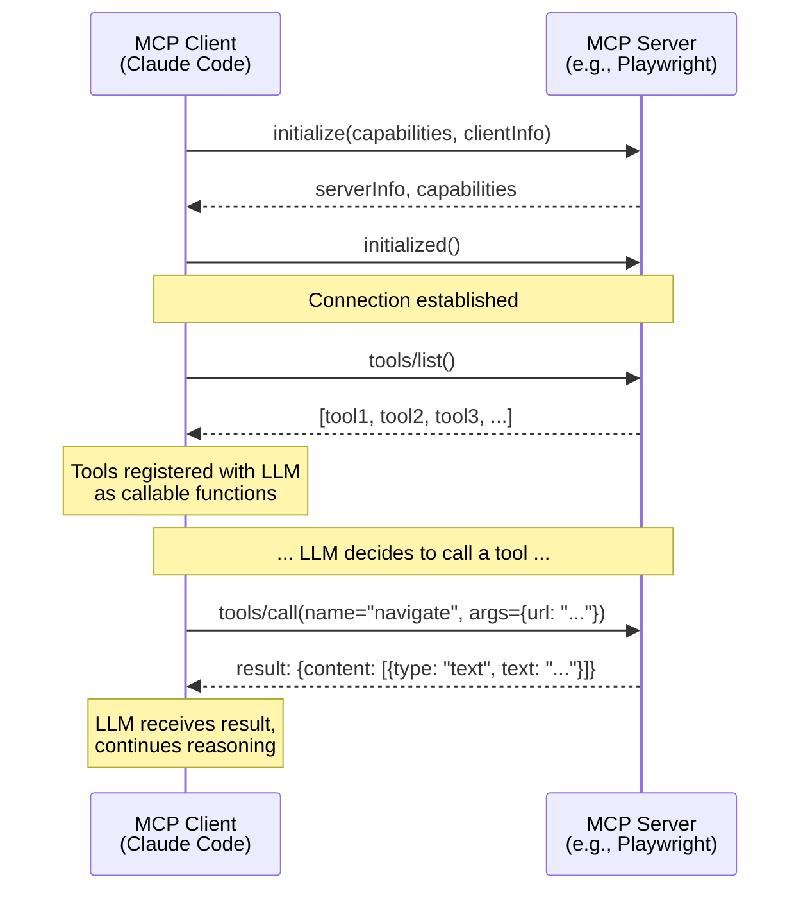
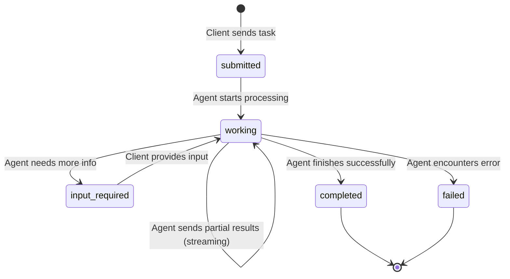
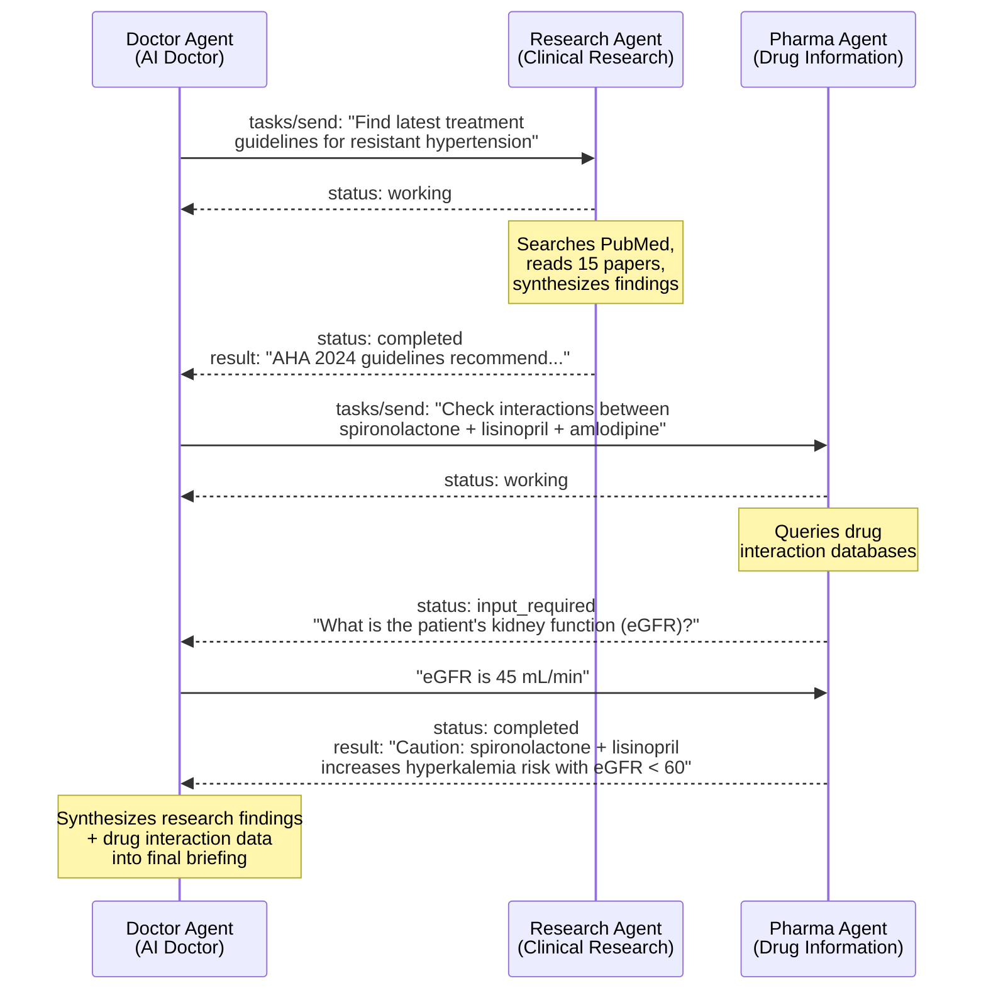

# MCP and A2A Protocols

**Part 5 of 7: Agent Architecture & AI Model Internals Series**
**AI Doctor Assistant Project**

---

## Table of Contents

1. [The Integration Problem](#the-integration-problem)
2. [MCP — Model Context Protocol](#mcp--model-context-protocol)
3. [A2A — Agent2Agent Protocol](#a2a--agent2agent-protocol)
4. [MCP vs A2A — When to Use Which](#mcp-vs-a2a--when-to-use-which)
5. [The Full Stack](#the-full-stack)
6. [The Ecosystem](#the-ecosystem)

---

## Learning Objectives

After reading this document, you will understand:

- Why custom tool integrations do not scale and what problem standardized protocols solve
- How MCP (Model Context Protocol) works: server/client architecture, transports, tool discovery, resources, and prompts
- How to build a minimal MCP server in Python and how Claude Code uses MCP under the hood
- How A2A (Agent2Agent Protocol) works: Agent Cards, task lifecycle, and multi-agent communication
- The precise distinction between MCP (agent-to-tool) and A2A (agent-to-agent) and when to use each
- How MCP and A2A compose together into a full agent architecture stack

---

## The Integration Problem

### Every Tool Integration Was Custom

Before MCP existed, every application that wanted to give an AI agent access to tools had to build that integration from scratch. Consider the landscape:

- **Claude Desktop** wants to read files from your filesystem. The Anthropic team writes a custom filesystem integration.
- **Cursor** wants Claude to search codebases. The Cursor team writes a custom code search integration.
- **A startup** wants Claude to query their database. They write a custom database integration.
- **Another startup** wants Claude to interact with Jira. They write a custom Jira integration.

Each integration is bespoke. Each team solves the same problems independently:

1. **Discovery**: How does the agent know what tools are available?
2. **Schema**: How are tool inputs and outputs described?
3. **Execution**: How does the agent call a tool and receive results?
4. **Authentication**: How does the agent prove it has permission to use a tool?
5. **Error handling**: How are tool failures communicated back to the agent?

```
THE N x M PROBLEM (before standardized protocols):

  Applications (N)          Tools (M)
  ┌──────────────┐         ┌──────────────┐
  │ Claude Code  │─────────│ Filesystem   │
  │              │────┐    │              │
  └──────────────┘    │    └──────────────┘
  ┌──────────────┐    │    ┌──────────────┐
  │ Claude       │────┼────│ Database     │
  │ Desktop      │──┐ │   │              │
  └──────────────┘  │ │   └──────────────┘
  ┌──────────────┐  │ │   ┌──────────────┐
  │ Cursor       │──┼─┼───│ GitHub       │
  │              │  │ │   │              │
  └──────────────┘  │ │   └──────────────┘
  ┌──────────────┐  │ │   ┌──────────────┐
  │ Custom App   │──┼─┼───│ Jira         │
  │              │  │ │   │              │
  └──────────────┘  │ │   └──────────────┘
                    │ │   ┌──────────────┐
                    └─┼───│ Slack        │
                      │   │              │
                      └───└──────────────┘

  Each line = a custom integration
  Total integrations: N x M (grows multiplicatively)
  4 apps x 5 tools = 20 custom integrations
```

This is the **N x M problem**. Every new application needs a custom integration for every tool, and every new tool needs a custom integration for every application. The work grows multiplicatively.

### The Standard Interface Solution

What if there was a standard protocol? Then each application implements the protocol once (as a client), and each tool implements it once (as a server). The N x M problem becomes N + M:

```
THE N + M SOLUTION (with MCP):

  MCP Clients (N)           MCP Standard          MCP Servers (M)
  ┌──────────────┐                                ┌──────────────┐
  │ Claude Code  │──┐                          ┌──│ Filesystem   │
  └──────────────┘  │                          │  └──────────────┘
  ┌──────────────┐  │    ┌──────────────┐      │  ┌──────────────┐
  │ Claude       │──┼────│  Standard    │──────┼──│ Database     │
  │ Desktop      │  │    │  Protocol    │      │  └──────────────┘
  └──────────────┘  │    │  (MCP)       │      │  ┌──────────────┐
  ┌──────────────┐  │    └──────────────┘      ├──│ GitHub       │
  │ Cursor       │──┤                          │  └──────────────┘
  └──────────────┘  │                          │  ┌──────────────┐
  ┌──────────────┐  │                          ├──│ Jira         │
  │ Custom App   │──┘                          │  └──────────────┘
  └──────────────┘                             │  ┌──────────────┐
                                               └──│ Slack        │
                                                  └──────────────┘

  Total integrations: N + M = 4 + 5 = 9 (instead of 20)
  Every new tool is instantly available to ALL clients.
  Every new client can instantly use ALL tools.
```

This is the same pattern as USB. Before USB, every peripheral (printer, keyboard, mouse, scanner) needed a different port and driver. USB standardized the interface, and suddenly any peripheral worked with any computer.

MCP is USB for AI agent tools. A2A extends this idea to agent-to-agent communication.

---

## MCP -- Model Context Protocol

### What Is MCP?

**Model Context Protocol (MCP)** is an open standard created by Anthropic that defines how AI agents discover and interact with external tools. It was released in late 2024 and has been adopted by Claude Code, Claude Desktop, Cursor, Windsurf, and dozens of other AI applications.

MCP defines a client-server architecture:

- **MCP Server**: A process that exposes tools, resources, and prompts through the MCP protocol
- **MCP Client**: An AI application that discovers and calls tools on MCP servers

### Server/Client Architecture

```
┌──────────────────────────────────────────────────────────┐
│                     MCP CLIENT                            │
│              (Claude Code, Claude Desktop)                 │
│                                                           │
│   ┌─────────────────────────────────────────────────┐    │
│   │              LLM (Claude)                        │    │
│   │                                                  │    │
│   │  "I need to read a file. Let me use the          │    │
│   │   mcp__filesystem__read_file tool."              │    │
│   └─────────────┬───────────────────────────────────┘    │
│                 │                                         │
│   ┌─────────────▼───────────────────────────────────┐    │
│   │          MCP Client Library                      │    │
│   │                                                  │    │
│   │  Manages connections to MCP servers               │    │
│   │  Routes tool calls to correct server              │    │
│   │  Handles serialization/deserialization            │    │
│   └─────┬───────────────────┬───────────────────────┘    │
│         │                   │                             │
└─────────┼───────────────────┼─────────────────────────────┘
          │                   │
   ┌──────▼──────┐    ┌──────▼──────┐
   │ MCP Server  │    │ MCP Server  │
   │ (Filesystem)│    │ (Playwright)│
   │             │    │             │
   │ Tools:      │    │ Tools:      │
   │ - read_file │    │ - navigate  │
   │ - write_file│    │ - click     │
   │ - list_dir  │    │ - snapshot  │
   └─────────────┘    └─────────────┘
```

### Transport Mechanisms

MCP supports two transport mechanisms, chosen based on where the server runs:

**stdio (Standard Input/Output)** — for local servers:

```
MCP Client ──── stdin/stdout pipes ──── MCP Server (local process)

  - Client spawns the server as a child process
  - Communication via stdin (client → server) and stdout (server → client)
  - Fast, no network overhead
  - Server runs on same machine as client
  - Most common for development tools (filesystem, git, local databases)
```

**Streamable HTTP** — for remote servers:

```
MCP Client ──── HTTP POST + SSE ──── MCP Server (remote service)

  - Client connects to server over HTTP
  - Requests via POST, responses and notifications via SSE
  - Supports authentication (Bearer tokens, OAuth)
  - Server runs on any reachable network host
  - Used for cloud services (APIs, SaaS tools, shared databases)
```

### The MCP Lifecycle

When an MCP client (like Claude Code) starts, it goes through a discovery and connection process:



### Tool Discovery

When the client calls `tools/list()`, the server returns a list of tools with JSON Schema descriptions. This is how the LLM knows what tools are available and how to call them:

```json
{
  "tools": [
    {
      "name": "browser_navigate",
      "description": "Navigate to a URL",
      "inputSchema": {
        "type": "object",
        "properties": {
          "url": {
            "type": "string",
            "description": "The URL to navigate to"
          }
        },
        "required": ["url"]
      }
    },
    {
      "name": "browser_click",
      "description": "Click an element on the page",
      "inputSchema": {
        "type": "object",
        "properties": {
          "ref": {
            "type": "string",
            "description": "Element reference from page snapshot"
          }
        },
        "required": ["ref"]
      }
    }
  ]
}
```

The LLM receives these tool descriptions as part of its system context. When it decides to use a tool, it generates a tool call with the correct name and arguments. The MCP client intercepts this, routes it to the correct server, executes the tool, and feeds the result back to the LLM.

### How Claude Code Uses MCP

If you have used Claude Code (which you are using right now to read this document), you have been using MCP extensively. Look at the tool names in any Claude Code session:

```
mcp__plugin_playwright_playwright__browser_navigate
mcp__plugin_playwright_playwright__browser_click
mcp__plugin_playwright_playwright__browser_snapshot
mcp__plugin_context7_context7__resolve-library-id
mcp__plugin_context7_context7__query-docs
mcp__claude_ai_TODOIST__add-tasks
mcp__claude_ai_TODOIST__find-tasks
mcp__claude_ai_Cloudflare_Developer_Platform__workers_list
```

The naming pattern reveals the MCP routing:

```
mcp__{plugin_name}__{server_name}__{tool_name}

Examples:
  mcp__plugin_playwright  __playwright  __browser_navigate
  │                        │              │
  │                        │              └─ Tool name from server
  │                        └─ MCP server name
  └─ Plugin configuration name

  mcp__claude_ai  __TODOIST  __add-tasks
  │                │           │
  │                │           └─ Tool name
  │                └─ MCP server name
  └─ Plugin source (Anthropic-hosted)
```

Each MCP server is configured in Claude Code's settings. The Playwright server runs locally via stdio. The Todoist and Cloudflare servers run remotely via HTTP. Claude Code's MCP client connects to all configured servers on startup, discovers their tools, and presents them all to the LLM as callable functions.

### Resources

Beyond tools, MCP servers can expose **resources** — data that the client can read. Resources are like read-only files or database records that the server makes available:

```json
{
  "resources": [
    {
      "uri": "file:///project/README.md",
      "name": "Project README",
      "mimeType": "text/markdown"
    },
    {
      "uri": "db://patients/12345",
      "name": "Patient Record #12345",
      "mimeType": "application/json"
    }
  ]
}
```

The client can read resources to provide context to the LLM without needing a tool call. This is useful for static or slowly-changing data that the agent should be aware of.

### Prompts

MCP servers can also provide **prompt templates** — pre-built prompts that the client can present to the user or inject into the LLM context:

```json
{
  "prompts": [
    {
      "name": "analyze-patient",
      "description": "Analyze a patient record and generate a briefing",
      "arguments": [
        {
          "name": "patient_id",
          "description": "The patient ID to analyze",
          "required": true
        }
      ]
    }
  ]
}
```

When the user selects this prompt template, the client fetches the full prompt content from the server (which may include dynamic data like the patient record) and sends it to the LLM.

### Building an MCP Server

Here is a minimal MCP server in Python that exposes a single tool. This demonstrates the core pattern:

```python
# weather_server.py
from mcp.server import Server
from mcp.server.stdio import stdio_server
import mcp.types as types

# Create the server instance
server = Server("weather-server")


@server.list_tools()
async def list_tools() -> list[types.Tool]:
    """Return the list of tools this server exposes."""
    return [
        types.Tool(
            name="get_weather",
            description="Get current weather for a city",
            inputSchema={
                "type": "object",
                "properties": {
                    "city": {
                        "type": "string",
                        "description": "City name (e.g., 'Paris')",
                    }
                },
                "required": ["city"],
            },
        )
    ]


@server.call_tool()
async def call_tool(
    name: str, arguments: dict
) -> list[types.TextContent]:
    """Handle tool execution requests."""
    if name == "get_weather":
        city = arguments["city"]
        # In a real server, call a weather API here
        return [
            types.TextContent(
                type="text",
                text=f"Weather in {city}: 22°C, partly cloudy",
            )
        ]
    raise ValueError(f"Unknown tool: {name}")


async def main():
    """Run the server using stdio transport."""
    async with stdio_server() as (read_stream, write_stream):
        await server.run(
            read_stream,
            write_stream,
            server.create_initialization_options(),
        )


if __name__ == "__main__":
    import asyncio
    asyncio.run(main())
```

To register this server with Claude Code, you would add it to your MCP settings:

```json
{
  "mcpServers": {
    "weather": {
      "command": "python",
      "args": ["weather_server.py"],
      "cwd": "/path/to/server"
    }
  }
}
```

Once registered, Claude Code would discover the `get_weather` tool on startup and present it to the LLM. The tool would appear as `mcp__weather__get_weather` in the available tools list.

### A More Realistic MCP Server

For the AI Doctor Assistant, an MCP server could expose patient data and clinical tools:

```python
# medical_server.py
from mcp.server import Server
from mcp.server.stdio import stdio_server
import mcp.types as types

server = Server("medical-tools")


@server.list_tools()
async def list_tools() -> list[types.Tool]:
    return [
        types.Tool(
            name="get_patient_record",
            description="Retrieve a patient's full medical record",
            inputSchema={
                "type": "object",
                "properties": {
                    "patient_id": {
                        "type": "string",
                        "description": "Patient identifier",
                    }
                },
                "required": ["patient_id"],
            },
        ),
        types.Tool(
            name="check_drug_interaction",
            description="Check for interactions between medications",
            inputSchema={
                "type": "object",
                "properties": {
                    "drug_a": {"type": "string"},
                    "drug_b": {"type": "string"},
                },
                "required": ["drug_a", "drug_b"],
            },
        ),
        types.Tool(
            name="get_lab_reference_range",
            description="Get normal reference range for a lab test",
            inputSchema={
                "type": "object",
                "properties": {
                    "test_name": {
                        "type": "string",
                        "description": "Lab test name (e.g., 'HbA1c')",
                    }
                },
                "required": ["test_name"],
            },
        ),
    ]


@server.list_resources()
async def list_resources() -> list[types.Resource]:
    return [
        types.Resource(
            uri="medical://formulary/current",
            name="Hospital Formulary",
            description="Current approved medication list",
            mimeType="application/json",
        )
    ]


@server.call_tool()
async def call_tool(
    name: str, arguments: dict
) -> list[types.TextContent]:
    if name == "get_patient_record":
        record = await fetch_patient_from_db(arguments["patient_id"])
        return [types.TextContent(type="text", text=json.dumps(record))]

    if name == "check_drug_interaction":
        result = await query_interaction_db(
            arguments["drug_a"], arguments["drug_b"]
        )
        return [types.TextContent(type="text", text=json.dumps(result))]

    if name == "get_lab_reference_range":
        ranges = get_reference_ranges(arguments["test_name"])
        return [types.TextContent(type="text", text=json.dumps(ranges))]

    raise ValueError(f"Unknown tool: {name}")
```

> **AI DOCTOR EXAMPLE:** In the current V1 architecture, the AI Doctor Assistant does not use MCP. The backend sends the full patient record directly to Claude Agent SDK in a single request. In V2+, MCP could allow the agent to dynamically fetch patient data, check drug interactions, and look up lab reference ranges as separate tool calls, enabling more targeted and efficient reasoning.

---

## A2A -- Agent2Agent Protocol

### What Is A2A?

**Agent2Agent Protocol (A2A)** is an open standard created by Google and now governed by the Linux Foundation. It defines how independent AI agents discover each other and collaborate on tasks. A2A was announced in April 2025 with backing from over 150 organizations including Salesforce, SAP, ServiceNow, Atlassian, and MongoDB.

The key distinction from MCP: **MCP connects an agent to tools. A2A connects an agent to other agents.**

A tool is a deterministic function: you call it with inputs and get an output. An agent is an autonomous entity: it has its own reasoning, can make decisions, can ask for clarification, and may take an unpredictable amount of time to complete a task.

```
MCP: Agent → Tool (deterministic, stateless, immediate)
     "Call the function get_weather('Paris')" → "22°C, partly cloudy"

A2A: Agent → Agent (autonomous, stateful, potentially long-running)
     "Research competing treatments for this diagnosis" → (agent thinks,
     searches databases, reads papers, reasons about findings, may ask
     clarifying questions, eventually returns a structured report)
```

### Agent Cards

In A2A, every agent publishes an **Agent Card** — a JSON document that describes the agent's identity, capabilities, and how to communicate with it. Think of it as a business card for AI agents.

Agent Cards are hosted at a well-known URL: `https://{agent-host}/.well-known/agent.json`

```json
{
  "name": "Clinical Research Agent",
  "description": "Searches medical literature and clinical trial databases to provide evidence-based treatment recommendations",
  "url": "https://clinical-research.example.com",
  "version": "1.0.0",
  "capabilities": {
    "streaming": true,
    "pushNotifications": true
  },
  "skills": [
    {
      "id": "literature-search",
      "name": "Medical Literature Search",
      "description": "Search PubMed, Cochrane, and clinical trial registries",
      "tags": ["medical", "research", "evidence-based"]
    },
    {
      "id": "treatment-comparison",
      "name": "Treatment Comparison",
      "description": "Compare efficacy and safety of treatment options",
      "tags": ["medical", "analysis"]
    }
  ],
  "authentication": {
    "schemes": ["bearer"]
  },
  "defaultInputModes": ["text/plain", "application/json"],
  "defaultOutputModes": ["text/plain", "application/json"]
}
```

The Agent Card enables **discovery**. A client agent can fetch the Agent Card, understand what the remote agent can do, and decide whether to collaborate with it.

### Task Lifecycle

Unlike MCP tool calls (which are stateless and immediate), A2A interactions follow a **stateful task lifecycle**. A task goes through well-defined states:



Each state transition is communicated via the protocol:

- **submitted**: The client has sent a task to the agent. The agent has acknowledged receipt.
- **working**: The agent is actively processing the task. During this state, the agent may stream partial results back to the client.
- **input-required**: The agent needs additional information from the client to continue. The task is paused until the client responds.
- **completed**: The agent has finished the task and returned final results.
- **failed**: The agent encountered an error and cannot complete the task.

### Communication Protocol

A2A uses standard web protocols: **HTTP** for requests, **SSE (Server-Sent Events)** for streaming, and **JSON-RPC 2.0** for message formatting. This means A2A agents can be built with any web framework in any programming language.

```
A2A Communication Flow:

  Client Agent                              Remote Agent
       │                                         │
       │  POST /tasks/send                        │
       │  {                                       │
       │    "jsonrpc": "2.0",                     │
       │    "method": "tasks/send",               │
       │    "params": {                           │
       │      "id": "task-123",                   │
       │      "message": {                        │
       │        "role": "user",                   │
       │        "parts": [{                       │
       │          "type": "text",                 │
       │          "text": "Compare metformin      │
       │           vs insulin for Type 2 DM"      │
       │        }]                                │
       │      }                                   │
       │    }                                     │
       │  }                                       │
       │─────────────────────────────────────────►│
       │                                          │
       │  Response: { status: "working" }         │
       │◄─────────────────────────────────────────│
       │                                          │
       │  SSE: partial result (streaming)         │
       │◄─────────────────────────────────────────│
       │                                          │
       │  SSE: partial result                     │
       │◄─────────────────────────────────────────│
       │                                          │
       │  SSE: { status: "completed",             │
       │         result: { ... } }                │
       │◄─────────────────────────────────────────│
       │                                          │
```

### Key A2A Design Principles

**Opaque execution**: The client does not know (or control) how the remote agent internally processes the task. The remote agent may use its own LLM, its own tools, its own MCP servers, or even delegate to other A2A agents. All the client sees is the task lifecycle and the final result.

**No shared memory**: Each agent maintains its own state. Agents communicate only through the A2A protocol messages. There is no shared context, no shared conversation history, no shared tool access.

**Multi-modal**: A2A supports multiple content types in task messages. Agents can exchange text, images, structured data (JSON), files, and other media types.



---

## MCP vs A2A -- When to Use Which

### Comparison Table

| Aspect | MCP | A2A |
|--------|-----|-----|
| **Purpose** | Agent accesses tools | Agent collaborates with agents |
| **Relationship** | Client → Server (hierarchical) | Peer → Peer (collaborative) |
| **What a "server" is** | A tool (deterministic function) | An agent (autonomous entity) |
| **Complexity of target** | Simple: input → output | Complex: reasoning, multi-step |
| **State** | Stateless (each call is independent) | Stateful (task lifecycle) |
| **Latency** | Milliseconds to seconds | Seconds to hours |
| **Discovery** | `tools/list` on connection | Agent Cards at well-known URL |
| **Communication** | JSON-RPC over stdio or HTTP | JSON-RPC over HTTP + SSE |
| **Can target ask questions?** | No (tools don't ask back) | Yes (`input-required` state) |
| **Streaming** | Tool result returned at once | Partial results streamed |
| **Creator** | Anthropic (2024) | Google (2025) |
| **Governance** | Open standard | Linux Foundation |
| **Adoption** | Broad (Claude, Cursor, etc.) | Early (150+ organizations) |

### Decision Framework

```
Do you need to...

  Call a function with defined inputs/outputs?
    → MCP
    Example: Read a file, query a database, get weather

  Ask an autonomous entity to perform a complex task?
    → A2A
    Example: Research a topic, analyze a document, plan a project

  Give your agent access to external data or APIs?
    → MCP
    Example: Access patient records, check drug interactions

  Coordinate multiple AI agents on a shared goal?
    → A2A
    Example: One agent researches, another analyzes, a third summarizes

  Need immediate, deterministic results?
    → MCP
    Example: Get lab reference ranges, format a date

  Accept that results may take time and require back-and-forth?
    → A2A
    Example: Generate a research report, create a treatment plan
```

### Can They Overlap?

**Can an agent be exposed as an MCP tool?** Yes. You can wrap an agent behind an MCP server's `call_tool` handler. The MCP client calls it like any other tool. But you lose the task lifecycle: there is no `input-required` state, no streaming of partial results, and no ability for the "tool" to ask clarifying questions. The agent must handle everything in a single request/response.

**Can an A2A agent use MCP tools internally?** Absolutely, and this is the expected pattern. An A2A agent receives a task, reasons about it, uses MCP to access tools (databases, APIs, files), and returns results through A2A.

```
Composition pattern:

  ┌─────────────────────────────────────────────────────────────┐
  │                     A2A Layer                                │
  │                                                              │
  │  Doctor Agent ◄──── A2A ────► Research Agent                 │
  │       │                            │                         │
  │       │                            │                         │
  │  ┌────▼─────────────┐    ┌────────▼──────────────────┐      │
  │  │    MCP Layer      │    │       MCP Layer            │      │
  │  │                   │    │                            │      │
  │  │ ┌───────────┐    │    │ ┌───────────┐ ┌─────────┐ │      │
  │  │ │ Patient DB │    │    │ │ PubMed API│ │ Cochrane│ │      │
  │  │ │ (MCP)     │    │    │ │ (MCP)     │ │ (MCP)   │ │      │
  │  │ └───────────┘    │    │ └───────────┘ └─────────┘ │      │
  │  │ ┌───────────┐    │    │ ┌───────────┐             │      │
  │  │ │ Drug DB   │    │    │ │ File Store│             │      │
  │  │ │ (MCP)     │    │    │ │ (MCP)     │             │      │
  │  │ └───────────┘    │    │ └───────────┘             │      │
  │  └──────────────────┘    └───────────────────────────┘      │
  └─────────────────────────────────────────────────────────────┘

  A2A: agent-to-agent communication (task delegation)
  MCP: agent-to-tool communication (data access, function calls)
```

---

## The Full Stack

### How It All Fits Together

Here is the complete agent architecture stack, from the human user down to the external tools and agents:

```
┌─────────────────────────────────────────────────────────────────────┐
│                          HUMAN USER                                  │
│                     (Doctor using the app)                           │
└───────────────────────────┬─────────────────────────────────────────┘
                            │
                            │  HTTP / WebSocket
                            ▼
┌─────────────────────────────────────────────────────────────────────┐
│                     APPLICATION LAYER                                 │
│               (FastAPI Backend / Claude Code)                         │
│                                                                      │
│   Manages sessions, authentication, request routing                  │
│   Formats prompts, handles responses, stores results                 │
└───────────────────────────┬─────────────────────────────────────────┘
                            │
                            │  Anthropic API / Claude Agent SDK
                            ▼
┌─────────────────────────────────────────────────────────────────────┐
│                        AI AGENT (Claude)                             │
│                                                                      │
│   Receives prompt + tool descriptions                                │
│   Reasons about the task                                             │
│   Decides which tools to call (or which agents to delegate to)       │
│   Generates structured output                                        │
│                                                                      │
│   ┌──────────────────────────┐  ┌──────────────────────────┐        │
│   │    MCP Tool Calls        │  │   A2A Task Delegation    │        │
│   │                          │  │                          │        │
│   │  Deterministic,          │  │  Autonomous,             │        │
│   │  immediate results       │  │  stateful tasks          │        │
│   └────────────┬─────────────┘  └────────────┬─────────────┘        │
└────────────────┼─────────────────────────────┼──────────────────────┘
                 │                              │
        ┌────────┴────────┐            ┌───────┴────────┐
        ▼                 ▼            ▼                ▼
┌──────────────┐ ┌──────────────┐ ┌──────────────┐ ┌──────────────┐
│  MCP Server  │ │  MCP Server  │ │  A2A Agent   │ │  A2A Agent   │
│  Filesystem  │ │  Database    │ │  Research    │ │  Scheduling  │
│              │ │              │ │              │ │              │
│  read_file   │ │  query       │ │  Searches    │ │  Manages     │
│  write_file  │ │  insert      │ │  literature  │ │  calendar    │
│  list_dir    │ │  update      │ │  Synthesizes │ │  Coordinates │
│              │ │              │ │  findings    │ │  appointments│
└──────────────┘ └──────────────┘ └──────────────┘ └──────────────┘
```

> **AI DOCTOR EXAMPLE:** Right now, you are reading this document inside Claude Code. Look at the tools available in this session. Every tool prefixed with `mcp__` is an MCP server. `mcp__plugin_playwright_playwright__*` is a Playwright MCP server providing browser automation. `mcp__claude_ai_TODOIST__*` is a Todoist MCP server for task management. `mcp__claude_ai_Cloudflare_Developer_Platform__*` is a Cloudflare MCP server for infrastructure management. `mcp__plugin_context7_context7__*` is a Context7 MCP server for library documentation lookup. Claude Code itself is the MCP client that connects to all of these servers, discovers their tools, and makes them available to the LLM. This is MCP in action, running right now, in this conversation.

### The Information Flow

Follow a complete request through the stack:

```
1. Doctor clicks "Generate Briefing" for patient #12345

2. FastAPI backend receives HTTP request
   → Validates authentication
   → Retrieves patient record from PostgreSQL
   → Constructs prompt with system instructions + patient data

3. Backend sends prompt to Claude via Agent SDK
   → System prompt (cached via prompt caching)
   → Tool definitions (cached via prompt caching)
   → Patient record + user message (new, uncached)

4. Claude reasons about the patient data
   → Identifies abnormal lab values
   → Recognizes medication combination
   → Decides to check drug interaction (tool call)

5. [MCP] Claude calls check_drug_interaction tool
   → MCP client routes to medical-tools MCP server
   → Server queries drug interaction database
   → Returns interaction data to Claude

6. [A2A — future] Claude delegates literature search
   → Sends task to Research Agent via A2A
   → Research Agent searches PubMed, returns findings
   → Claude incorporates findings into briefing

7. Claude generates structured briefing output
   → Flags with severity, evidence, and recommendations
   → Returns structured JSON via output_format

8. Backend receives response
   → Stores briefing in PostgreSQL
   → Returns JSON to frontend

9. Frontend renders the briefing with flag cards
```

---

## The Ecosystem

### MCP Server Ecosystem

The MCP ecosystem has grown rapidly since the protocol's release. There are several categories of MCP servers:

**First-party servers** (built by Anthropic):
- Filesystem (read/write files)
- Git (repository operations)
- PostgreSQL, SQLite (database access)
- Brave Search (web search)
- Google Drive, Slack (productivity)

**Community servers** (open source):
- Playwright (browser automation)
- Context7 (library documentation)
- Docker (container management)
- Kubernetes (cluster management)
- Various database drivers (MongoDB, Redis, MySQL)

**Commercial/hosted servers:**
- Todoist (task management)
- Cloudflare (infrastructure)
- Stripe (payments)
- Linear (project management)

### MCP Client Ecosystem

Applications that act as MCP clients (connecting to and using MCP servers):

| Client | Type | MCP Support |
|--------|------|-------------|
| Claude Code | CLI agent | Full MCP support, primary use case |
| Claude Desktop | Desktop app | Full MCP support |
| Cursor | IDE | MCP support for tools |
| Windsurf (Codeium) | IDE | MCP support for tools |
| Continue | IDE extension | MCP support |
| Zed | Editor | MCP support |
| Custom apps | Any | Via MCP SDK libraries |

### A2A Adoption

A2A is newer than MCP (2025 vs 2024), and adoption is in earlier stages. However, the backing is significant:

- **Google**: Creator and primary contributor
- **Linux Foundation**: Governance and stewardship
- **150+ organizations** have expressed support or are building A2A-compatible agents
- **Key supporters**: Salesforce (Einstein agents), SAP (Joule agents), ServiceNow, Atlassian, MongoDB, LangChain, CrewAI

The A2A specification is designed to be complementary to MCP, not competitive. The two protocols address different layers of the agent architecture stack.

### Future Directions

**MCP evolution:**
- Richer resource types (live-updating resources, subscriptions)
- Better authentication and authorization patterns
- Server-to-server MCP (tools that use other tools)
- Standardized error handling and retry semantics

**A2A evolution:**
- Agent registries (discover agents like discovering services)
- Task dependency graphs (orchestrate multi-agent workflows)
- Shared artifact stores (agents share intermediate results)
- Cross-organization agent collaboration (your company's agents talk to a partner's agents)

**Convergence:**
- Expect tighter integration between MCP and A2A in agent frameworks
- LangChain, CrewAI, and AutoGen are adding native support for both protocols
- The "agent operating system" pattern: MCP as the syscall layer, A2A as the IPC layer

For infrastructure considerations around running agent workloads on Kubernetes (GPU nodes, agent isolation, resource management), see **[infra-arch/07-GPU-AND-AGENTS.md](../infra-arch/07-GPU-AND-AGENTS.md)**.

---

## Next Steps

This document covered the two standardized protocols that enable agents to interact with the external world: MCP for tool access and A2A for agent collaboration. Together, they define the communication layer of modern agent architectures.

The next document in the series covers how these concepts apply to building production agent systems: orchestration patterns, error handling in multi-tool flows, and designing robust agent pipelines that handle real-world failure modes.

---

*Part 5 of 7: Agent Architecture & AI Model Internals Series*
*AI Doctor Assistant Project*
