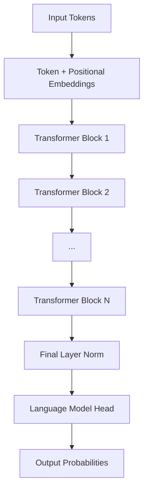

# Transformer Architecture — How the Model Actually Works

**Part 6 of 8: Agent Architecture & AI Model Internals Series**
**AI Doctor Assistant Project**

---

## Table of Contents

1. [Part 1: From Text to Numbers](#part-1-from-text-to-numbers)
   - [Tokenization](#tokenization)
   - [Embeddings](#embeddings)
2. [Part 2: The Attention Mechanism](#part-2-the-attention-mechanism)
   - [Intuition — What Problem Attention Solves](#intuition--what-problem-attention-solves)
   - [Query, Key, Value — The Core Math](#query-key-value--the-core-math)
   - [The Attention Formula](#the-attention-formula)
   - [Multi-Head Attention](#multi-head-attention)
   - [Masked (Causal) Attention](#masked-causal-attention)
3. [Part 3: The Full Transformer Block](#part-3-the-full-transformer-block)
   - [Layer Normalization](#layer-normalization)
   - [Feed-Forward Network (FFN)](#feed-forward-network-ffn)
   - [Residual Connections](#residual-connections)
   - [Stacking Layers](#stacking-layers)
4. [Part 4: Generating Output](#part-4-generating-output)
   - [The Language Model Head](#the-language-model-head)
   - [Sampling Strategies](#sampling-strategies)
   - [Autoregressive Generation](#autoregressive-generation)
5. [Part 5: Scale and Architecture Variants](#part-5-scale-and-architecture-variants)
   - [Model Sizes](#model-sizes)
   - [Memory Requirements](#memory-requirements)
   - [Tensor Parallelism](#tensor-parallelism)
   - [Pipeline Parallelism](#pipeline-parallelism)
   - [Mixture of Experts (MoE)](#mixture-of-experts-moe)

---

## Learning Objectives

After reading this document, you will be able to:

- Explain how text is converted to numbers through tokenization and embeddings
- Trace the attention mechanism step-by-step with actual matrix operations
- Describe what Query, Key, and Value represent and how they interact
- Explain why multi-head attention captures richer patterns than single-head
- Diagram a complete transformer block (norm → attention → residual → norm → FFN → residual)
- Explain how the model generates one token at a time using softmax over the vocabulary
- Compare sampling strategies (greedy, temperature, top-k, top-p) and their tradeoffs
- Describe how KV cache connects attention to efficient generation (linking back to Doc 03)
- Estimate model memory requirements from parameter count and precision
- Explain tensor parallelism, pipeline parallelism, and Mixture of Experts at a high level

---

## Part 1: From Text to Numbers

Before a transformer can process language, text must become numbers. This happens in two stages: **tokenization** (text → integer IDs) and **embedding** (integer IDs → dense vectors).

---

### Tokenization

**Tokens are not words.** They are subword units — fragments that balance vocabulary size against sequence length. Understanding tokenization is critical because it determines how the model "sees" your input.

#### What Tokens Are

A tokenizer breaks text into pieces from a fixed vocabulary. Each piece gets an integer ID:

```
Input:    "The cat sat on the mat"
Tokens:   ["The", " cat", " sat", " on", " the", " mat"]
Token IDs: [464,   3857,   3290,   319,   279,    2351]
```

Note the space handling: `" cat"` (with leading space) is a different token from `"cat"`. Tokenizers encode whitespace as part of the token, not separately.

#### Byte Pair Encoding (BPE)

Most modern models use **BPE** to build their vocabulary. The algorithm:

1. Start with individual bytes/characters as the vocabulary
2. Count all adjacent pairs in the training corpus
3. Merge the most frequent pair into a new token
4. Repeat until vocabulary reaches target size (e.g., 100,000 tokens)

```
Training corpus: "low lower lowest"

Step 1: Characters:  l, o, w, e, r, s, t, (space)
Step 2: Most frequent pair: (l, o) → merge to "lo"
Step 3: Most frequent pair: (lo, w) → merge to "low"
Step 4: Most frequent pair: (e, r) → merge to "er"
Step 5: Most frequent pair: (low, er) → merge to "lower"
...continue until vocabulary size reached
```

This produces a vocabulary of subword units. Common words like "the" become single tokens. Rare words are split: `"unhappiness"` → `["un", "happiness"]` or `["un", "happ", "iness"]` depending on the tokenizer.

#### Why Tokenization Matters

Different models use different tokenizers. The same text produces different token sequences:

| Input | Claude Tokens | GPT Tokens | Llama Tokens |
|-------|--------------|------------|--------------|
| `"Hello world"` | 2 tokens | 2 tokens | 2 tokens |
| `"tokenization"` | 1 token | 2-3 tokens | 2 tokens |
| `"1+1=2"` | 3-5 tokens | 3-5 tokens | 3-5 tokens |
| `"こんにちは"` | 1-3 tokens | 5 tokens | 3-5 tokens |

This matters because:

- **Billing**: API costs are per-token, so tokenizer efficiency affects cost
- **Context window**: A 200K context window means 200K tokens, not 200K words
- **Math ability**: If `"123"` is one token and `"456"` is one token, the model can't "see" individual digits — making arithmetic harder
- **Multilingual**: Some tokenizers encode non-English text very inefficiently (more tokens per word)

```
AI DOCTOR EXAMPLE:
A patient briefing with 500 words might be ~700 tokens. When calculating
API costs for the AI Doctor app, count tokens (not words) using Anthropic's
token counting API or the tiktoken library.
```

---

### Embeddings

Once text is tokenized into integer IDs, those IDs must become dense vectors that the transformer can process. This is the **embedding** step.

#### Token Embeddings

Each token ID maps to a vector of floating-point numbers. Think of it as a lookup table:

```
Token ID:  3857  (" cat")
              ↓
Embedding: [0.12, -0.34, 0.56, 0.89, -0.23, 0.45, ..., 0.67]
            └──────────────────────────────────────────────────┘
                          d_model dimensions (e.g., 4096)
```

The **embedding matrix** has shape `[vocabulary_size × d_model]`. For a model with 100K vocabulary and d_model=4096:

```
Embedding Matrix (100,000 × 4,096):
┌─────────────────────────────────────────────┐
│ Token 0:     [0.01, -0.23, 0.45, ..., 0.12] │  ← d_model floats
│ Token 1:     [0.34,  0.56, -0.12, ..., 0.89] │
│ Token 2:     [-0.45, 0.23, 0.67, ..., -0.34] │
│   ...                                         │
│ Token 3857:  [0.12, -0.34, 0.56, ..., 0.67]  │  ← " cat"
│   ...                                         │
│ Token 99999: [0.78, -0.12, 0.34, ..., 0.56]  │
└─────────────────────────────────────────────┘
```

Looking up a token embedding is just indexing into this matrix — no computation involved. The values are **learned during training** (they start random and get optimized).

#### What Embedding Dimensions Represent

Each of the 4096 dimensions captures some aspect of meaning. No single dimension has a clean interpretation, but collectively they encode:

- Semantic similarity: "cat" and "dog" have nearby vectors; "cat" and "democracy" don't
- Syntactic role: nouns cluster differently from verbs
- Relationships: vector("king") - vector("man") + vector("woman") ≈ vector("queen")

#### Positional Embeddings

Token embeddings alone don't encode **position**. The sequences "dog bites man" and "man bites dog" would produce the same set of vectors (just reordered), but the model needs to know word order.

**Positional embeddings** add position information:

```
Final input = token_embedding + positional_embedding

Token "cat" at position 2:
  token_embed("cat")     = [0.12, -0.34, 0.56, ..., 0.67]
  position_embed(pos=2)  = [0.01,  0.02, -0.01, ..., 0.03]
  ─────────────────────────────────────────────────────────
  final_input            = [0.13, -0.32, 0.55, ..., 0.70]
```

Modern models (Claude, Llama, GPT-4) use **RoPE (Rotary Position Embeddings)** which encode position through rotation matrices rather than addition. The key insight: RoPE makes the attention score between two tokens depend on their **relative** distance, not absolute position. This enables better generalization to longer sequences.

#### Summary: Text to Transformer Input

```
"The cat sat"
     │
     ▼ Tokenizer
[464, 3857, 3290]           ← Token IDs
     │
     ▼ Embedding lookup
┌───────────────────────┐
│ [0.12, -0.34, ..., 0.67] │  ← "The"  (4096-dim vector)
│ [0.45,  0.23, ..., -0.12] │  ← " cat" (4096-dim vector)
│ [0.78, -0.56, ..., 0.33] │  ← " sat" (4096-dim vector)
└───────────────────────┘
     │
     ▼ + Positional embedding
┌───────────────────────┐
│ [0.13, -0.32, ..., 0.70] │  ← "The"  at position 0
│ [0.46,  0.25, ..., -0.09] │  ← " cat" at position 1
│ [0.79, -0.54, ..., 0.36] │  ← " sat" at position 2
└───────────────────────┘
     │
     ▼ Into transformer layers
```

This matrix of shape `[sequence_length × d_model]` is the input to the first transformer layer.

---

## Part 2: The Attention Mechanism

Attention is the core innovation of the transformer architecture. It's what allows the model to understand context — to know that "it" in "The cat sat on the mat because it was tired" refers to "the cat."

---

### Intuition — What Problem Attention Solves

Consider this sentence:

> "The **cat** sat on the mat because **it** was tired"

To understand "it," the model needs to "look back" at all previous words and determine which one "it" refers to. This is **attention** — a mechanism for each token to selectively focus on relevant tokens in the sequence.

Without attention, each token would be processed independently (like a bag of words). With attention, every token can gather information from every other token in the sequence.

The key question attention answers: **"Given what I'm looking for (Query), which other tokens have what I need (Key), and what information should I take from them (Value)?"**

---

### Query, Key, Value — The Core Math

For each token, we compute three vectors using learned weight matrices:

- **Q (Query)**: "What am I looking for?" — what this token wants to attend to
- **K (Key)**: "What do I contain?" — what this token can be matched against
- **V (Value)**: "What information do I carry?" — the actual content to retrieve

```
For each token's hidden state x (a d_model-dim vector):

Q = x × W_Q    (Query:  what am I looking for?)
K = x × W_K    (Key:    what do I contain?)
V = x × W_V    (Value:  what information do I carry?)
```

Where W_Q, W_K, W_V are learned weight matrices of shape `[d_model × d_k]`.

**Analogy**: Think of a library:
- **Query** = your search terms ("books about cats")
- **Key** = the index card for each book ("cats, feline, pets")
- **Value** = the actual book content

You compare your query against each key to find relevant books, then read the content (value) of the best matches.

#### Step-by-Step with Small Numbers

Let's work through a tiny example: 4 tokens, 3 dimensions (real models use 4096+ dimensions, but 3 is enough to see the mechanics).

**Input** (4 tokens × 3 dimensions):

```
           dim1   dim2   dim3
Token 0:  [ 1.0,   0.0,  -1.0]    "The"
Token 1:  [ 0.5,   0.8,   0.3]    "cat"
Token 2:  [-0.2,   0.6,   0.9]    "sat"
Token 3:  [ 0.3,  -0.4,   0.7]    "on"
```

**Weight matrices** (3×3, learned during training):

```
W_Q =  [ 0.1,  0.2, -0.1]     W_K =  [ 0.3, -0.1,  0.2]     W_V =  [ 0.2,  0.1,  0.3]
        [ 0.3, -0.1,  0.4]             [ 0.1,  0.4, -0.2]             [-0.1,  0.3,  0.1]
        [-0.2,  0.3,  0.1]             [-0.3,  0.2,  0.1]             [ 0.4, -0.2,  0.2]
```

**Computing Q = Input × W_Q** (matrix multiplication):

```
Q[0] = [1.0×0.1 + 0.0×0.3 + (-1.0)×(-0.2),  1.0×0.2 + 0.0×(-0.1) + (-1.0)×0.3,  ...]
     = [0.3, -0.1, -0.2]

Similarly for all 4 tokens:
Q = [ 0.30, -0.10, -0.20]    ← Token 0's query
    [ 0.23,  0.15,  0.16]    ← Token 1's query
    [ 0.00,  0.23,  0.35]    ← Token 2's query
    [-0.23,  0.31,  0.04]    ← Token 3's query
```

K and V are computed the same way with W_K and W_V. Each token now has a Query, Key, and Value vector.

---

### The Attention Formula

The full attention computation:

```
Attention(Q, K, V) = softmax(Q × K^T / √d_k) × V
```

Let's break this into four steps with our 4-token example.

#### Step 1: Q × K^T (Attention Scores)

Multiply Q (4×3) by K transposed (3×4) to get a 4×4 **attention score matrix**:

```
                    Token 0  Token 1  Token 2  Token 3
                        K^T columns →
Q × K^T =  Token 0 [ 0.45,   0.12,  -0.31,   0.22]
            Token 1 [ 0.18,   0.39,   0.27,  -0.08]
            Token 2 [-0.15,   0.33,   0.41,   0.14]
            Token 3 [ 0.09,  -0.12,   0.28,   0.35]
```

**What each cell means**: Cell [i, j] = "how much should token i attend to token j?"

- Cell [0, 1] = 0.12 → Token 0 ("The") has moderate attention toward Token 1 ("cat")
- Cell [2, 2] = 0.41 → Token 2 ("sat") attends strongly to itself

#### Step 2: Scale by √d_k

Divide by √d_k (where d_k = 3, so √3 ≈ 1.73):

```
Scaled scores = (Q × K^T) / 1.73

                Token 0  Token 1  Token 2  Token 3
    Token 0 [   0.26,    0.07,   -0.18,    0.13]
    Token 1 [   0.10,    0.23,    0.16,   -0.05]
    Token 2 [  -0.09,    0.19,    0.24,    0.08]
    Token 3 [   0.05,   -0.07,    0.16,    0.20]
```

**Why scale?** Without scaling, when d_k is large (e.g., 128), dot products become large numbers. Large inputs to softmax produce extremely peaked distributions (one value ≈ 1.0, rest ≈ 0.0), which kills gradient flow during training.

#### Step 3: Softmax (Row-wise)

Apply softmax to each row, converting scores to probabilities (each row sums to 1.0):

```
softmax(x_i) = e^(x_i) / Σ e^(x_j)

                   Token 0  Token 1  Token 2  Token 3    Sum
    Token 0 [      0.29,    0.24,    0.19,    0.26]    = 1.0
    Token 1 [      0.24,    0.28,    0.26,    0.21]    = 1.0
    Token 2 [      0.20,    0.27,    0.28,    0.24]    = 1.0
    Token 3 [      0.24,    0.21,    0.27,    0.28]    = 1.0
```

These are **attention weights**: a probability distribution over which tokens to attend to.

- Token 0 ("The") spreads attention fairly evenly (no strong focus)
- Token 2 ("sat") attends slightly more to itself (0.28) and Token 1 "cat" (0.27)

#### Step 4: Multiply by V (Weighted Values)

Multiply attention weights (4×4) by V (4×3) to get the output:

```
Output = Attention_weights × V

Each output row is a weighted combination of all Value vectors:

Output[0] = 0.29×V[0] + 0.24×V[1] + 0.19×V[2] + 0.26×V[3]
           = weighted mix of all tokens' values, emphasizing what Token 0 attends to
```

The result is a new 4×3 matrix where each token's representation has been enriched with information from other tokens it attended to.

**This is the core insight**: after attention, each token's vector contains information not just about itself, but about the tokens it found relevant. "It" now carries information from "cat" because it attended strongly to it.

---

### Multi-Head Attention

One attention head learns one pattern. But language has many kinds of relationships:

- **Syntactic**: subject-verb agreement, noun-adjective pairing
- **Semantic**: coreference ("it" → "cat"), synonymy
- **Positional**: nearby tokens, clause boundaries
- **Logical**: cause-effect, temporal ordering

**Multi-head attention** runs multiple attention heads in parallel, each with its own W_Q, W_K, W_V:

```
                    Input (seq_len × d_model)
                              │
              ┌───────────────┼───────────────┐
              │               │               │
         ┌────▼────┐    ┌────▼────┐    ┌────▼────┐
         │ Head 1  │    │ Head 2  │    │ Head 3  │    ... (32-128 heads)
         │ W_Q₁    │    │ W_Q₂    │    │ W_Q₃    │
         │ W_K₁    │    │ W_K₁    │    │ W_K₃    │
         │ W_V₁    │    │ W_V₁    │    │ W_V₃    │
         └────┬────┘    └────┬────┘    └────┬────┘
              │               │               │
              │  (each outputs seq_len × d_k)  │
              │               │               │
              └───────────────┼───────────────┘
                              │ Concatenate
                              ▼
                    [seq_len × (n_heads × d_k)]
                              │
                              ▼ Linear projection (W_O)
                    [seq_len × d_model]
                              │
                              ▼ Output
```

**Dimension split**: If d_model=4096 and n_heads=32, each head works with d_k=4096/32=128 dimensions. The total computation is the same as one large head, but split into 32 independent "perspectives."

In practice, different heads learn to focus on different things. Research has shown individual heads specializing in:

- Attending to the previous token
- Attending to the first token (often special/BOS)
- Subject-verb agreement across long distances
- Positional patterns (every 3rd token, end of sentence)

---

### Masked (Causal) Attention

During text generation, the model predicts the **next** token. It must not see future tokens — that would be cheating.

**Causal masking** enforces this by setting attention scores to -∞ for future positions before softmax:

```
Mask matrix (1 = can attend, 0 = masked):

         t0   t1   t2   t3
    t0 [  1    0    0    0 ]    Token 0 can only see itself
    t1 [  1    1    0    0 ]    Token 1 sees tokens 0-1
    t2 [  1    1    1    0 ]    Token 2 sees tokens 0-2
    t3 [  1    1    1    1 ]    Token 3 sees all tokens
```

Applied to attention scores (before softmax):

```
Scores before masking:          After masking (0 → -∞):
[ 0.26,  0.07, -0.18,  0.13]   [ 0.26,    -∞,    -∞,    -∞]
[ 0.10,  0.23,  0.16, -0.05]   [ 0.10,  0.23,    -∞,    -∞]
[-0.09,  0.19,  0.24,  0.08]   [-0.09,  0.19,  0.24,    -∞]
[ 0.05, -0.07,  0.16,  0.20]   [ 0.05, -0.07,  0.16,  0.20]
```

After softmax, -∞ becomes 0 probability. Token 2 can attend to tokens 0, 1, and 2 — but not token 3.

This is what makes the model **autoregressive**: it can only look backward, generating one token at a time.

```
AI DOCTOR EXAMPLE:
When Claude generates a patient briefing, it produces tokens left-to-right.
While generating "Patient shows elevated..." the word "elevated" can attend
to "Patient" and "shows" but not to words that haven't been generated yet.
This is why generation is sequential — each word depends on all previous words.
```

---

## Part 3: The Full Transformer Block

A single transformer block combines attention with normalization, a feed-forward network, and residual connections. Modern models stack 32-100+ of these blocks.

---

### Layer Normalization

**What it does**: Normalizes activations to have mean ≈ 0 and variance ≈ 1 for each token independently.

**Why**: Without normalization, values can grow or shrink across layers, making training unstable. Normalization keeps values in a reasonable range.

```
LayerNorm(x) = γ × (x - mean(x)) / √(var(x) + ε) + β

where γ (scale) and β (shift) are learned parameters
      ε is a small constant for numerical stability (1e-5)
```

**Pre-norm vs Post-norm**:

- **Post-norm** (original Transformer paper): `x + LayerNorm(Attention(x))`
- **Pre-norm** (modern, used by Claude/GPT/Llama): `x + Attention(LayerNorm(x))`

Pre-norm is more stable during training and is standard in modern architectures.

---

### Feed-Forward Network (FFN)

After attention aggregates information across tokens, the FFN processes each token independently:

```
FFN(x) = W₂ × activation(W₁ × x + b₁) + b₂

Dimensions:
  x:       [d_model]        e.g., [4096]
  W₁:      [d_model × d_ff]  e.g., [4096 × 16384]  (4× expansion)
  W₂:      [d_ff × d_model]  e.g., [16384 × 4096]  (project back)
```

The FFN expands to 4× the model dimension, applies a nonlinear activation, then projects back:

```
Input:  4096 dims ──→ Expand: 16384 dims ──→ Activation ──→ Contract: 4096 dims
```

**Where knowledge lives**: Research suggests that the FFN layers store factual knowledge (like "Paris is the capital of France"), while attention layers route information between tokens. The FFN has **more parameters** than attention — it's the larger component of each transformer block.

**Activation function**: Modern models use **SiLU** (Swish) or **GELU** instead of the original ReLU:

```
GELU(x) ≈ x × Φ(x)    where Φ is the standard normal CDF
SiLU(x) = x × sigmoid(x)
```

These are smoother than ReLU, providing better gradient flow during training.

---

### Residual Connections

**Skip connections** add the input directly to the output of each sub-layer:

```
output = x + sublayer(x)
```

This means information can flow directly through the network without being transformed. Without residual connections, gradients must pass through every layer during backpropagation — in a 100-layer network, they would vanish to near-zero.

#### Full Transformer Block Diagram

```
Input x
  │
  ├────────────────────────────┐
  ▼                            │ (residual)
Layer Norm                     │
  ▼                            │
Multi-Head Attention           │
  ▼                            │
  + ◄──────────────────────────┘
  │
  ├────────────────────────────┐
  ▼                            │ (residual)
Layer Norm                     │
  ▼                            │
Feed-Forward Network           │
  ▼                            │
  + ◄──────────────────────────┘
  │
Output (same shape as input: seq_len × d_model)
```

**Key property**: Input and output have the **same shape**. This means transformer blocks are stackable — the output of block N feeds directly into block N+1.

---

### Stacking Layers

A complete transformer model stacks many identical blocks:



How many layers?

| Model Class | Approximate Layers | d_model | Attention Heads |
|------------|-------------------|---------|-----------------|
| Haiku-class (~8B) | 32 | 4096 | 32 |
| Sonnet-class (~70B) | 80 | 8192 | 64 |
| Opus-class (~200B+) | 100+ | 12288 | 96 |

More layers = deeper reasoning capability but slower inference and higher cost. Each layer adds one round of "thinking" where tokens can exchange information (attention) and transform their representations (FFN).

---

## Part 4: Generating Output

The transformer processes input through all its layers, producing a final hidden state for each token. The last step: convert these hidden states into a probability distribution over the vocabulary to predict the next token.

---

### The Language Model Head

The **language model head** (or **lm_head**) is a linear projection from the model's hidden dimension to the vocabulary size:

```
logits = hidden_state × W_lm_head

Dimensions:
  hidden_state:  [d_model]           e.g., [4096]
  W_lm_head:     [d_model × vocab]   e.g., [4096 × 100000]
  logits:        [vocab]             e.g., [100000]
```

The result is one score (logit) per token in the vocabulary:

```
Token:      "the"   "cat"   "sat"   "happy"  "Tokyo"  "."   ...  (100K tokens)
Logits:      4.2     1.3    -0.5     0.1      -2.3    3.1   ...
                                      │
                                      ▼ softmax
Probability: 0.41   0.02    0.004   0.007    0.001   0.14  ...  (sums to 1.0)
```

**Only the last token's hidden state is used for prediction.** When generating "The cat sat ___", we take the hidden state at position 3 ("sat") and project it to get probabilities for what comes next.

---

### Sampling Strategies

Given the probability distribution, how do we pick the next token?

#### Greedy Decoding (temperature = 0)

Always pick the highest-probability token:

```
Probabilities: [0.41, 0.14, 0.02, 0.007, ...]
                 ↑
                Pick "the" (highest)
```

**Pros**: Deterministic, consistent output
**Cons**: Repetitive, misses creative alternatives

#### Temperature

Temperature reshapes the probability distribution before sampling:

```
adjusted_logits = logits / temperature
probabilities = softmax(adjusted_logits)
```

```
                    Original (T=1.0)    Cold (T=0.3)     Hot (T=2.0)
"the"               0.41                0.82             0.28
"."                 0.14                0.10             0.16
"cat"               0.02                0.001            0.08
"happy"             0.007               0.0001           0.05
...                 ...                 ...              ...

Distribution:       Moderate peaks      Very peaked       Flat/uniform
Effect:             Normal              Confident/boring  Creative/chaotic
```

- **T < 1**: Sharper distribution → more deterministic, safer responses
- **T = 1**: Original distribution → balanced
- **T > 1**: Flatter distribution → more random, creative
- **T → 0**: Approaches greedy decoding

#### Top-k Sampling

Only consider the k most likely tokens, redistribute probability among them:

```
k = 3:
Original:  "the"(0.41), "."(0.14), "cat"(0.02), "happy"(0.007), ...
                                                   ↑ cut off here
After top-k: "the"(0.72), "."(0.25), "cat"(0.03)  ← renormalized to sum to 1.0
```

#### Top-p (Nucleus Sampling)

Keep the smallest set of tokens whose cumulative probability ≥ p:

```
p = 0.9:
Sorted: "the"(0.41) + "."(0.14) + "cat"(0.02) + ... = cumulative
        0.41          0.55         0.57               keep going...
        ...until cumulative ≥ 0.9, then stop

Only sample from this nucleus of tokens.
```

Top-p adapts automatically — when the model is confident (one token dominates), the nucleus is small. When uncertain, it includes more options.

#### Comparison

| Strategy | When to Use | Tradeoff |
|----------|-------------|----------|
| Greedy (T=0) | Factual Q&A, code generation | Consistent but repetitive |
| Low temperature (0.1-0.5) | Structured output, following instructions | Reliable but less creative |
| Default (T=1.0) | General conversation | Balanced |
| Top-k (k=40) | Creative writing | Prevents very unlikely tokens |
| Top-p (p=0.9) | General use, recommended default | Adaptive nucleus size |
| High temperature (1.5+) | Brainstorming, exploration | Creative but may lose coherence |

---

### Autoregressive Generation

The model generates text one token at a time, feeding each generated token back as input:

```
Step 1: Input: "What is"
        → Forward pass through all layers
        → Predict next token: "the" (sampled from distribution)
        → Append to sequence

Step 2: Input: "What is the"
        → Forward pass through all layers
        → Predict next token: "weather"
        → Append to sequence

Step 3: Input: "What is the weather"
        → Forward pass through all layers
        → Predict next token: "in"
        → Append to sequence

...continue until stop token or max_tokens
```

**Without KV cache**, each step would recompute attention for ALL tokens from scratch. Step 10 would reprocess tokens 1-9 even though nothing about them changed.

**With KV cache** (see Doc 03), the Key and Value matrices from previous steps are stored and reused. Only the new token's K and V need to be computed:

```
Step 1: Compute K₁, V₁ for "What" + K₂, V₂ for "is"
        → Cache: [K₁, K₂], [V₁, V₂]

Step 2: Load cached [K₁, K₂], [V₁, V₂]
        Compute only K₃, V₃ for "the"
        → Cache: [K₁, K₂, K₃], [V₁, V₂, V₃]

Step 3: Load cached [K₁, K₂, K₃], [V₁, V₂, V₃]
        Compute only K₄, V₄ for "weather"
        → Cache: [K₁, K₂, K₃, K₄], [V₁, V₂, V₃, V₄]
```

This reduces generation from O(N²) to O(N) total computation across all steps — a massive speedup for long sequences.

---

## Part 5: Scale and Architecture Variants

Understanding model scale helps you reason about costs, hardware requirements, and why larger models are more capable.

---

### Model Sizes

A model's parameter count comes from its weight matrices:

```
Per transformer layer:
  Attention:  4 × d_model × d_model  (W_Q, W_K, W_V, W_O)
  FFN:        2 × d_model × d_ff     (W₁ up-project, W₂ down-project)
              where d_ff ≈ 4 × d_model

  Total per layer ≈ 4d² + 8d² = 12d²  (where d = d_model)

Full model:
  Embeddings: vocab_size × d_model
  N layers × 12 × d_model²
  LM head: d_model × vocab_size

Rough estimate: total_params ≈ n_layers × 12 × d_model²
```

| Model Class | ~Parameters | d_model | Layers | Heads | d_ff |
|------------|-------------|---------|--------|-------|------|
| Small (Haiku-class) | ~8B | 4096 | 32 | 32 | 14336 |
| Medium (Sonnet-class) | ~70B | 8192 | 80 | 64 | 28672 |
| Large (Opus-class) | ~200B+ | 12288 | 100+ | 96 | 49152 |

*Note: Exact Claude architectures are not public. These are rough estimates based on similarly-sized published models.*

---

### Memory Requirements

Each parameter takes memory based on its numerical precision:

| Precision | Bytes/Param | 7B Model | 70B Model | 200B Model |
|-----------|-------------|----------|-----------|------------|
| FP32 | 4 | 28 GB | 280 GB | 800 GB |
| FP16/BF16 | 2 | 14 GB | 140 GB | 400 GB |
| INT8 | 1 | 7 GB | 70 GB | 200 GB |
| INT4 | 0.5 | 3.5 GB | 35 GB | 100 GB |

**Plus KV cache memory** that grows with sequence length and batch size:

```
KV cache per token = 2 × n_layers × n_heads × d_k × precision_bytes

Example (70B model, FP16):
  2 × 80 layers × 64 heads × 128 d_k × 2 bytes = 2.6 MB per token
  At 100K context: 2.6 MB × 100K = 260 GB just for KV cache!
```

This is why context windows are expensive — the KV cache dominates memory at long sequence lengths.

---

### Tensor Parallelism

Split each layer's weight matrices across multiple GPUs. Each GPU holds a slice of every layer:

```
Layer weights (d_model × d_ff):

┌────────────────────────────────────────────────────────────┐
│                    Full weight matrix                        │
│                                                             │
│   GPU 0 slice    │   GPU 1 slice    │   GPU 2 slice    │   GPU 3 slice    │
│   (d_model × ¼)  │  (d_model × ¼)  │  (d_model × ¼)  │  (d_model × ¼)  │
└────────────────────────────────────────────────────────────┘

All GPUs process the SAME token simultaneously.
Each computes a partial result.
Results are combined via all-reduce communication.
```

**Advantage**: All GPUs stay busy on every token. Low latency for single requests.
**Disadvantage**: High inter-GPU communication bandwidth required (NVLink/NVSwitch).

---

### Pipeline Parallelism

Put different layers on different GPUs:

```
GPU 0: Layers 1-25        ──→ passes activations to GPU 1
GPU 1: Layers 26-50       ──→ passes activations to GPU 2
GPU 2: Layers 51-75       ──→ passes activations to GPU 3
GPU 3: Layers 76-100      ──→ produces final output
```

**Advantage**: Less inter-GPU communication (only between pipeline stages).
**Disadvantage**: Pipeline bubbles — GPUs sit idle while waiting for earlier stages. Mitigated with **micro-batching** (process multiple small batches to keep all stages busy).

In practice, large model serving combines both: tensor parallelism within a node (fast NVLink) and pipeline parallelism across nodes (slower network).

---

### Mixture of Experts (MoE)

Not all parameters need to be active for every token. **MoE** models have multiple "expert" FFN layers, with a router that selects which experts to use:

```
                  Input token
                      │
                      ▼
               ┌──────────────┐
               │    Router     │  (small network, learned)
               │ (gating fn)  │
               └──┬───┬───┬──┘
                  │   │   │
           ┌──────┘   │   └──────┐
           ▼          ▼          ▼
      ┌─────────┐ ┌─────────┐ ┌─────────┐
      │Expert 1 │ │Expert 2 │ │Expert 3 │ ... Expert 8
      │  FFN    │ │  FFN    │ │  FFN    │
      └────┬────┘ └────┬────┘ └────┬────┘
           │ w₁        │ w₂        │ (not selected)
           └─────┬─────┘
                 ▼
          Weighted sum of selected expert outputs
```

**Typical setup**: 8 experts per layer, router selects top-2 per token.

- **Total parameters**: sum of ALL expert weights (large — e.g., 8×7B = 56B for Mixtral)
- **Active parameters**: only selected experts (small — e.g., 2×7B ≈ 14B active per token)

This is why MoE models are "large but fast" — Mixtral 8×7B has 47B total parameters but only ~13B active per token, running at similar speed to a dense 13B model while matching 70B quality.

**Why it works**: Different experts specialize. One might handle code, another handles natural language, another handles math. The router learns which expert is best for each token.

---

## Summary

```
┌─────────────────────────────────────────────────────────────┐
│                THE TRANSFORMER PIPELINE                       │
│                                                               │
│  1. Tokenize:  "Hello world" → [15496, 1917]                │
│                                                               │
│  2. Embed:     Token IDs → dense vectors + position info     │
│                                                               │
│  3. Transform: N layers of:                                   │
│     a. Multi-head attention (tokens look at each other)       │
│     b. Feed-forward network (per-token transformation)        │
│     c. Layer norm + residual connections (stability)          │
│                                                               │
│  4. Predict:   Final hidden state → logits → softmax          │
│                → probability distribution over vocabulary     │
│                                                               │
│  5. Sample:    Pick next token (greedy, temperature, top-p)   │
│                                                               │
│  6. Repeat:    Append token, generate next (autoregressive)   │
│                KV cache makes this efficient                  │
│                                                               │
│  Scale:        8B-200B+ parameters, 32-100+ layers            │
│                Split across GPUs via tensor/pipeline parallel  │
│                MoE: not all parameters active per token        │
└─────────────────────────────────────────────────────────────┘
```

---

## Next Steps

> **Next:** Proceed to [06-TRAINING-AND-RUNNING-MODELS.md](./06-TRAINING-AND-RUNNING-MODELS.md) to learn how these massive models are trained (pre-training on trillions of tokens, RLHF alignment, Constitutional AI), and how to run models locally with Ollama and llama.cpp — including quantization techniques that fit 70B-parameter models onto consumer GPUs.

---

*Part 6 of 8: Agent Architecture & AI Model Internals Series*
*AI Doctor Assistant Project*
