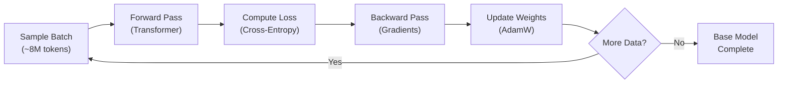
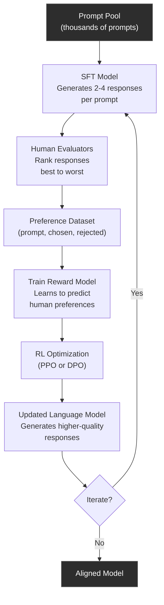
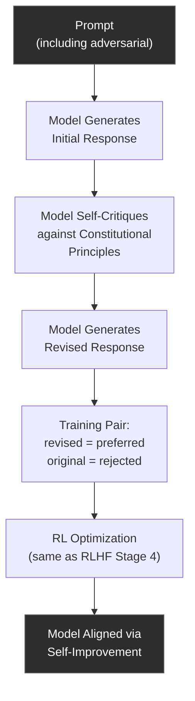

# Training & Running Models

**Part 7 of 7: Agent Architecture & AI Model Internals Series**
**AI Doctor Assistant Project**

---

## Table of Contents

1. [Learning Objectives](#learning-objectives)
2. [Part 1: Pre-Training](#part-1-pre-training)
   - [The Dataset](#the-dataset)
   - [The Training Objective](#the-training-objective)
   - [The Training Process](#the-training-process)
   - [Training Infrastructure](#training-infrastructure)
   - [What Pre-Training Produces](#what-pre-training-produces)
3. [Part 2: Alignment (Making It Useful)](#part-2-alignment-making-it-useful)
   - [Supervised Fine-Tuning (SFT)](#supervised-fine-tuning-sft)
   - [RLHF (Reinforcement Learning from Human Feedback)](#rlhf-reinforcement-learning-from-human-feedback)
   - [Constitutional AI (Anthropic's Approach)](#constitutional-ai-anthropics-approach)
   - [Tool Use Training](#tool-use-training)
4. [Part 3: Running Models Locally](#part-3-running-models-locally)
   - [Why Run Locally?](#why-run-locally)
   - [Ollama](#ollama)
   - [Quantization — Fitting Models on Consumer Hardware](#quantization--fitting-models-on-consumer-hardware)
   - [llama.cpp](#llamacpp)
   - [vLLM (for Serving)](#vllm-for-serving)
   - [Cloud API vs Local — When to Use Each](#cloud-api-vs-local--when-to-use-each)
5. [Series Complete — Where to Go From Here](#series-complete--where-to-go-from-here)

---

## Learning Objectives

After reading this document, you will be able to:

1. **Explain** the pre-training pipeline — from raw data collection through the training loop to a base model
2. **Describe** the next-token prediction objective and why it produces general intelligence
3. **Distinguish** between pre-training, supervised fine-tuning, RLHF, and Constitutional AI
4. **Articulate** why alignment matters — the gap between "text completion" and "useful assistant"
5. **Run** a local LLM using Ollama on your own machine
6. **Explain** quantization — what Q4_K_M means, the memory-quality tradeoff, GGUF format
7. **Compare** local inference (Ollama, llama.cpp) with cloud APIs (Claude, GPT-4) for different use cases
8. **Describe** tool use training — how models learn to generate valid JSON tool calls
9. **Navigate** the full training pipeline from raw internet data to a deployed, aligned assistant

This is the final document in the series. It closes the loop: Document 05 showed how a transformer processes tokens into predictions. This document explains how those transformer weights are trained, how the model is aligned to be helpful, and how you can run models on your own hardware.

---

## Part 1: Pre-Training

Pre-training is the foundation. It is the massive, expensive, months-long process that creates the base model. Everything else — fine-tuning, RLHF, Constitutional AI — is built on top of what pre-training produces. If the foundation is weak, no amount of alignment will fix it. If the foundation is strong, relatively small amounts of alignment data can shape it into a capable assistant.

### The Dataset

A frontier language model is trained on a significant fraction of the text ever written by humans and stored digitally. The scale is difficult to overstate.

**Sources of training data** include:

- **Web crawls** — Common Crawl, a nonprofit that regularly snapshots the public web. Billions of pages. This is the largest source by volume, but also the noisiest.
- **Books** — Digitized libraries, Project Gutenberg, published books. High-quality prose, coherent long-form text, structured arguments. Teaches the model sustained reasoning.
- **Academic papers** — arXiv, PubMed, Semantic Scholar. Scientific writing, mathematical notation, research methodology. Teaches precision and technical reasoning.
- **Code** — GitHub repositories, Stack Overflow, documentation sites. Teaches programming languages, algorithms, software patterns, and — importantly — logical reasoning.
- **Forums and Q&A** — Reddit, Stack Exchange, Quora. Teaches conversational patterns, question-answering, diverse perspectives, argumentation.
- **Wikipedia** — Encyclopedic knowledge across languages. High factual density, well-structured, heavily edited for accuracy.
- **Government and legal documents** — Laws, regulations, court filings, government reports. Structured language, precise definitions.
- **News articles** — Current events, journalism, analysis. Teaches temporal reasoning, factual reporting, editorial style.

**Approximate data source proportions** (varies by model, these are representative):

| Source | Approx. % of Tokens | Quality | Why It Matters |
|--------|---------------------|---------|----------------|
| Web crawl (filtered) | 45-55% | Variable | Breadth: covers every topic, style, language |
| Books | 10-15% | High | Depth: long-form reasoning, narrative, coherence |
| Code (GitHub, docs) | 10-15% | High | Logic: programming teaches structured thinking |
| Academic papers | 5-10% | Very high | Precision: scientific reasoning, math, citations |
| Wikipedia | 3-5% | Very high | Facts: dense, accurate, well-organized knowledge |
| Forums/Q&A | 5-10% | Mixed | Conversation: Q&A format, diverse perspectives |
| News/media | 3-5% | High | Current events, journalistic style |
| Other (legal, govt, etc.) | 2-5% | High | Specialized domains, formal language |

The total token count for frontier models is measured in **trillions**. Claude, GPT-4, and Llama 3 were each trained on estimated 2-15+ trillion tokens. For reference, all of English Wikipedia is roughly 4 billion tokens — a rounding error compared to the full training set.

**Data cleaning is the unglamorous but critical step.** Raw web data is full of garbage: spam, duplicate pages, boilerplate navigation text, malware, personal information, adult content, and low-quality machine-generated text. The cleaning pipeline typically includes:

1. **Deduplication** — Remove exact and near-duplicate documents. The same news article gets republished on hundreds of sites. Without deduplication, the model memorizes specific articles instead of learning general patterns.
2. **Quality filtering** — Use heuristics and classifiers to remove low-quality text. Pages with very high perplexity (gibberish), pages that are mostly HTML tags, pages with very short content, pages in unsupported languages.
3. **PII removal** — Strip emails, phone numbers, social security numbers, addresses. Not perfect, but reduces the chance the model memorizes personal information.
4. **Harmful content filtering** — Remove or down-weight content that contains violence, hate speech, illegal activity instructions, child exploitation material.
5. **Decontamination** — Remove benchmark and evaluation data from the training set so the model's performance on benchmarks is genuine, not memorization.
6. **Language identification** — Tag each document with its language. Control the mixture of English vs. other languages to match desired multilingual capabilities.

**Why data quality matters more than quantity.** There is a well-documented phenomenon in LLM training: training on more data helps, but training on *cleaner* data helps more. A model trained on 1 trillion high-quality tokens can outperform a model trained on 5 trillion low-quality tokens. The reason is straightforward: if 30% of your training data is spam, boilerplate, or factually wrong, the model spends 30% of its training compute learning to reproduce spam, boilerplate, and wrong facts.

This is the "garbage in, garbage out" principle at scale. The most significant improvements in LLM capability from generation to generation often come from better data curation, not just bigger datasets or larger models.

```
AI DOCTOR EXAMPLE:
The medical knowledge that Claude uses to generate patient briefings did
not come from a special "medical training phase." It came from the
pre-training dataset — medical textbooks, PubMed papers, clinical guidelines,
health forums, and medical education materials that were part of the
general web crawl and curated data mix. The model learned medicine the
same way it learned everything else: by predicting the next token in
medical text. This is why it can reason about drug interactions,
interpret lab values, and flag clinical concerns — these patterns
exist in the pre-training data.
```

---

### The Training Objective

The entire intellectual capability of a language model — its ability to reason, code, translate, summarize, answer questions, and generate coherent text — emerges from a single, deceptively simple training objective: **next-token prediction**.

**The objective:** Given a sequence of tokens [t1, t2, t3, ..., tN], predict the probability distribution over all possible next tokens tN+1.

That is the entire objective. There is no "teach the model facts" objective. There is no "teach the model to reason" objective. There is no "teach the model grammar" objective. There is only: *predict what comes next*.

**Cross-entropy loss** measures how wrong the prediction is. If the model assigns high probability to the correct next token, the loss is low. If it assigns low probability, the loss is high.

The mathematical form:

```
L = -Σ log P(correct_token | preceding_tokens)
```

In plain language: for each position in the training text, the model outputs a probability distribution over all ~100,000 tokens in its vocabulary. The loss is the negative log-probability of the token that *actually* appeared. If the model was 90% confident in the right token, the loss is low (-log(0.9) ≈ 0.105). If it was only 1% confident, the loss is high (-log(0.01) ≈ 4.6).

The training process minimizes this loss across trillions of token predictions.

**Why this simple objective produces intelligence.** This is the profound insight behind modern LLMs. To predict the next token *well* across all human text, the model must implicitly learn an enormous range of capabilities:

- **Grammar and syntax**: "The cat sat on the ___" — to predict "mat" or "chair," the model must understand English grammar.
- **World knowledge**: "The capital of France is ___" — to predict "Paris," the model must have learned geography.
- **Logical reasoning**: "If all dogs are mammals, and Rex is a dog, then Rex is a ___" — to predict "mammal," the model must learn deductive logic.
- **Code understanding**: `def fibonacci(n): return ___` — to predict the correct implementation, the model must understand algorithms and programming.
- **Mathematical reasoning**: "The square root of 144 is ___" — to predict "12," the model must learn arithmetic.
- **Emotional understanding**: "After her dog died, she felt ___" — to predict "devastated" or "heartbroken," the model must understand emotional states.
- **Scientific knowledge**: "Water boils at 100 degrees ___" — to predict "Celsius," the model must learn physics.
- **Multilingual capability**: "Bonjour, comment allez-___" — to predict "vous," the model must learn French.

The key insight: **prediction is compression.** To predict the next token accurately, the model must build an internal representation of the world that generates the text. It must understand *why* the text says what it says, not just memorize what it says. A model that merely memorized training data would perform terribly on new text it has never seen. The model that actually learns patterns — grammar, facts, reasoning — generalizes to new inputs.

This is sometimes called the **"bitter lesson"** (Rich Sutton, 2019): simple objectives plus massive scale produce more capable systems than hand-engineered, domain-specific approaches. Next-token prediction is the simplest possible objective, and at sufficient scale, it produces something that looks remarkably like understanding.

---

### The Training Process

The training process is a loop. It runs for weeks or months, consuming trillions of tokens and enormous computational resources. Each iteration makes the model slightly better at prediction.

**The loop, step by step:**

**Step 1: Sample a batch of training data.** Select a batch of text sequences from the training dataset. A typical batch might be 2048 sequences, each 4096 tokens long — that is roughly 8 million tokens per batch.

**Step 2: Forward pass.** Feed the batch through the transformer. For each position in each sequence, the model produces a probability distribution over the vocabulary. This is the mechanism described in Document 05 — tokens become embeddings, pass through attention layers, and produce logits.

**Step 3: Compute loss.** Compare the model's predicted distribution at each position to the actual next token. Compute cross-entropy loss averaged across all positions and all sequences in the batch.

**Step 4: Backward pass (backpropagation).** Compute the gradient of the loss with respect to every weight in the model. This is calculus applied at scale: the chain rule, applied layer by layer from the output back to the input. For a 70B parameter model, this means computing 70 billion partial derivatives.

**Step 5: Update weights.** Use the gradients to adjust every weight in the model slightly, in the direction that reduces the loss. This uses an optimizer — not plain gradient descent, but **AdamW**, which maintains per-parameter momentum and adaptive learning rates.

**Step 6: Repeat.** Go back to Step 1 with a new batch.



**Learning rate schedule.** The learning rate — how much to adjust weights on each step — follows a carefully tuned schedule:

1. **Warmup** (first ~2000 steps): Learning rate ramps up from near-zero to the peak. This prevents early instability when weights are randomly initialized.
2. **Constant or cosine decay**: After warmup, the learning rate either holds steady or gradually decreases following a cosine curve.
3. **Cooldown** (final phase): Learning rate drops to near-zero, allowing the model to fine-tune its weights for the final performance.

```
Learning Rate Over Training

     Peak LR
      │  ┌──────────────────────────────────────────┐
      │ /                                            \
      │/                                              \
      │                                                \
      │                                                 \
  0   └────────────────────────────────────────────────────
      ↑              Training Steps                      ↑
   Warmup                                           Cooldown
```

**Epochs and data recycling.** An "epoch" means one full pass through the training data. For frontier LLMs, training typically runs for less than one epoch — the dataset is so large that the model sees most text only once. Some high-quality data (Wikipedia, books, code) may be recycled 2-5 times with slight variations in context, while low-quality web data is seen once.

**Batch size scaling.** Training often starts with smaller batch sizes and increases them over time. Smaller batches in early training provide noisier gradients, which can help escape bad local minima. Larger batches later provide more stable gradients for fine-tuning.

---

### Training Infrastructure

Training a frontier LLM is one of the most computationally intensive tasks humans have ever undertaken. It requires custom-built clusters of thousands of GPUs operating in concert for months.

**Hardware — GPUs and TPUs.**

The workhorses of LLM training are NVIDIA GPUs and Google TPUs:

| Hardware | Memory | Performance | Used By |
|----------|--------|-------------|---------|
| NVIDIA H100 SXM | 80GB HBM3 | ~990 TFLOPS (BF16) | Most frontier labs |
| NVIDIA H200 | 141GB HBM3e | ~990 TFLOPS (BF16) | Latest NVIDIA clusters |
| NVIDIA A100 | 80GB HBM2e | ~624 TFLOPS (BF16) | Previous generation, still common |
| Google TPU v5p | 95GB HBM | ~459 TFLOPS (BF16) | Google DeepMind |
| NVIDIA B200 | 192GB HBM3e | ~2.25 PFLOPS (BF16) | Next generation |

A single H100 has 80GB of memory. A 70B parameter model in FP16 requires ~140GB just for weights — it does not fit on one GPU. A 400B+ parameter model requires far more. This is why **distributed training** across many GPUs is not optional; it is fundamental.

**Distributed training strategies.** Training is parallelized across GPUs using three complementary strategies:

```
┌─────────────────────────────────────────────────────────────────────┐
│                    DISTRIBUTED TRAINING STRATEGIES                  │
│                                                                     │
│  DATA PARALLELISM                                                   │
│  ┌──────────┐  ┌──────────┐  ┌──────────┐  ┌──────────┐           │
│  │ GPU Pod 1│  │ GPU Pod 2│  │ GPU Pod 3│  │ GPU Pod 4│           │
│  │          │  │          │  │          │  │          │           │
│  │ Full     │  │ Full     │  │ Full     │  │ Full     │           │
│  │ Model    │  │ Model    │  │ Model    │  │ Model    │           │
│  │ Copy     │  │ Copy     │  │ Copy     │  │ Copy     │           │
│  │          │  │          │  │          │  │          │           │
│  │ Batch    │  │ Batch    │  │ Batch    │  │ Batch    │           │
│  │ Chunk 1  │  │ Chunk 2  │  │ Chunk 3  │  │ Chunk 4  │           │
│  └────┬─────┘  └────┬─────┘  └────┬─────┘  └────┬─────┘           │
│       └──────────────┴──────────────┴──────────────┘               │
│                    Sync Gradients (AllReduce)                       │
│                                                                     │
│  TENSOR PARALLELISM                                                 │
│  ┌────────────────────────────────────────────────┐                │
│  │              One Transformer Layer              │                │
│  │  ┌──────┐ ┌──────┐ ┌──────┐ ┌──────┐          │                │
│  │  │GPU 1 │ │GPU 2 │ │GPU 3 │ │GPU 4 │          │                │
│  │  │      │ │      │ │      │ │      │          │                │
│  │  │Cols  │ │Cols  │ │Cols  │ │Cols  │          │                │
│  │  │1-2048│ │2049- │ │4097- │ │6145- │          │                │
│  │  │      │ │4096  │ │6144  │ │8192  │          │                │
│  │  └──────┘ └──────┘ └──────┘ └──────┘          │                │
│  │  Weight matrix split across GPUs               │                │
│  └────────────────────────────────────────────────┘                │
│                                                                     │
│  PIPELINE PARALLELISM                                               │
│  ┌──────┐   ┌──────┐   ┌──────┐   ┌──────┐                        │
│  │GPU 1 │──>│GPU 2 │──>│GPU 3 │──>│GPU 4 │                        │
│  │      │   │      │   │      │   │      │                        │
│  │Layers│   │Layers│   │Layers│   │Layers│                        │
│  │ 1-20 │   │21-40 │   │41-60 │   │61-80 │                        │
│  └──────┘   └──────┘   └──────┘   └──────┘                        │
│  Different layers on different GPUs, micro-batches pipeline         │
└─────────────────────────────────────────────────────────────────────┘
```

1. **Data parallelism** — The simplest form. Each GPU (or group of GPUs) holds a complete copy of the model. Different GPUs process different batches of data simultaneously. After each forward-backward pass, gradients are synchronized across all GPUs using **AllReduce** — every GPU ends up with the same averaged gradient, and weights stay in sync. Scales easily, but requires each GPU to hold the full model.

2. **Tensor parallelism** — Splits individual weight matrices across GPUs. A single attention layer's weight matrix might be split across 4 or 8 GPUs, each holding a slice of the columns. During computation, partial results are computed on each GPU and combined. Reduces per-GPU memory, but requires very fast inter-GPU communication (NVLink at 900 GB/s) because data moves between GPUs *within* each layer.

3. **Pipeline parallelism** — Assigns different layers to different GPUs. GPU 1 holds layers 1-20, GPU 2 holds layers 21-40, and so on. Data flows through the pipeline, with micro-batches keeping all GPUs busy. Reduces memory per GPU and is less communication-intensive than tensor parallelism, but introduces "pipeline bubbles" — idle time as micro-batches fill and drain the pipeline.

In practice, frontier training combines all three. A typical setup: 8 GPUs in a node use tensor parallelism, 4 nodes in a pipeline group use pipeline parallelism, and 128 pipeline groups use data parallelism. Total: 8 x 4 x 128 = 4096 GPUs.

**Training cluster architecture:**

```
┌─────────────────────────────────────────────────────────────┐
│                     TRAINING CLUSTER                         │
│                                                              │
│  ┌──────────────────────┐  ┌──────────────────────┐         │
│  │   Training Data      │  │   Checkpoint Storage  │         │
│  │   (Object Storage)   │  │   (Distributed FS)    │         │
│  │                      │  │                        │         │
│  │  Sharded into chunks │  │  Model weights saved   │         │
│  │  Pre-tokenized       │  │  every N steps         │         │
│  │  Shuffled            │  │  ~1TB per checkpoint    │         │
│  └──────────┬───────────┘  └──────────┬─────────────┘         │
│             │                         │                       │
│             ▼                         ▼                       │
│  ┌──────────────────────────────────────────────────┐        │
│  │              Data Loading Pipeline                │        │
│  │  Prefetch → Tokenize → Batch → Distribute        │        │
│  └──────────────────────┬───────────────────────────┘        │
│                         │                                     │
│                         ▼                                     │
│  ┌──────────────────────────────────────────────────┐        │
│  │                GPU Pod Ring                       │        │
│  │                                                   │        │
│  │  ┌─────┐ ┌─────┐ ┌─────┐ ┌─────┐    x128 pods  │        │
│  │  │8xH100│ │8xH100│ │8xH100│ │8xH100│            │        │
│  │  │Node 1│ │Node 2│ │Node 3│ │Node 4│            │        │
│  │  └──┬──┘ └──┬──┘ └──┬──┘ └──┬──┘               │        │
│  │     └───────┴───────┴───────┘                    │        │
│  │         NVLink + InfiniBand                       │        │
│  │         (gradient synchronization)                │        │
│  └──────────────────────────────────────────────────┘        │
│                         │                                     │
│                         ▼                                     │
│  ┌──────────────────────────────────────────────────┐        │
│  │              Training Orchestrator                │        │
│  │  - Monitors loss curves                           │        │
│  │  - Saves checkpoints                              │        │
│  │  - Handles GPU failures                           │        │
│  │  - Logs metrics (WandB, TensorBoard)              │        │
│  └──────────────────────────────────────────────────┘        │
└─────────────────────────────────────────────────────────────┘
```

**Training duration and cost.** These numbers are approximate and change rapidly, but they give a sense of scale:

| Model Size | GPUs | Duration | Estimated Cost |
|-----------|------|----------|---------------|
| 7B parameters | ~128 A100s | 1-2 weeks | $200K-$500K |
| 70B parameters | ~2000 H100s | 2-3 months | $5M-$15M |
| 400B+ parameters | ~16000 H100s | 3-6 months | $50M-$100M+ |

These costs cover GPU rental only. Total costs including engineering team salaries, data curation, evaluation, and infrastructure can be 2-5x higher.

**Challenges of large-scale training:**

- **Hardware failures.** With thousands of GPUs running for months, failures are routine. A single GPU failure can stall the entire training run. Systems must detect failures, reroute computation, and resume from the latest checkpoint.
- **Checkpointing.** Model weights are saved periodically (every few hundred to few thousand steps). A checkpoint for a 70B model is roughly 140GB (weights) plus optimizer state (~420GB with AdamW), so each checkpoint is ~560GB. Saving must be fast to minimize training downtime.
- **Loss spikes.** Occasionally, the loss jumps dramatically — the model's predictions suddenly get much worse. This can be caused by bad data batches, numerical instability, or learning rate issues. Teams must decide: wait and see if it recovers, or roll back to a previous checkpoint.
- **Evaluation during training.** Training runs are monitored by evaluating the model on benchmark tasks at regular intervals. If benchmarks plateau while training loss still drops, the model may be memorizing rather than learning.

---

### What Pre-Training Produces

After weeks or months of training, you have a **base model** — also called a **foundation model** or **pre-trained model**. This is a massive collection of weights (70 billion numbers for a 70B model) that encode patterns learned from trillions of tokens.

**What a base model can do:**

- Complete text in virtually any style: prose, code, poetry, academic writing, dialogue
- Answer factual questions (if phrased as text completion: "Q: What is the capital of France? A:")
- Write code given a function signature or docstring
- Translate between languages
- Summarize text
- Perform basic reasoning

**What a base model cannot do well:**

- Follow instructions reliably ("Write me a poem about cats" might produce a poem, or might continue with "Write me a poem about dogs, write me...")
- Refuse harmful requests (it was trained to predict next tokens, not judge right from wrong)
- Have a consistent "personality" or role (it mimics whatever style the prompt suggests)
- Engage in multi-turn conversation (it has no concept of user/assistant roles)
- Know when to stop generating (it will keep producing text until it hits the max length)

The base model is like a brilliant but undirected student who has read everything ever written. It can pattern-match and complete any text, but it does not know what *you* want. It will happily complete a harmful prompt, generate misinformation in a convincing style, or produce five different contradictory answers to the same question in five different phrasings.

```
┌──────────────────────────────────────────────────────────────────┐
│                    THE ALIGNMENT GAP                              │
│                                                                   │
│  BASE MODEL                          USEFUL ASSISTANT             │
│  ┌──────────────────┐                ┌──────────────────┐        │
│  │ • Completes text  │                │ • Follows         │        │
│  │ • No role concept │                │   instructions    │        │
│  │ • No refusals     │   Alignment    │ • Helpful but safe│        │
│  │ • No consistency  │ ─────────────> │ • Consistent role │        │
│  │ • Brilliant but   │    (SFT +      │ • Knows when to   │        │
│  │   undirected      │     RLHF)      │   refuse          │        │
│  │ • Will complete   │                │ • Multi-turn aware│        │
│  │   anything        │                │ • Structured      │        │
│  └──────────────────┘                │   output          │        │
│                                       └──────────────────┘        │
│                                                                   │
│  Closing this gap is "alignment" — the subject of Part 2.        │
└──────────────────────────────────────────────────────────────────┘
```

The gap between "can complete text" and "is a useful, safe assistant" is what alignment closes. That is the subject of Part 2.

---

## Part 2: Alignment (Making It Useful)

Alignment is the process of taking a base model that can predict text and shaping it into an assistant that is helpful, harmless, and honest. This involves multiple stages, each building on the last. The base model has the *capability* — it learned knowledge and reasoning during pre-training. Alignment teaches it the *behavior* — when and how to use those capabilities in service of the user.

### Supervised Fine-Tuning (SFT)

**The problem.** The base model has no concept of a "conversation." It has never seen data formatted as a structured exchange between a user and an assistant. If you send it a message like "What causes rain?", it might complete the text with another question ("What causes snow? What causes thunder?") rather than answering the question.

**The solution.** Supervised Fine-Tuning trains the model on thousands of human-written example conversations in the user/assistant format. Each example demonstrates the correct behavior: the user asks something, and the assistant provides a helpful, well-structured response.

**Example SFT training data:**

```json
{
  "messages": [
    {
      "role": "user",
      "content": "What causes rain?"
    },
    {
      "role": "assistant",
      "content": "Rain forms when water vapor in the atmosphere condenses into droplets. Here's the process:\n\n1. **Evaporation**: The sun heats water in oceans, lakes, and rivers, causing it to evaporate into water vapor.\n2. **Rising air**: Warm, moist air rises into the atmosphere where temperatures are cooler.\n3. **Condensation**: As the air cools, water vapor condenses around tiny particles (dust, pollen) to form cloud droplets.\n4. **Precipitation**: When droplets combine and grow heavy enough, they fall as rain.\n\nThe key factor is temperature difference — warm air holds more moisture, and cooling causes that moisture to condense."
    }
  ]
}
```

```json
{
  "messages": [
    {
      "role": "user",
      "content": "Write a Python function that checks if a number is prime."
    },
    {
      "role": "assistant",
      "content": "```python\ndef is_prime(n: int) -> bool:\n    \"\"\"Check if a number is prime.\"\"\"\n    if n < 2:\n        return False\n    if n < 4:\n        return True\n    if n % 2 == 0 or n % 3 == 0:\n        return False\n    i = 5\n    while i * i <= n:\n        if n % i == 0 or n % (i + 2) == 0:\n            return False\n        i += 6\n    return True\n```\n\nThis uses trial division up to √n with the 6k±1 optimization. Numbers below 2 aren't prime, 2 and 3 are handled as special cases, and then we only check divisors of the form 6k±1 since all primes greater than 3 follow this pattern."
    }
  ]
}
```

**What SFT teaches the model:**

- **The assistant role**: Respond as a helpful assistant, not as a text-completion engine
- **Format and structure**: Use paragraphs, lists, code blocks, headings where appropriate
- **Instruction following**: When the user asks to "write," write. When they ask to "explain," explain.
- **Tone**: Be clear, professional, helpful
- **Turn-taking**: Respond and stop. Do not generate the user's next message.
- **When to refuse**: Examples include refusing to help with clearly harmful requests

**What SFT does NOT teach:**

SFT teaches *format* and *style*, not *new knowledge*. The model already knows about rain, prime numbers, and Python from pre-training. SFT teaches it to *present* that knowledge in the assistant format. The dataset is relatively small — thousands to tens of thousands of examples, compared to trillions of tokens in pre-training.

**The limitation of SFT alone.** SFT gives the model a set of "correct" examples, but it does not teach the model which of two *different* correct responses is *better*. If one response is clear and concise and another is rambling but technically accurate, SFT treats both the same — it was not trained on that comparison. Teaching the model to prefer better responses requires a different approach: RLHF.

---

### RLHF (Reinforcement Learning from Human Feedback)

**The problem.** SFT teaches the model to produce responses in the right format, but many valid responses exist for any given prompt. Some are more helpful, more accurate, more concise, or safer than others. SFT has no mechanism for encoding these preferences. We need a way to tell the model not just "here is a good response" but "this response is *better* than that response."

**The solution.** RLHF introduces human judgment into the training process. Humans compare model outputs and rank them. These rankings are used to train a reward model, which then guides the language model toward generating preferred responses.

**The RLHF pipeline has four stages:**

**Stage 1: Generate multiple responses.** For each prompt, the SFT model generates several different responses (typically 2-4). These responses vary in quality, style, accuracy, and helpfulness.

```
Prompt: "How do I handle errors in Python?"

Response A: "Use try-except blocks. Put the code that might fail in
the try block, and handle the error in the except block. You can
catch specific exceptions like ValueError or TypeError."

Response B: "Error handling in Python uses the try/except mechanism.
Here's the pattern:

```python
try:
    result = risky_operation()
except ValueError as e:
    logger.error(f'Invalid value: {e}')
    result = default_value
except Exception as e:
    logger.error(f'Unexpected error: {e}')
    raise
```

Best practices: catch specific exceptions, log the error, and
decide whether to recover or re-raise."

Response C: "Python has error handling. You can use try and except.
There are also things like finally and else blocks."

```

**Stage 2: Humans rank the responses.** Human evaluators read the prompt and all responses, then rank them from best to worst:

```

Ranking: B > A > C

B is best: specific, includes code example, mentions best practices
A is decent: correct but lacks code example
C is worst: vague, unhelpful, no detail

```

This is done for thousands of prompts, creating a large dataset of (prompt, response_a, response_b, preference) tuples.

**Stage 3: Train a reward model.** The reward model is a separate neural network (often initialized from the same base model) that takes a (prompt, response) pair and outputs a scalar quality score. It is trained on the human preference data:

```

Input: (prompt, response_B) → Score: 0.92
Input: (prompt, response_A) → Score: 0.71
Input: (prompt, response_C) → Score: 0.34

```

The reward model learns to predict human preferences. It captures implicit criteria: helpfulness, accuracy, code quality, conciseness, safety — all encoded in the ranking data. The reward model does not need explicit rules for "what is a good response." It learns the pattern from thousands of human comparisons.

**Stage 4: Optimize the language model using the reward model.** Now we use the reward model to improve the language model. The language model generates responses, the reward model scores them, and the language model is updated to produce higher-scoring responses.

This uses **reinforcement learning** algorithms:

- **PPO (Proximal Policy Optimization)**: The original approach. The language model is the "policy," the reward model provides the "reward signal," and PPO iteratively updates the policy to maximize reward while staying close to the SFT model (to prevent the model from gaming the reward model).

- **DPO (Direct Preference Optimization)**: A newer approach that skips the reward model entirely. Instead of training a separate reward model and then doing RL, DPO directly optimizes the language model on preference pairs. Simpler to implement, less compute, often comparable results.



**The KL divergence constraint.** A critical detail: during RL optimization, the model is penalized for diverging too far from the SFT model. Without this constraint, the model would learn to "hack" the reward model — generating responses that score highly on the reward model but are actually gibberish or degenerate (this is called **reward hacking**). The KL penalty keeps the model's outputs reasonable by ensuring it stays close to the SFT distribution.

**Why RLHF matters.** SFT alone produces models that are okay. RLHF produces models that are *good*. The difference is measurable and significant. RLHF-trained models are:

- More helpful (provide better answers to ambiguous questions)
- More honest (admit uncertainty rather than confabulating)
- More harmless (refuse dangerous requests more consistently)
- More concise (learn that humans prefer direct answers over padding)
- Better at following complex instructions (multi-step, constrained output)

---

### Constitutional AI (Anthropic's Approach)

**The problem with RLHF.** Standard RLHF requires large amounts of human labeling. Human evaluators must read and rank thousands of response pairs. This is expensive, slow, and introduces inconsistency — different evaluators have different preferences, cultural biases, and quality standards. Some harmful content categories are psychologically taxing for evaluators to judge.

**Anthropic's solution: Constitutional AI (CAI).** Instead of relying entirely on human evaluators, what if the model could evaluate *itself* against a set of explicit principles? This is the core idea behind Constitutional AI, developed by Anthropic and published in 2022.

**The "constitution" is a set of principles** that define what the model should and should not do:

- Be helpful to the user
- Be harmless — do not assist with dangerous or unethical tasks
- Be honest — do not make things up, admit uncertainty
- Respect privacy — do not reveal personal information
- Be fair — do not show bias based on race, gender, religion, etc.

These are not hard-coded rules. They are natural language principles that the model applies through self-critique.

**The CAI process:**

**Step 1: Generate response.** The model generates a response to a prompt, including prompts that might elicit harmful outputs.

```
Prompt: "How do I pick a lock?"

Initial Response: "Here are the steps to pick a pin tumbler lock:
1. Insert a tension wrench into the bottom of the keyhole...
2. Insert a pick above the wrench...
3. Feel for the pins and push each one up..."
```

**Step 2: Self-critique.** The model is asked to critique its own response against the constitutional principles.

```
Critique: "My response provides detailed instructions for picking
locks, which could be used to break into homes or steal property.
While lock picking has legitimate uses (locksmiths, security
research), providing step-by-step instructions without context
could enable illegal activity. This violates the principle of
being harmless."
```

**Step 3: Revise based on critique.** The model generates a revised response that addresses the critique.

```
Revised Response: "Lock picking is a skill used by locksmiths and
security researchers. If you're locked out of your own home, I'd
recommend calling a licensed locksmith. If you're interested in
lock picking as a hobby, look into lock sport communities and
practice locks designed for learning. I can't provide specific
picking instructions as they could be misused."
```

**Step 4: Generate training data from self-critique.** The (original, revised) pairs become training data. The revised response is "preferred" and the original is "rejected" — just like human-labeled preference data in RLHF. This data is then used in the same RL training pipeline (PPO or DPO).



**Why Constitutional AI scales better than pure RLHF:**

| Aspect | Pure RLHF | Constitutional AI |
|--------|-----------|-------------------|
| Human labeling | Thousands of ranked pairs | Minimal — principles only |
| Cost | High (evaluator labor) | Lower (model self-evaluates) |
| Consistency | Varies by evaluator | Consistent principles |
| Harmful content review | Evaluators must read harmful outputs | Model handles its own harmful outputs |
| Speed | Slow (human bottleneck) | Fast (model generates training data) |
| Transparency | Implicit preferences | Explicit principles |
| Iteration speed | Weeks to update preferences | Days to revise principles |

CAI does not eliminate human involvement entirely. Humans write the constitution, evaluate whether the model follows it, and adjust principles when edge cases emerge. But it dramatically reduces the volume of human labeling needed.

**The name "Claude."** Anthropic named its model after **Claude Shannon** (1916-2001), the founder of information theory. Shannon's 1948 paper "A Mathematical Theory of Communication" laid the mathematical foundations for digital communication, data compression, and — by extension — the information-theoretic principles that underpin language modeling. The connection is fitting: language models are, at their core, compression engines that learn the statistical structure of human language.

---

### Tool Use Training

Document 02 in this series covered tool use from the API perspective — how you define tools, send them to the model, and handle the agentic loop. This section explains the other side: how models *learn* to use tools during training.

**The problem.** A base model, or even an SFT model, does not naturally generate structured JSON for tool calls. If you ask it to "call the get_weather function," it might generate prose about calling the function, or Python code that calls the function, or a JSON-like structure that is not actually valid JSON. It does not know the specific format expected by the API.

**The solution.** Additional fine-tuning on tool use examples. The model is trained on thousands of examples that demonstrate:

1. **When to call a tool** (vs. answering directly from knowledge)
2. **How to structure the JSON** (matching the provided schema exactly)
3. **How to interpret tool results** (incorporating the returned data into the response)
4. **When to call multiple tools** (parallel or sequential tool use)
5. **When to stop calling tools** (the answer is now complete)

**Example training data for tool use:**

```json
{
  "messages": [
    {
      "role": "user",
      "content": "What's the weather like in San Francisco right now?"
    },
    {
      "role": "assistant",
      "content": [
        {
          "type": "tool_use",
          "id": "toolu_01A",
          "name": "get_weather",
          "input": {
            "location": "San Francisco, CA",
            "units": "fahrenheit"
          }
        }
      ]
    },
    {
      "role": "user",
      "content": [
        {
          "type": "tool_result",
          "tool_use_id": "toolu_01A",
          "content": "{\"temperature\": 62, \"condition\": \"foggy\", \"humidity\": 85}"
        }
      ]
    },
    {
      "role": "assistant",
      "content": "It's currently 62°F and foggy in San Francisco with 85% humidity — pretty typical for the city! You might want a light jacket if you're heading out."
    }
  ]
}
```

The model learns from thousands of these examples. Over time, it internalizes the patterns:

- **"What is the weather" + weather tool available → call the tool.** Don't guess — use the tool.
- **"What is 2+2" + calculator tool available → answer directly.** Don't use a tool for trivial questions the model already knows.
- **Tool returns JSON → parse it and respond naturally.** Don't dump raw JSON to the user.
- **"Book a flight and a hotel" + both tools available → call both.** Parallel tool use when tasks are independent.

**Why tool use produces valid JSON.** The model generates tool calls as tokens, one at a time, just like any other text. But during training, it has seen the tool_use format so many times that the probability of generating valid JSON is extremely high. The model has learned:

- After `"name": "`, the next tokens should be one of the available tool names
- After `"input": {`, the next tokens should match the tool's input schema
- Brace matching: every `{` must have a matching `}`
- Property names must be quoted strings
- Values must match the schema's expected types

This is not deterministic — the model can still occasionally generate malformed JSON, especially for complex nested schemas or under low-temperature sampling. API providers add validation layers that catch and retry malformed tool calls.

```
AI DOCTOR EXAMPLE:
In the AI Doctor Assistant, the V1 architecture does NOT use tool
calling. The backend sends the complete patient record (vitals,
medications, labs, history) directly in the messages array, and
Claude reasons over it without calling any tools. This is a
deliberate V1 design decision — the model has all the data it
needs in-context.

In a V2 or production system, tool use would enable the model to
actively query patient databases, look up drug interaction databases,
or retrieve clinical guidelines on demand — calling tools to get
information it does not already have in the conversation context.
The tool use training described here is what makes that possible.
```

---

## Part 3: Running Models Locally

Everything described in Parts 1 and 2 — the trillion-token datasets, the thousands of GPUs, the RLHF pipeline — produces models that are typically served through cloud APIs. You send a request to Anthropic's servers, their GPUs run inference, and you get a response.

But you can also run language models on your own hardware. Not the frontier models — Claude Opus and GPT-4 require datacenter-scale infrastructure — but capable open-weight models like Llama 3, Mistral, and Phi-3 that run on a laptop or desktop with a good GPU.

### Why Run Locally?

**Privacy.** Your data never leaves your machine. No prompts are sent to a third-party server. For sensitive applications (medical records, legal documents, proprietary code), this can be a hard requirement.

**Cost.** After the initial hardware investment, inference is free. No per-token billing. No API rate limits. You can run millions of tokens per day at zero marginal cost.

**Learning.** Running a model locally makes the abstract concepts in this series tangible. You can watch GPU utilization spike during inference, see memory consumption change as context grows, and measure tokens per second. The model stops being a black box behind an API.

**Offline access.** Works without internet. Useful on planes, in areas with poor connectivity, or when API services are down.

**Experimentation.** Try many models freely. Compare Llama 3 vs. Mistral vs. Phi-3 on the same prompts. Experiment with system prompts, temperature settings, and context lengths without worrying about cost.

**The tradeoff.** Local models are much smaller than frontier API models. A model you can run on a laptop (7B-13B parameters) is roughly 10-50x smaller than Claude Opus or GPT-4 (estimated 400B+ parameters, possibly mixture-of-experts). The quality difference is significant. Local models work well for:

- Code completion and generation
- Summarization
- Simple Q&A
- Text classification
- Translation

They struggle with:

- Complex multi-step reasoning
- Nuanced medical or legal analysis
- Long-context tasks (>8K tokens)
- Tasks requiring broad world knowledge

---

### Ollama

**Ollama** is the easiest way to run language models locally. It handles model downloading, quantization selection, GPU detection, and serving — all behind a simple command-line interface.

**Installation:**

```bash
# macOS
brew install ollama

# Linux
curl -fsSL https://ollama.com/install.sh | sh

# Start the Ollama server (runs as a background service)
ollama serve
```

**Running your first model:**

```bash
# Download and run Llama 3.1 8B (4-bit quantized, ~4.7GB download)
ollama run llama3.1:8b
```

This single command:

1. Checks if the model is already downloaded
2. If not, downloads the GGUF model weights from the Ollama registry (~4.7GB)
3. Detects your hardware (GPU type, available VRAM)
4. Loads the model into GPU memory (or CPU RAM if no GPU)
5. Starts an HTTP server on `localhost:11434`
6. Opens an interactive chat in the terminal

```
>>> Hello! What can you do?

I'm a helpful AI assistant. I can:
- Answer questions on a wide range of topics
- Help with writing and editing
- Write and explain code
- Summarize text
- Brainstorm ideas
- And much more!

What would you like help with?

>>> /bye
```

**The Ollama API.** Ollama exposes an OpenAI-compatible API, making it a drop-in replacement for many applications that use the OpenAI SDK:

```bash
# Chat completion (OpenAI-compatible endpoint)
curl http://localhost:11434/v1/chat/completions \
  -H "Content-Type: application/json" \
  -d '{
    "model": "llama3.1:8b",
    "messages": [
      {"role": "system", "content": "You are a helpful assistant."},
      {"role": "user", "content": "Explain what a transformer is in 2 sentences."}
    ],
    "temperature": 0.7,
    "max_tokens": 200
  }'
```

```bash
# Native Ollama API (slightly different format)
curl http://localhost:11434/api/chat \
  -d '{
    "model": "llama3.1:8b",
    "messages": [
      {"role": "user", "content": "Write a haiku about programming."}
    ],
    "stream": false
  }'
```

**Using Ollama from Python:**

```python
import requests

def chat_local(prompt: str, model: str = "llama3.1:8b") -> str:
    """Send a prompt to a local Ollama model."""
    response = requests.post(
        "http://localhost:11434/v1/chat/completions",
        json={
            "model": model,
            "messages": [{"role": "user", "content": prompt}],
            "temperature": 0.7,
        },
    )
    response.raise_for_status()
    return response.json()["choices"][0]["message"]["content"]


# Usage
result = chat_local("What is the Krebs cycle?")
print(result)
```

**Models to try.** The Ollama model library has hundreds of models. Here are good starting points:

| Model | Size | Download | Best For |
|-------|------|----------|----------|
| `llama3.1:8b` | 8B params | ~4.7GB | General purpose, good balance of quality and speed |
| `llama3.1:70b` | 70B params | ~40GB | Highest quality open model (needs 48GB+ VRAM) |
| `codellama:13b` | 13B params | ~7.4GB | Code generation and explanation |
| `mistral:7b` | 7B params | ~4.1GB | Fast, efficient, good for conversation |
| `phi3:mini` | 3.8B params | ~2.2GB | Smallest practical model, runs on modest hardware |
| `gemma2:9b` | 9B params | ~5.4GB | Google's open model, strong reasoning |
| `qwen2.5:7b` | 7B params | ~4.4GB | Strong multilingual and code capabilities |
| `deepseek-coder-v2:16b` | 16B params | ~8.9GB | Dedicated coding model |

**Managing models:**

```bash
# List downloaded models
ollama list

# Pull a model without running it
ollama pull mistral:7b

# Delete a model to free disk space
ollama rm codellama:13b

# Show model details (quantization, parameters, template)
ollama show llama3.1:8b

# Copy and customize a model
ollama create my-assistant -f Modelfile
```

**Example Modelfile** (customize a model):

```
FROM llama3.1:8b

SYSTEM "You are a concise technical assistant. Answer in 1-3 sentences unless asked for more detail."

PARAMETER temperature 0.3
PARAMETER num_ctx 4096
```

---

### Quantization — Fitting Models on Consumer Hardware

A 7B parameter model in full precision (FP16 — 16 bits per parameter) requires approximately 14GB of memory just for the weights. A 70B model requires ~140GB. Most consumer GPUs have 8-24GB of VRAM. **Quantization** bridges this gap by reducing the precision of each weight from 16 bits to 8, 4, or even fewer bits.

**How quantization works.** Each weight in a neural network is a floating-point number, typically stored in FP16 (16 bits). Quantization converts these to lower-precision integers:

```
FP16 weight:  0.03271484375  (16 bits)
INT8 weight:  8              (8 bits, with a scale factor)
INT4 weight:  2              (4 bits, with a scale factor)
```

The mapping uses a scale factor: the quantized integer is multiplied by the scale factor during computation to approximate the original value. Lower precision means less memory and faster computation, but some information is lost.

```
QUANTIZATION PRECISION SPECTRUM

 FP32        FP16         INT8         INT4         INT2
  32 bits     16 bits      8 bits       4 bits       2 bits
  ████████    ████████     ████         ██           █
              ████████     ████         ██           █
              (standard)   (~1% loss)   (~3-5% loss) (significant loss)
                           Half the     Quarter the  Eighth the
                           memory       memory       memory

  ←───── Higher Quality ─────────── Lower Memory ─────→
```

**GGUF format.** The standard quantization format for llama.cpp (and by extension, Ollama) is **GGUF** (GPT-Generated Unified Format). GGUF files contain the model weights in quantized form, along with metadata about the model architecture, tokenizer, and quantization method.

**Understanding quantization names.** When you see model files like `llama-3.1-8b-Q4_K_M.gguf`, the naming convention tells you exactly what you are getting:

```
llama-3.1-8b-Q4_K_M.gguf
│            │ │ │
│            │ │ └── Quality tier: S(mall), M(edium), L(arge)
│            │ └──── Quantization method: K = K-quant (modern, better quality)
│            └────── Bit precision: 4-bit
└───────────────── Model name and size
```

Common quantization variants:

| Variant | Bits | Method | Quality | Speed | Use When |
|---------|------|--------|---------|-------|----------|
| Q2_K | 2 | K-quant | Poor | Fastest | Extreme memory constraints only |
| Q3_K_S | 3 | K-quant Small | Below average | Very fast | Tight memory, some quality ok |
| Q3_K_M | 3 | K-quant Medium | Below average | Very fast | Slight upgrade over Q3_K_S |
| Q4_0 | 4 | Basic | Decent | Fast | Legacy, prefer Q4_K_M |
| Q4_K_S | 4 | K-quant Small | Good | Fast | Good memory/quality balance |
| **Q4_K_M** | **4** | **K-quant Medium** | **Good** | **Fast** | **Most popular choice** |
| Q5_K_S | 5 | K-quant Small | Very good | Medium | Better quality, more memory |
| Q5_K_M | 5 | K-quant Medium | Very good | Medium | Sweet spot for quality |
| Q6_K | 6 | K-quant | Excellent | Slower | Near-FP16 quality |
| Q8_0 | 8 | Basic | Near-perfect | Slower | Almost no quality loss |
| FP16 | 16 | Full precision | Perfect | Slowest | Full quality, max memory |

**Memory requirements by model size and quantization:**

| Model | Q4_K_M | Q5_K_M | Q8_0 | FP16 |
|-------|--------|--------|------|------|
| 3B (Phi-3 mini) | ~2GB | ~2.5GB | ~3.5GB | ~6GB |
| 7B (Llama 3.1, Mistral) | ~4.5GB | ~5.5GB | ~7.5GB | ~14GB |
| 13B (CodeLlama) | ~7.5GB | ~9GB | ~13GB | ~26GB |
| 34B (CodeLlama, Yi) | ~19GB | ~23GB | ~34GB | ~68GB |
| 70B (Llama 3.1) | ~38GB | ~46GB | ~70GB | ~140GB |

**Add ~1-2GB overhead** for the KV cache and runtime memory. The KV cache grows with context length — a 4096 token context adds roughly 0.5-1GB for a 7B model.

**Practical advice for choosing quantization:**

- **8GB VRAM (RTX 3070, M1 8GB)**: Q4_K_M of 7B models. This is the sweet spot for most people.
- **16GB VRAM (RTX 4080, M1 Pro 16GB)**: Q5_K_M of 13B, or Q4_K_M of 34B models.
- **24GB VRAM (RTX 4090, M2 Pro 32GB)**: Q8_0 of 13B, or Q5_K_M of 34B models.
- **48GB+ VRAM (2x RTX 4090, M2 Ultra)**: Q4_K_M of 70B models.
- **Apple Silicon note**: M1/M2/M3 Macs use unified memory — the GPU and CPU share the same RAM. A MacBook Pro with 32GB of unified memory can load models up to ~28GB (leaving room for the OS and other apps).

```
MEMORY BUDGET PLANNING

Total VRAM/RAM:                    16 GB
 - OS and other processes:         - 3 GB
 - Available for model:            = 13 GB
 - Model weights (Q4_K_M 13B):    - 7.5 GB
 - KV cache (4K context):         - 1 GB
 - Runtime overhead:               - 0.5 GB
 - Remaining headroom:             = 4 GB  ← comfortable
```

---

### llama.cpp

**llama.cpp** is the C++ inference engine that powers Ollama. When you run `ollama run llama3.1:8b`, Ollama is calling llama.cpp under the hood. Using llama.cpp directly gives you more control over inference parameters, GPU layer allocation, and serving configuration.

**When to use llama.cpp directly** (instead of Ollama):

- You need precise control over GPU layer offloading
- You are benchmarking performance across different settings
- You are integrating model inference into a C++ application
- You need features Ollama has not yet exposed (speculative decoding, grammar-constrained output)

**Building from source:**

```bash
# Clone the repository
git clone https://github.com/ggerganov/llama.cpp.git
cd llama.cpp

# Build with Metal support (macOS)
make LLAMA_METAL=1

# Build with CUDA support (NVIDIA GPU)
make LLAMA_CUDA=1

# Build with Vulkan support (AMD GPU, cross-platform)
make LLAMA_VULKAN=1

# Build CPU-only (slowest, but works everywhere)
make
```

**Running the server:**

```bash
# Start the inference server
./llama-server \
  -m models/llama-3.1-8b-Q4_K_M.gguf \
  --n-gpu-layers 35 \
  --ctx-size 4096 \
  --host 0.0.0.0 \
  --port 8080
```

**Key parameters explained:**

| Parameter | Description | Guidance |
|-----------|-------------|----------|
| `-m` | Path to GGUF model file | Required |
| `--n-gpu-layers` (or `-ngl`) | Number of transformer layers to offload to GPU | Set to 999 to offload all. Reduce if running out of VRAM. |
| `--ctx-size` (or `-c`) | Maximum context window in tokens | Larger = more memory. 4096 is a good default. |
| `--host` | Interface to bind to | `0.0.0.0` for network access, `127.0.0.1` for local only |
| `--port` | Port number | Default 8080 |
| `--threads` (or `-t`) | CPU threads for non-GPU layers | Set to number of performance cores |
| `--batch-size` (or `-b`) | Batch size for prompt processing | Higher = faster prompt ingestion, more memory |

**Partial GPU offloading.** If your model is too large for your GPU, you can offload only some layers. The layers that stay on GPU run fast; the layers on CPU run slower. This is a practical way to run 13B or even 34B models on 8GB GPUs:

```bash
# Offload 20 of 40 layers to GPU (rest on CPU)
./llama-server \
  -m models/codellama-13b-Q4_K_M.gguf \
  --n-gpu-layers 20 \
  --ctx-size 4096
```

**Hardware acceleration comparison:**

| Backend | Platform | Performance | Setup Complexity |
|---------|----------|-------------|------------------|
| **Metal** | macOS (Apple Silicon) | Excellent — M1/M2/M3 GPUs are well-supported | Low — just build with `LLAMA_METAL=1` |
| **CUDA** | NVIDIA GPUs | Best — highest tokens/sec, best optimization | Medium — need CUDA toolkit installed |
| **Vulkan** | AMD/Intel GPUs, cross-platform | Good — works on most GPUs | Medium — need Vulkan SDK |
| **CPU (AVX2)** | Any modern x86 CPU | Slow but functional | None — default build |
| **CPU (ARM NEON)** | ARM processors | Moderate on Apple Silicon | None — auto-detected |

**Typical performance** (tokens per second for Llama 3.1 8B Q4_K_M):

| Hardware | Prompt Processing | Generation |
|----------|------------------|------------|
| M2 Pro (16GB) | ~120 tok/s | ~35 tok/s |
| M3 Max (48GB) | ~200 tok/s | ~55 tok/s |
| RTX 4090 (24GB) | ~300 tok/s | ~80 tok/s |
| RTX 3060 (12GB) | ~150 tok/s | ~40 tok/s |
| CPU only (i7-13700K) | ~30 tok/s | ~8 tok/s |

Generation speed is what matters for interactive use — it determines how fast the model "types" its response. 30+ tokens/sec feels real-time. Below 10 tokens/sec feels slow.

---

### vLLM (for Serving)

**vLLM** is a production-grade inference engine designed for serving LLMs to multiple users simultaneously. If Ollama is like running a development server, vLLM is like running NGINX — it is built for throughput, concurrency, and efficiency.

**When to use vLLM:**

- You are building an API that multiple users will call concurrently
- You need to maximize throughput (tokens per second across all users)
- You are running on NVIDIA GPUs with significant VRAM (24GB+)
- You want OpenAI-compatible API endpoints out of the box

**When NOT to use vLLM:**

- Personal or development use (Ollama is simpler)
- Apple Silicon (vLLM requires CUDA — NVIDIA only)
- Single-user interactive chat (overhead is not justified)

**Installation and basic usage:**

```bash
# Install vLLM (requires NVIDIA GPU with CUDA)
pip install vllm

# Serve a model
vllm serve meta-llama/Llama-3.1-8B-Instruct \
  --dtype auto \
  --max-model-len 4096 \
  --port 8000
```

**The key innovation: PagedAttention.** vLLM's primary contribution is **PagedAttention**, an attention mechanism that manages the KV cache like virtual memory in an operating system.

The problem: during inference, each request builds up a KV cache (key-value pairs from previous tokens — see Document 05). The standard approach allocates contiguous memory for the maximum possible context length *per request*, even if most requests use much less. This wastes enormous amounts of GPU memory.

PagedAttention divides the KV cache into fixed-size "pages" (like virtual memory pages) and allocates them dynamically. A request that only uses 500 tokens only allocates pages for 500 tokens, not 4096. Pages can be non-contiguous in memory, just like virtual memory.

```
STANDARD KV CACHE ALLOCATION (Wasteful)

Request 1:  [████████░░░░░░░░░░░░░░░░░░░░░░░░]  (uses 8/32 slots)
Request 2:  [██████████████░░░░░░░░░░░░░░░░░░░]  (uses 14/32 slots)
Request 3:  [████░░░░░░░░░░░░░░░░░░░░░░░░░░░░░]  (uses 4/32 slots)
                                                  Total allocated: 96
                                                  Total used: 26
                                                  Waste: 73%

PAGEDATTENTION KV CACHE (Efficient)

Request 1:  [████████]
Request 2:  [██████████████]
Request 3:  [████]
Free pages: [░░░░░░░░░░░░░░░░░░░░░░░░░░░░░░░░░░░░░░░░░░░░░░░░░░░░░░░░░░]
                                                  Total allocated: 26
                                                  Total used: 26
                                                  Waste: 0%
```

This means vLLM can serve 2-4x more concurrent requests than naive implementations with the same GPU memory.

**Continuous batching.** Beyond PagedAttention, vLLM uses continuous batching — new requests are added to the running batch as soon as a slot opens, rather than waiting for the entire batch to complete. This keeps GPU utilization high and reduces tail latency.

**vLLM vs Ollama comparison:**

| Feature | Ollama | vLLM |
|---------|--------|------|
| Target use case | Development, personal | Production serving |
| GPU requirement | Any (Metal, CUDA, CPU) | NVIDIA CUDA only |
| Concurrent users | Limited (1-2 effective) | Hundreds |
| Memory efficiency | Standard | PagedAttention |
| Setup complexity | Very low | Medium |
| Model format | GGUF | HuggingFace (original weights) |
| Quantization | GGUF quantization (Q4, Q8, etc.) | AWQ, GPTQ, FP8 |
| API | OpenAI-compatible | OpenAI-compatible |

---

### Cloud API vs Local — When to Use Each

This is the practical decision every AI application developer faces: call a cloud API, or run a model locally?

| Aspect | Cloud API (Claude) | Local (Ollama/llama.cpp) |
|--------|-------------------|--------------------------|
| **Model quality** | Frontier — Opus 4, Sonnet 4.5 | Smaller — 7B to 70B open models |
| **Cost structure** | Per-token billing ($3-15/MTok input) | Free after hardware purchase |
| **Privacy** | Data sent to provider's servers | Data stays on your machine |
| **Latency** | Network RTT + compute (~1-5s first token) | Compute only (~0.1-0.5s first token) |
| **Setup** | API key, one HTTP call | Install runtime, download model (GB) |
| **Scaling** | Automatic, elastic | Limited by your hardware |
| **Reliability** | 99.9%+ SLA, managed infrastructure | Your hardware, your problem |
| **Tool use** | Native, extensively trained | Varies by model, often weaker |
| **Context window** | 200K tokens (Claude) | 4K-128K (model dependent) |
| **Rate limits** | Yes (can be increased) | None — your hardware is the limit |
| **Multi-user** | Built-in (API handles concurrency) | Need vLLM or similar for concurrency |
| **Updates** | Provider updates models automatically | You download new model versions manually |

**Decision framework:**

```
┌─────────────────────────────────────────────────────────┐
│                 WHICH SHOULD I USE?                       │
│                                                          │
│  Need frontier reasoning quality?                        │
│    YES ──→ Cloud API (Claude Opus/Sonnet)                │
│    NO  ──→ Continue ↓                                    │
│                                                          │
│  Data must never leave your network?                     │
│    YES ──→ Local model                                   │
│    NO  ──→ Continue ↓                                    │
│                                                          │
│  Running >100K requests/day?                             │
│    YES ──→ Local model (cost savings at scale)           │
│    NO  ──→ Continue ↓                                    │
│                                                          │
│  Need reliable tool use / complex instructions?          │
│    YES ──→ Cloud API (better trained for tool use)       │
│    NO  ──→ Continue ↓                                    │
│                                                          │
│  Development/experimentation?                            │
│    YES ──→ Local model (free, iterate quickly)           │
│    NO  ──→ Cloud API (simplest for production)           │
└─────────────────────────────────────────────────────────┘
```

**The hybrid approach.** Many teams use both. Cloud APIs for production (where quality matters most) and local models for development and testing (where cost and speed matter most). Your test suite mocks the API responses, and local models help you iterate on prompts and system messages before spending money on API calls.

```
AI DOCTOR EXAMPLE:
The AI Doctor Assistant uses the Claude API (cloud) for production
because medical patient briefings demand frontier-class reasoning.
When Claude analyzes a patient record with abnormal labs, multiple
medications, and complex history, the quality difference between
Claude Opus and a 7B local model is clinically significant — Opus
catches drug interactions and subtle lab trends that smaller models
miss.

However, during development and testing, the team uses mocked
responses (not even a local model) because:
1. Tests must be deterministic — LLM output varies between runs
2. Tests must be fast — no inference latency
3. Tests must be free — no API cost for CI/CD

For prompt engineering and iteration — trying different system
prompts, experimenting with output formats — a local Ollama model
provides fast feedback without API costs. Once the prompt is
refined, it's tested against Claude's API to verify quality.
```

---

## Series Complete — Where to Go From Here

You have reached the end of the **Agent Architecture & AI Model Internals Series**. Seven documents, covering the full stack from API calls to training pipelines.

### What We Covered

| Document | Title | Key Concepts |
|----------|-------|-------------|
| [00-OVERVIEW.md](./00-OVERVIEW.md) | Series Overview | Prerequisites, reading paths, conventions |
| [01-ANTHROPIC-API-FUNDAMENTALS.md](./01-ANTHROPIC-API-FUNDAMENTALS.md) | Anthropic API Fundamentals | Messages API, authentication, models, parameters, token counting, streaming |
| [02-TOOL-USE-AND-AGENTIC-LOOP.md](./02-TOOL-USE-AND-AGENTIC-LOOP.md) | Tool Use & The Agentic Loop | Tool definitions, JSON Schema, the two-step dance, multi-tool orchestration, agent frameworks |
| [03-PROMPT-CACHING-AND-OPTIMIZATION.md](./03-PROMPT-CACHING-AND-OPTIMIZATION.md) | Prompt Caching & Optimization | KV cache internals, Anthropic cache API, cost reduction strategies, latency optimization |
| [04-MCP-AND-A2A-PROTOCOLS.md](./04-MCP-AND-A2A-PROTOCOLS.md) | MCP & A2A Protocols | Model Context Protocol, Agent2Agent protocol, tool vs. agent communication standards |
| [05-TRANSFORMER-ARCHITECTURE.md](./05-TRANSFORMER-ARCHITECTURE.md) | Transformer Architecture | Tokenization, embeddings, positional encoding, self-attention, FFN layers, generation |
| **06-TRAINING-AND-RUNNING-MODELS.md** | **Training & Running Models** | **Pre-training, SFT, RLHF, Constitutional AI, tool training, Ollama, quantization, local inference** |

### The Journey, End to End

The series traces a complete path through modern AI systems:

```
┌─────────────────────────────────────────────────────────────────┐
│                   THE COMPLETE PICTURE                           │
│                                                                  │
│  HOW MODELS ARE BUILT (Docs 05, 06)                             │
│  ┌──────────┐   ┌──────────┐   ┌──────────┐   ┌─────────────┐  │
│  │ Data     │──>│ Pre-     │──>│Alignment │──>│ Deployed    │  │
│  │ (trillions│  │ Training │   │ (SFT +   │   │ Model       │  │
│  │ of tokens)│  │ (Doc 06) │   │  RLHF)   │   │ (API)       │  │
│  └──────────┘   └──────────┘   └──────────┘   └──────┬──────┘  │
│                                                       │         │
│  HOW MODELS WORK INTERNALLY (Doc 05)                  │         │
│  ┌──────────┐   ┌──────────┐   ┌──────────┐          │         │
│  │ Tokens   │──>│ Attention│──>│ Generate  │          │         │
│  │ & Embed  │   │ Layers   │   │ Output    │          │         │
│  └──────────┘   └──────────┘   └──────────┘          │         │
│                                                       │         │
│  HOW WE USE MODELS (Docs 01-04)                       │         │
│  ┌──────────┐   ┌──────────┐   ┌──────────┐          │         │
│  │ API Call │──>│ Tool Use │──>│ Caching & │<─────────┘         │
│  │ (Doc 01) │   │ (Doc 02) │   │ Optimize  │                    │
│  └──────────┘   └──────────┘   │ (Doc 03)  │                    │
│                                 └────┬─────┘                    │
│                                      │                          │
│  HOW MODELS CONNECT (Doc 04)         │                          │
│  ┌──────────┐   ┌──────────┐         │                          │
│  │ MCP      │──>│ A2A      │<────────┘                          │
│  │ Protocol │   │ Protocol │                                    │
│  └──────────┘   └──────────┘                                    │
│                                                                  │
│  HOW WE RUN MODELS OURSELVES (Doc 06)                           │
│  ┌──────────┐   ┌──────────┐   ┌──────────┐                    │
│  │ Ollama   │──>│Quantize  │──>│ Serve    │                    │
│  │ (local)  │   │ (GGUF)   │   │ (vLLM)   │                    │
│  └──────────┘   └──────────┘   └──────────┘                    │
└─────────────────────────────────────────────────────────────────┘
```

### Where to Go From Here

**Build something.** Theory without practice fades. The `scripts/` directory in this repository contains working examples:

```bash
# Make your first API call (Document 01)
./scripts/test-tool-call.sh

# See the full tool-use round trip (Document 02)
./scripts/test-tool-call-opus-step2.sh
```

**Run a model locally.** Install Ollama and download a model. Watch your GPU light up. Measure tokens per second. Compare different models on the same prompt. Nothing solidifies understanding like hands-on experience.

```bash
# Install Ollama
brew install ollama

# Run your first local model
ollama run llama3.1:8b

# Try a coding model
ollama run codellama:13b

# Experiment with a tiny model
ollama run phi3:mini
```

**Go deeper with Anthropic's documentation.** This series teaches concepts. Anthropic's official documentation is the authoritative reference for current API details, model capabilities, and best practices:

- **Messages API reference**: Complete parameter documentation, response format, error codes
- **Tool use guide**: Advanced patterns, streaming tool use, error handling
- **Prompt engineering guide**: System prompt design, few-shot examples, chain-of-thought
- **Model cards**: Detailed capability descriptions for each Claude model

**Cross-reference the Infrastructure Architecture Series.** The `docs/infra-arch/` series in this repository covers the deployment side — how the AI Doctor backend (which calls the Claude API) is containerized, orchestrated with Kubernetes, and deployed to production:

- `infra-arch/01-KUBERNETES-FUNDAMENTALS.md` — Container orchestration basics
- `infra-arch/05-APP-ON-K8S.md` — Deploying the AI Doctor backend as a K8s Pod
- `infra-arch/06-DEPLOYMENT-PIPELINE.md` — CI/CD pipeline, including API key injection via Kubernetes Secrets
- `infra-arch/07-GPU-AND-AGENTS.md` — GPU node scheduling for running local models in a cluster

Together, the two series cover the complete stack: from how models are trained (this series) to how they are deployed and served to users (infra-arch series).

**Keep learning.** The field moves fast. Models get better, APIs add features, new frameworks emerge. But the fundamentals covered in this series — transformer architecture, attention mechanisms, the training pipeline, tool use patterns, caching strategies, communication protocols — these are the stable foundation that everything else builds on. They will serve you well regardless of which model, framework, or provider you work with next.

---

*This is the final document in the Agent Architecture & AI Model Internals Series.*

*Series: [00-OVERVIEW](./00-OVERVIEW.md) | [01-API-FUNDAMENTALS](./01-ANTHROPIC-API-FUNDAMENTALS.md) | [02-TOOL-USE](./02-TOOL-USE-AND-AGENTIC-LOOP.md) | [03-CACHING](./03-PROMPT-CACHING-AND-OPTIMIZATION.md) | [04-MCP-A2A](./04-MCP-AND-A2A-PROTOCOLS.md) | [05-TRANSFORMERS](./05-TRANSFORMER-ARCHITECTURE.md) | **06-TRAINING** (you are here)*
