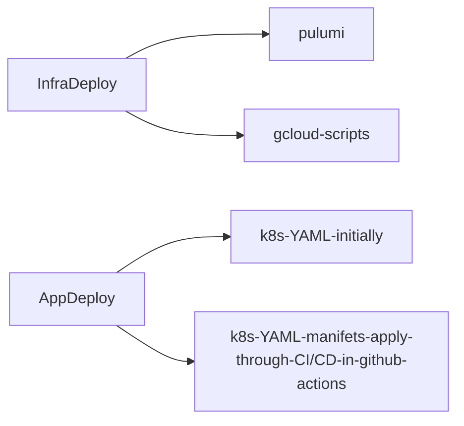
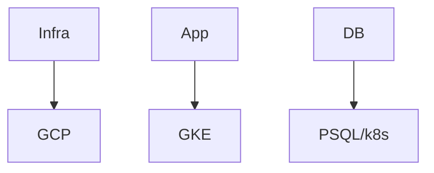
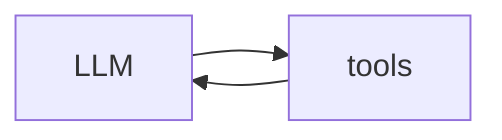
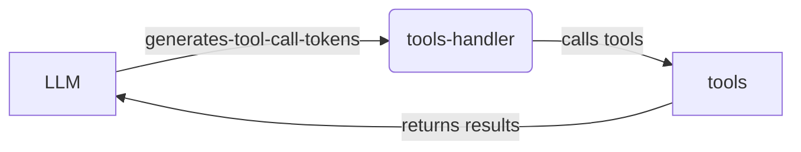

# INFRA Iteration 01

In this doc we will create the first version of what we will actually deploy and what tools we willm use basis the learninsg till now from doc 00 to doc 12.

We will keepn iot mionila so we have something up and runing by the end if the day but still ensure we are using the tooling which is extendible and we will still use in the second iteratiion of this infra but in a more cleaner and better way.

## INFRA ARCH 01

## tool selection

## basic agent

## internal of tool calls

## few questions basis the reading for the next iteration

- are the serverless instances like cloud run and cloud function and aws lambda evenbtually built on top of k8s?
- currently there is a huge demand for AI agent sandboxes like e2b -> is it built on topn of a k8s cluster a swell ? what is the use of these sandboxes ? why can't I run my agent with bash tool, network and fs access on a Pod in k8s? and than destroy this POD once the job is done? what is the benefit does e2b bring?
- also wjen a cluster is created eventually we are provising sone machines which is actual hardware -> and then usin hypervisopr VMs are provisoned ? and than -> on these virtual VMs are called nodes in K8s? and than -> on top of these Nodes/VMs we are running Pods ? and inside the Pods we are running the containers which are docker images -> and technically I can run all my 3 images FE, BE and PSQL insoide rthe same Pod ? right ?
- also why is th rneed for a seprate Cloud Loader balancer as it looks expeonsieve? can the K8s Ingress not handle it ? also whewre isb the k8s ingress deployed eventually? on aparticuklar Node and inside a Pod?
- can I look inside the etcd database and see what is going on?
- think of the cheapest setup to depoy on k8s as in GCP as this is purely from learing perspective but as clise to real - what is the lowest CPU and Mem count we can use ?
- also if we use pulumi to create the clustyer we we care learing and destroy in the night - will our overall cost be lower ?
- also looks like pulumi gives both the go and YAML options to create infra ? can we ue go that way we can learn go as well - also lets have some scripts for using gcloud to create and destroy clusters as well
-
