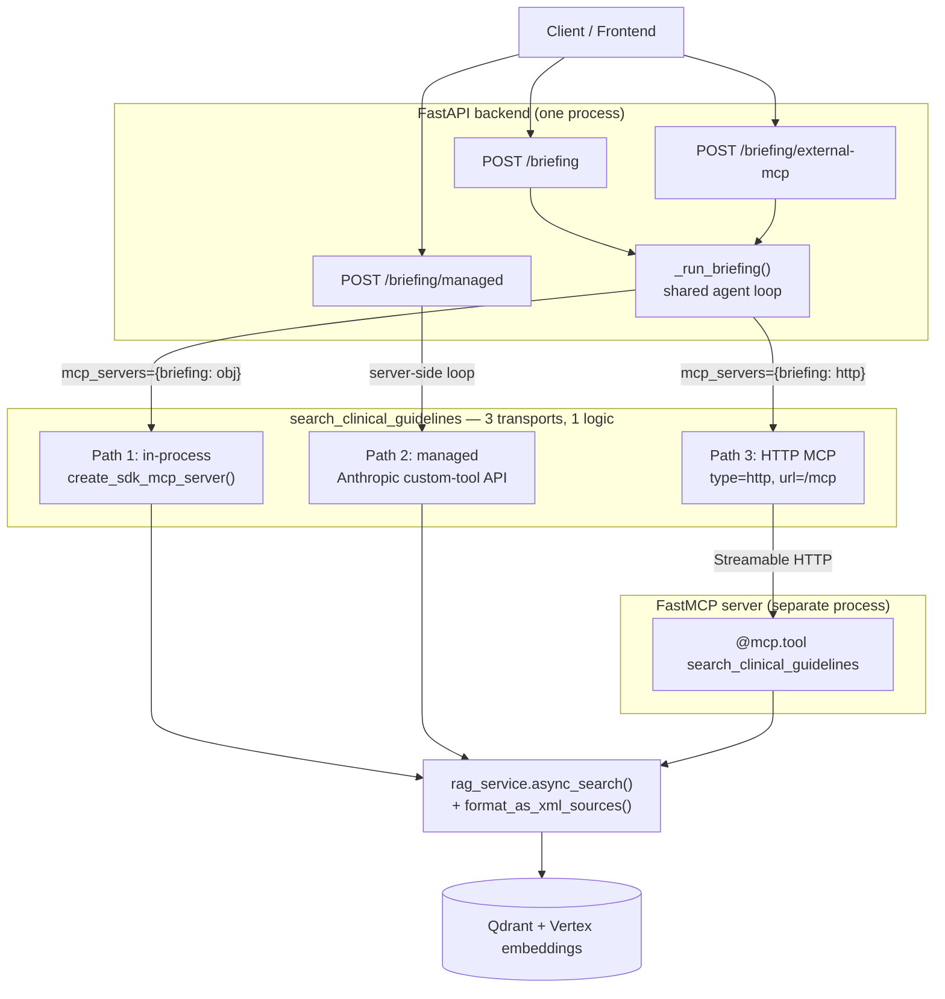
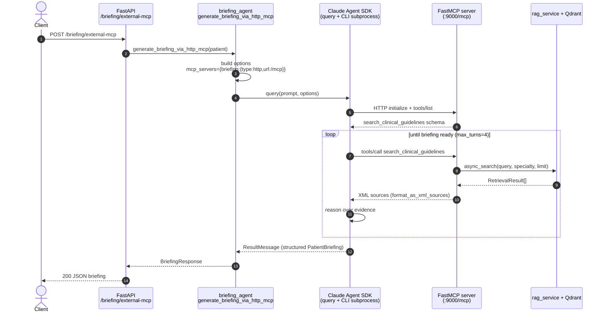

# Briefing Agent — Tool Paths & the HTTP MCP Server

The briefing agent reaches its one tool, `search_clinical_guidelines`, through **three
interchangeable transports**. The tool *logic* is identical in every case — only the wiring
differs. This doc explains the design and traces the HTTP MCP path (Path 3) end to end.

| Path | Mechanism | Code | Transport |
|------|-----------|------|-----------|
| 1. In-process | `create_sdk_mcp_server()` | `src/agents/briefing_agent.py` | none (in-memory) |
| 2. Managed | Anthropic Managed Agents custom tool | `src/services/managed_briefing_service.py` | server-side (Anthropic) |
| 3. **HTTP MCP** | **FastMCP over Streamable HTTP** | `mcp_server/server.py` + `briefing_agent.py` | **HTTP** |

All three ultimately call `rag_service.async_search()` + `format_as_xml_sources()`
(Qdrant + Vertex embeddings).

## Why Streamable HTTP (not SSE)

SSE is deprecated in both FastMCP and the MCP spec (server→client streaming only). Streamable
HTTP is bidirectional, multi-client, and matches the Claude Agent SDK's `McpHttpServerConfig`
(`{"type": "http", "url": ...}`) natively.

---

## Architecture — three transports, one logic



---

## Request flow — the HTTP MCP path (Path 3)

The agent and the FastMCP server are **separate processes** that meet over HTTP. The agent never
imports the server; the only coupling is a config dict (`{"type": "http", "url": .../mcp}`).



---

## The naming link

`allowed_tools` encodes both ends of the wiring:

```
mcp__briefing__search_clinical_guidelines
     ───┬───   ──────────┬──────────────
        │                └─ tool name (the @mcp.tool function)
        └─ the key in the mcp_servers dict ("briefing")
```

The server's *internal* name (`"clinical-guidelines"`) is irrelevant to the agent — what matters
is the **dict key** in `mcp_servers`. Because both the in-process and HTTP paths use the key
`"briefing"`, the same `allowed_tools` string and system prompt work unchanged for both.

## Key files

| File | Role |
|------|------|
| `backend/mcp_server/server.py` | Standalone FastMCP server (`@mcp.tool`, `mcp.run(transport="http")`) |
| `backend/src/agents/briefing_agent.py` | `_http_mcp_servers()`, `generate_briefing_via_http_mcp()`, shared `_run_briefing()` |
| `backend/src/routers/briefings.py` | `POST /briefing/external-mcp` endpoint |
| `backend/src/config.py` | `external_mcp_url`, `mcp_server_host/port`, `external_mcp_auth_token` |
| `backend/src/services/rag_service.py` | `async_search()` + `format_as_xml_sources()` (shared by all paths) |

## Run & test

See `backend/mcp_server/README.md` for the full run/test instructions (standalone server,
`fastmcp list`/`call`, the MCP Inspector UI, and the in-memory pytest).

```bash
# 1. start the server
cd backend && uv run python -m mcp_server.server

# 2. (separate terminal) start the API
cd backend && env -u CLAUDECODE -u CLAUDE_CODE_ENTRYPOINT -u CLAUDE_CODE_SESSION_ID \
    uv run uvicorn src.main:app --reload

# 3. trigger the HTTP MCP path
curl -s -X POST http://localhost:8000/api/v1/patients/1/briefing/external-mcp | jq
```
