# Mermaid Diagramming Cheatsheet

> Quick reference for creating diagrams in the infra-arch doc series.
> Every example is infra/deployment-themed — copy, adapt, use.

### Renderer Compatibility

Not all diagram types work everywhere. Know your tier before choosing:

| Tier | Renders on | Diagram types |
|------|-----------|---------------|
| **Universal** | GitHub, VS Code, all renderers | `graph`, `sequenceDiagram`, `erDiagram`, `gantt`, `pie`, `stateDiagram-v2`, `gitGraph` |
| **Wide** | GitHub, VS Code, most renderers | `mindmap`, `timeline`, `quadrantChart`, `journey`, `C4Context`, `C4Container` |
| **Beta / Limited** | Mermaid Live Editor only | `architecture-beta`, `zenuml`, `block-beta`, `sankey-beta`, `xychart-beta`, `packet-beta`, `kanban` |

When writing docs for GitHub, stick to Universal or Wide tier. For beta diagrams, always provide a universal fallback.

---

## Quick Start

Before writing any diagram, know these 5 rules. They cover 90% of Mermaid syntax errors.

### Rule 1: Space after diagram type

```
graph LR       ✅ correct
graphLR        ❌ breaks — no space
```

### Rule 2: Comments use `%%`, not `#`

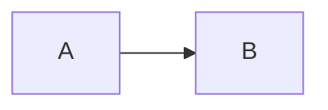
```mermaid
graph LR
  %% This is a valid Mermaid comment
  A --> B
```

`#` is NOT a comment character — it will cause parse errors.

### Rule 3: Quote node labels with special characters

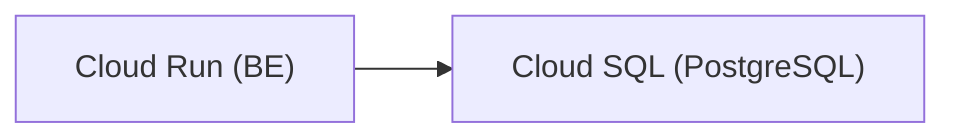
```mermaid
graph LR
  A["Cloud Run (BE)"] --> B["Cloud SQL (PostgreSQL)"]
```

Without quotes, parentheses, brackets, and slashes break the parser:

```
A[Cloud Run (BE)]    ❌ parens interpreted as shape syntax
A["Cloud Run (BE)"]  ✅ quotes protect special chars
```

Characters that require quoting: `( ) [ ] { } / \ | # & ; : < >`

### Rule 4: Arrow types

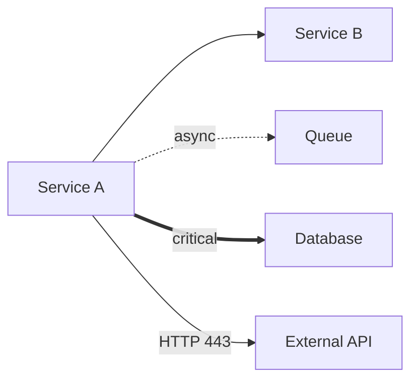
```mermaid
graph LR
  A["Service A"] --> B["Service B"]
  A -. "async" .-> C["Queue"]
  A == "critical" ==> D["Database"]
  A -- "HTTP 443" --> E["External API"]
```

| Arrow | Meaning |
|-------|---------|
| `-->` | Solid line (default flow) |
| `-.->` | Dotted line (async / optional) |
| `==>` | Thick line (critical path) |
| `-- text -->` | Labeled solid line |
| `-. text .->` | Labeled dotted line |
| `== text ==>` | Labeled thick line |

### Rule 5: Subgraphs for grouping

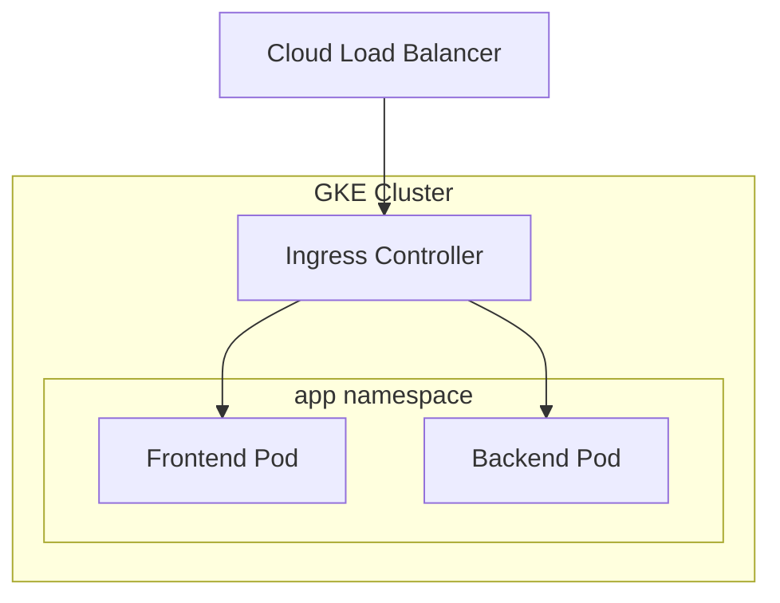
```mermaid
graph TB
  subgraph GKE["GKE Cluster"]
    subgraph ns["app namespace"]
      FE["Frontend Pod"]
      BE["Backend Pod"]
    end
    ING["Ingress Controller"]
  end

  LB["Cloud Load Balancer"] --> ING
  ING --> FE
  ING --> BE
```

Key rules:

- `subgraph id["Display Label"]` — id has no spaces, label can
- `end` closes each subgraph (not `endsubgraph`)
- Subgraphs can nest
- Connections can cross subgraph boundaries

---

## 1. Flowchart / Graph

**When to use:** Architecture layouts, data flows, request routing, deployment pipelines.

### Direction options

| Declaration | Direction |
|------------|-----------|
| `graph TB` or `graph TD` | Top to bottom |
| `graph BT` | Bottom to top |
| `graph LR` | Left to right |
| `graph RL` | Right to left |

### Node shapes

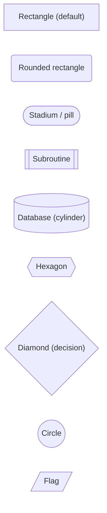
```mermaid
graph LR
  A["Rectangle (default)"]
  B("Rounded rectangle")
  C(["Stadium / pill"])
  D[["Subroutine"]]
  E[("Database (cylinder)")]
  F{{"Hexagon"}}
  G{"Diamond (decision)"}
  I(("Circle"))
  J[/"Flag"/]
```

### Full example: AI Doctor request flow

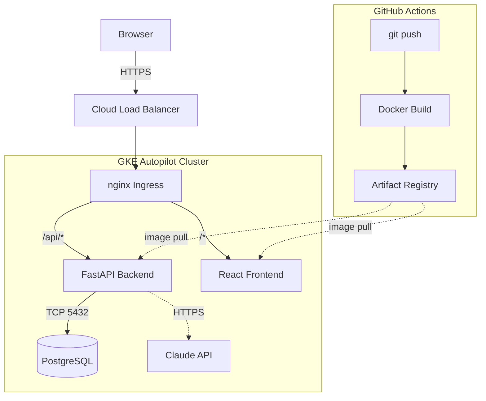
```mermaid
graph TB
  Client["Browser"] -->|"HTTPS"| LB["Cloud Load Balancer"]

  LB --> ING["nginx Ingress"]

  subgraph GKE["GKE Autopilot Cluster"]
    ING -->|"/api/*"| BE["FastAPI Backend"]
    ING -->|"/*"| FE["React Frontend"]
    BE -->|"TCP 5432"| DB[("PostgreSQL")]
    BE -. "HTTPS" .-> Claude["Claude API"]
  end

  subgraph CI["GitHub Actions"]
    Push["git push"] --> Build["Docker Build"]
    Build --> AR["Artifact Registry"]
    AR -. "image pull" .-> BE
    AR -. "image pull" .-> FE
  end
```

### Key syntax rules

- First word after `graph` is direction — `TB`, `LR`, etc.
- Node IDs are alphanumeric (no spaces, no dots): `myNode`, `node1`
- Pipe syntax for edge labels: `A -->|"label"| B` — alternative to `A -- "label" --> B`
- Semicolons optional at line ends

---

## 2. Sequence Diagram

**When to use:** HTTP request lifecycle, service-to-service calls, authentication flows.

### Basic syntax

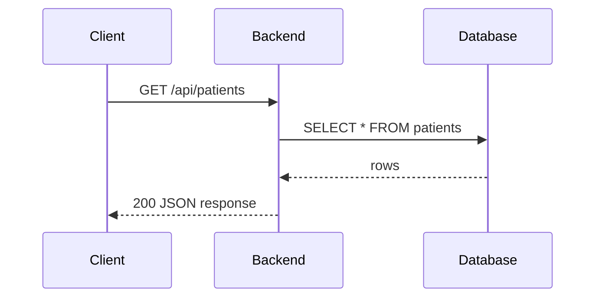
```mermaid
sequenceDiagram
  participant C as Client
  participant BE as Backend
  participant DB as Database

  C->>BE: GET /api/patients
  BE->>DB: SELECT * FROM patients
  DB-->>BE: rows
  BE-->>C: 200 JSON response
```

### Arrow types

| Arrow | Meaning |
|-------|---------|
| `->>` | Solid with arrowhead (request) |
| `-->>` | Dashed with arrowhead (response) |
| `-x` | Solid with cross (failure) |
| `--x` | Dashed with cross (async failure) |
| `-)` | Solid with open arrow (async) |
| `--)` | Dashed with open arrow (async response) |

### Full example: AI briefing generation

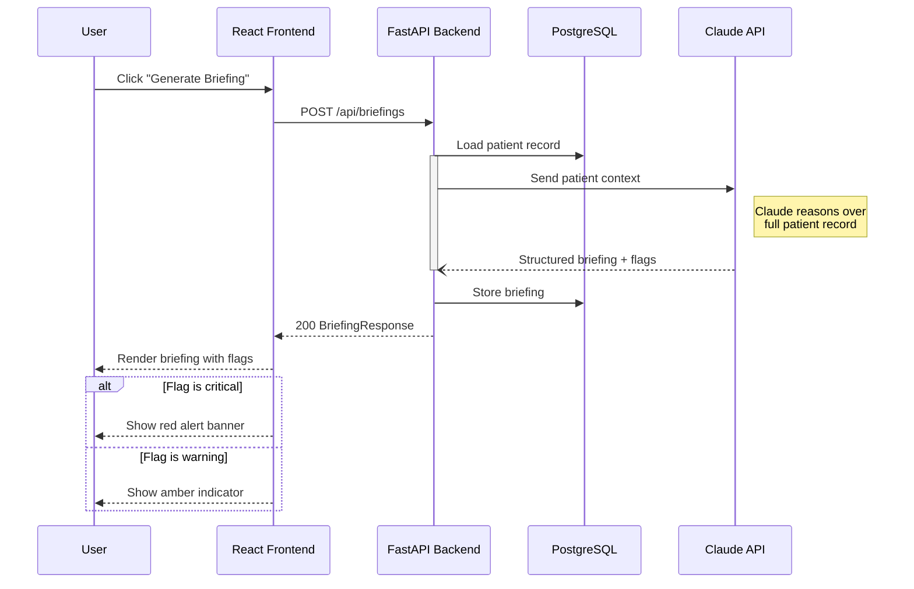
```mermaid
sequenceDiagram
  participant U as User
  participant FE as React Frontend
  participant BE as FastAPI Backend
  participant DB as PostgreSQL
  participant AI as Claude API

  U->>FE: Click "Generate Briefing"
  FE->>BE: POST /api/briefings
  BE->>DB: Load patient record

  activate BE
  BE->>AI: Send patient context
  Note right of AI: Claude reasons over<br/>full patient record
  AI--)BE: Structured briefing + flags
  deactivate BE

  BE->>DB: Store briefing
  BE-->>FE: 200 BriefingResponse
  FE-->>U: Render briefing with flags

  alt Flag is critical
    FE-->>U: Show red alert banner
  else Flag is warning
    FE-->>U: Show amber indicator
  end
```

### Key syntax rules

- `participant` declares actors — order of declaration = order on diagram
- `activate` / `deactivate` for lifeline bars (or use `+` / `-` suffix on arrows)
- `Note right of X:` / `Note left of X:` / `Note over X,Y:` for annotations
- `alt` / `else` / `end` for conditional blocks
- `loop` / `end` for loops
- `par` / `and` / `end` for parallel operations
- Line breaks in notes: `<br/>`

---

## 3. Architecture Diagram (beta)

**When to use:** Cloud infrastructure layouts with service icons. Note: this is a newer Mermaid feature — only works in Mermaid Live Editor and renderers on Mermaid v11+. GitHub does **not** support this yet.

### Basic syntax

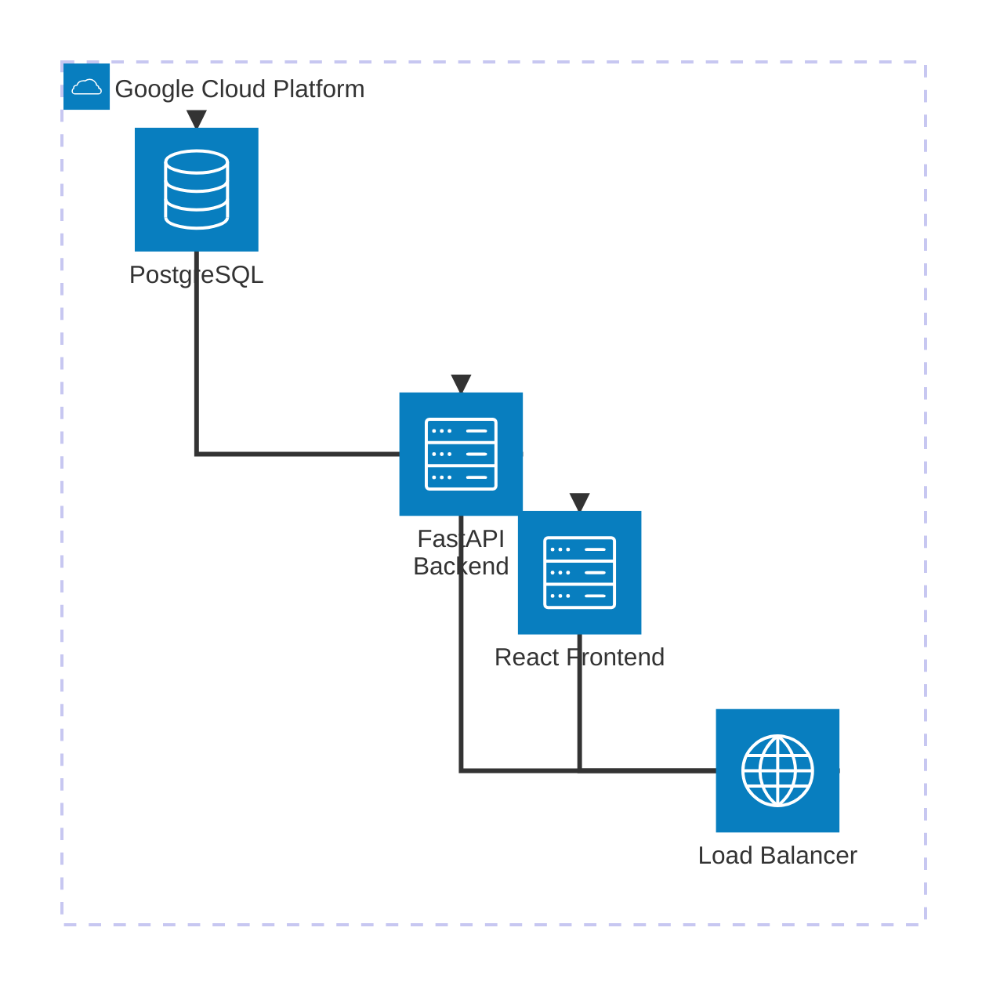
```mermaid
architecture-beta
  group gcp(cloud)[Google Cloud Platform]

  service lb(internet)[Load Balancer] in gcp
  service fe(server)[React Frontend] in gcp
  service be(server)[FastAPI Backend] in gcp
  service db(database)[PostgreSQL] in gcp

  lb:R --> T:fe
  lb:R --> T:be
  be:R --> T:db
```

### Key syntax rules

- `group id(icon)[Label]` creates a boundary — icon is **required** (e.g., `cloud`, `server`)
- `service id(icon)[Label]` declares a component — icon is **required** (e.g., `server`, `database`, `disk`, `internet`)
- Avoid parentheses inside `[Label]` — they conflict with the `(icon)` syntax
- `in` places a service inside a group
- Edge ports: `L` (left), `R` (right), `T` (top), `B` (bottom)
- Format: `source:PORT --> PORT:target` or `source:PORT -- PORT:target` (undirected)
- **Renderer support:** Mermaid Live Editor only — GitHub/VS Code may not render this

---

## 4. Block Diagram

**When to use:** Infrastructure layouts, block-level system architecture.

### Full example: VPS deployment layout

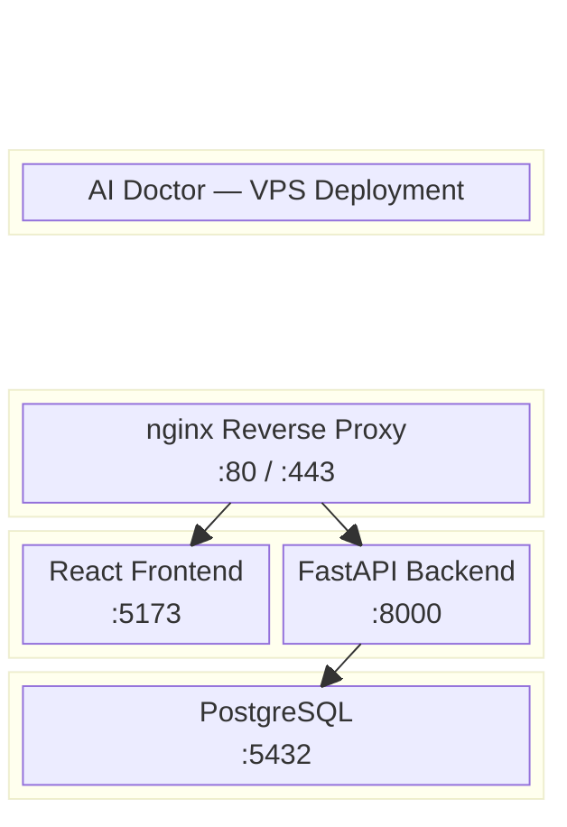
```mermaid
block-beta
  columns 3

  space:3
  block:header:3
    title["AI Doctor — VPS Deployment"]
  end

  space:3

  block:nginx:3
    A["nginx Reverse Proxy<br/>:80 / :443"]
  end

  block:apps:3
    columns 2
    B["React Frontend<br/>:5173"]
    C["FastAPI Backend<br/>:8000"]
  end

  block:data:3
    D["PostgreSQL<br/>:5432"]
  end

  A --> B
  A --> C
  C --> D
```

### Key syntax rules

- `columns N` sets the grid width
- `space` creates empty cells; `space:N` spans N columns
- `block:id:N` creates a named block spanning N columns
- Nested `columns` allowed inside blocks

---

## 5. C4 Diagram

**When to use:** System context views, container diagrams, high-level architecture for stakeholders.

### System Context example

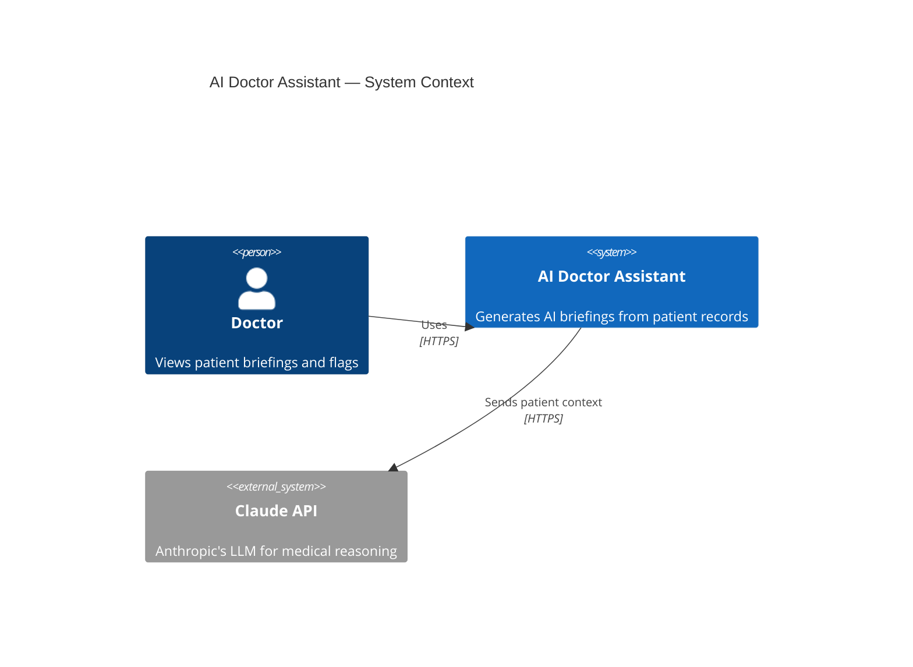
```mermaid
C4Context
  title AI Doctor Assistant — System Context

  Person(doctor, "Doctor", "Views patient briefings and flags")
  System(aidoctor, "AI Doctor Assistant", "Generates AI briefings from patient records")
  System_Ext(claude, "Claude API", "Anthropic's LLM for medical reasoning")

  Rel(doctor, aidoctor, "Uses", "HTTPS")
  Rel(aidoctor, claude, "Sends patient context", "HTTPS")
```

### Container example

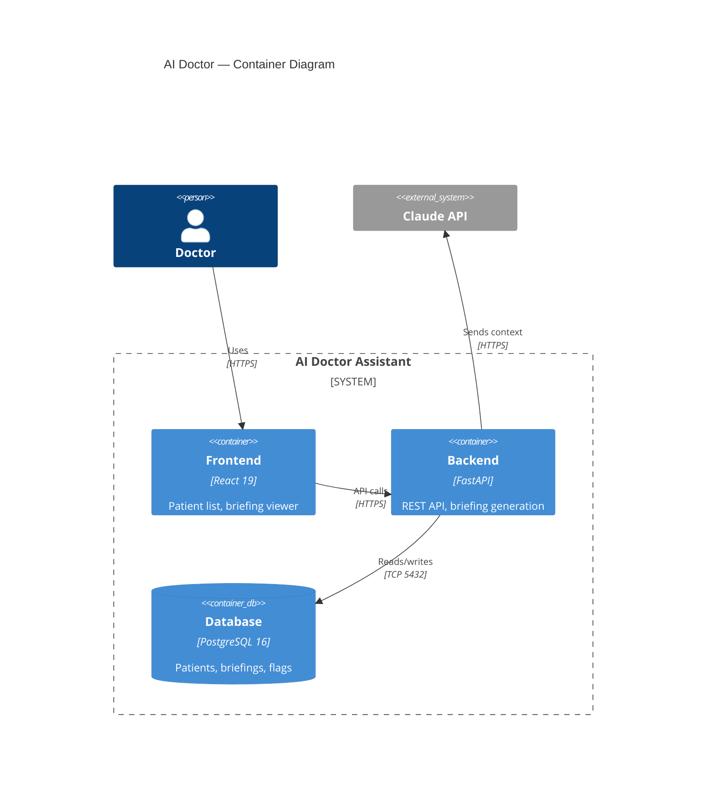
```mermaid
C4Container
  title AI Doctor — Container Diagram

  Person(doctor, "Doctor")

  System_Boundary(app, "AI Doctor Assistant") {
    Container(fe, "Frontend", "React 19", "Patient list, briefing viewer")
    Container(be, "Backend", "FastAPI", "REST API, briefing generation")
    ContainerDb(db, "Database", "PostgreSQL 16", "Patients, briefings, flags")
  }

  System_Ext(claude, "Claude API")

  Rel(doctor, fe, "Uses", "HTTPS")
  Rel(fe, be, "API calls", "HTTPS")
  Rel(be, db, "Reads/writes", "TCP 5432")
  Rel(be, claude, "Sends context", "HTTPS")
```

### Key syntax rules

- `Person()`, `System()`, `System_Ext()` — external systems
- `System_Boundary()` with curly braces groups containers
- `Container()`, `ContainerDb()`, `ContainerQueue()`
- `Rel(from, to, label, technology)`
- C4 diagrams support `C4Context`, `C4Container`, `C4Component`, `C4Deployment`

---

## 6. State Diagram

**When to use:** Deployment states, CI/CD pipeline stages, pod lifecycle.

### Full example: CI/CD pipeline states

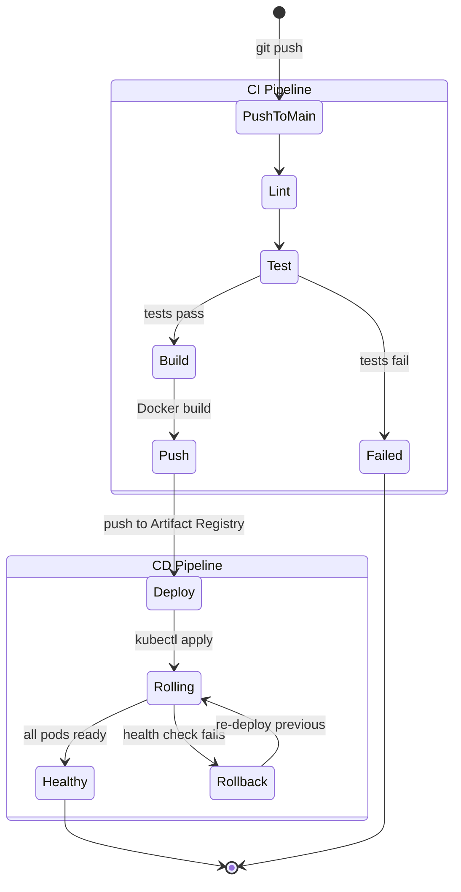
```mermaid
stateDiagram-v2
  [*] --> PushToMain: git push

  state "CI Pipeline" as CI {
    PushToMain --> Lint
    Lint --> Test
    Test --> Build: tests pass
    Test --> Failed: tests fail
    Build --> Push: Docker build
    Push --> Deploy: push to Artifact Registry
  }

  state "CD Pipeline" as CD {
    Deploy --> Rolling: kubectl apply
    Rolling --> Healthy: all pods ready
    Rolling --> Rollback: health check fails
    Rollback --> Rolling: re-deploy previous
  }

  Healthy --> [*]
  Failed --> [*]
```

### Key syntax rules

- `[*]` is the start/end pseudo-state
- `state "Label" as id` for named states
- Nested states with curly braces
- Transitions: `StateA --> StateB: label`
- `stateDiagram-v2` (not `stateDiagram`) for the modern syntax

---

## 7. Entity Relationship Diagram

**When to use:** Database schemas, data model documentation.

### Full example: AI Doctor data model

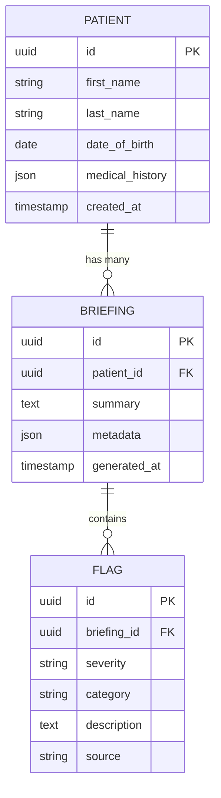
```mermaid
erDiagram
  PATIENT ||--o{ BRIEFING : "has many"
  BRIEFING ||--o{ FLAG : "contains"

  PATIENT {
    uuid id PK
    string first_name
    string last_name
    date date_of_birth
    json medical_history
    timestamp created_at
  }

  BRIEFING {
    uuid id PK
    uuid patient_id FK
    text summary
    json metadata
    timestamp generated_at
  }

  FLAG {
    uuid id PK
    uuid briefing_id FK
    string severity
    string category
    text description
    string source
  }
```

### Relationship syntax

| Symbol | Meaning |
|--------|---------|
| `\|\|` | Exactly one |
| `o\|` | Zero or one |
| `}o` | Zero or many |
| `}\|` | One or many |

Reading: `PATIENT ||--o{ BRIEFING` = "one patient has zero or many briefings"

---

## 8. Gitgraph

**When to use:** Branch strategy, release workflows, monorepo branching.

### Full example: AI Doctor branching strategy

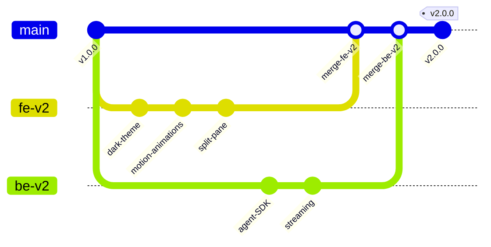
```mermaid
gitGraph
  commit id: "v1.0.0"
  branch fe-v2
  checkout fe-v2
  commit id: "dark-theme"
  commit id: "motion-animations"
  commit id: "split-pane"

  checkout main
  branch be-v2
  checkout be-v2
  commit id: "agent-SDK"
  commit id: "streaming"

  checkout main
  merge fe-v2 id: "merge-fe-v2"
  merge be-v2 id: "merge-be-v2"
  commit id: "v2.0.0" tag: "v2.0.0"
```

### Key syntax rules

- `gitGraph` — capital G required (not `gitgraph`)
- `commit id: "label"` — named commits (avoid spaces in IDs — use hyphens)
- `commit tag: "v1.0"` — tagged commits
- `branch name` — branch names must be simple alphanumeric or hyphenated (no `/` — causes parse errors in most renderers)
- `checkout` — switch to branch
- `merge branchName` — merge into current branch
- `cherry-pick id: "commit-id"` — cherry-pick a commit

---

## 9. Gantt Chart

**When to use:** Deployment timelines, migration schedules, sprint planning.

### Full example: Infrastructure migration timeline

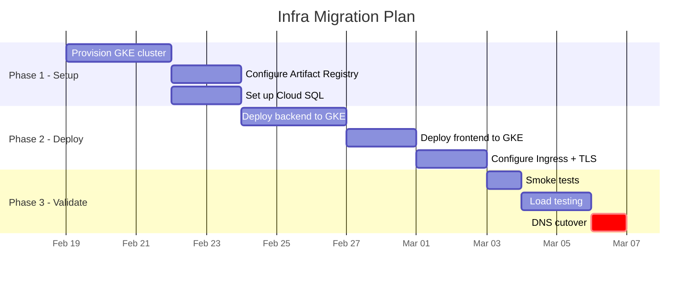
```mermaid
gantt
  title Infra Migration Plan
  dateFormat YYYY-MM-DD
  axisFormat %b %d

  section Phase 1 - Setup
    Provision GKE cluster     :p1a, 2026-02-19, 3d
    Configure Artifact Registry :p1b, after p1a, 2d
    Set up Cloud SQL           :p1c, after p1a, 2d

  section Phase 2 - Deploy
    Deploy backend to GKE      :p2a, after p1b, 3d
    Deploy frontend to GKE     :p2b, after p2a, 2d
    Configure Ingress + TLS    :p2c, after p2b, 2d

  section Phase 3 - Validate
    Smoke tests                :p3a, after p2c, 1d
    Load testing               :p3b, after p3a, 2d
    DNS cutover                :crit, p3c, after p3b, 1d
```

### Key syntax rules

- `dateFormat` — how dates are parsed (input format)
- `axisFormat` — how dates display on the axis
- Task format: `TaskName :id, startDate, duration` or `TaskName :id, after otherId, duration`
- `crit` flag marks critical path items (shows in red)
- `done` / `active` flags for progress tracking

---

## 10. Pie Chart

**When to use:** Cost breakdowns, resource allocation, traffic distribution.

### Full example: Monthly cloud cost breakdown

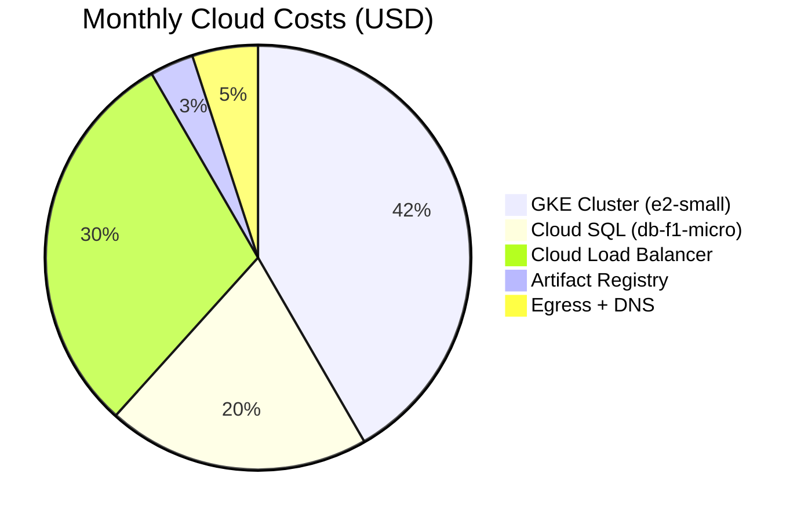
```mermaid
pie title Monthly Cloud Costs (USD)
  "GKE Cluster (e2-small)" : 25
  "Cloud SQL (db-f1-micro)" : 12
  "Cloud Load Balancer" : 18
  "Artifact Registry" : 2
  "Egress + DNS" : 3
```

### Key syntax rules

- `pie title "Title"` — title is optional
- `"Label" : value` — each slice
- Values are proportional — Mermaid calculates percentages
- `pie showData` — shows values on the chart

---

## 11. Quadrant Chart

**When to use:** Decision matrices, comparing deployment options, technology evaluation.

### Full example: Deployment target comparison

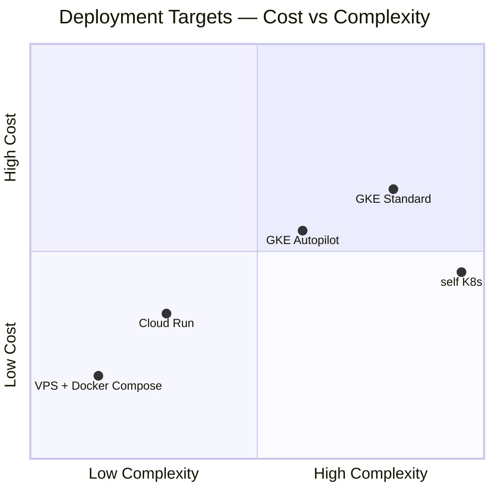
```mermaid
quadrantChart
  title Deployment Targets — Cost vs Complexity
  x-axis "Low Complexity" --> "High Complexity"
  y-axis "Low Cost" --> "High Cost"

  "VPS + Docker Compose": [0.15, 0.2]
  "Cloud Run": [0.3, 0.35]
  "GKE Autopilot": [0.6, 0.55]
  "GKE Standard": [0.8, 0.65]
  "self K8s": [0.95, 0.45]
```

### Key syntax rules

- Axis labels: `x-axis "Low" --> "High"`
- Data points: `"Label": [x, y]` where x and y are 0.0 to 1.0
- Quadrant labels can be set with `quadrant-1`, `quadrant-2`, etc.

---

## 12. Mindmap

**When to use:** Concept mapping, brainstorming infrastructure decisions, topic overviews.

### Full example: Kubernetes security layers

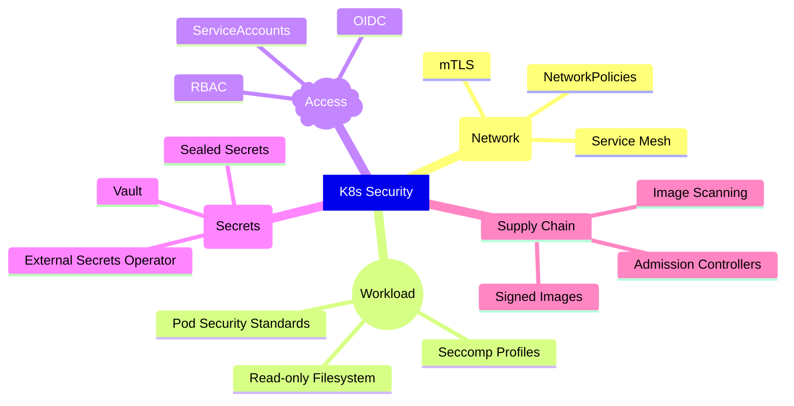
```mermaid
mindmap
  root["K8s Security"]
    (Network)
      NetworkPolicies
      Service Mesh
      mTLS
    ((Workload))
      Pod Security Standards
      Seccomp Profiles
      Read-only Filesystem
    )Access(
      RBAC
      ServiceAccounts
      OIDC
    (Secrets)
      External Secrets Operator
      Sealed Secrets
      Vault
    Supply Chain
      Image Scanning
      Signed Images
      Admission Controllers
```

### Key syntax rules

- Indentation-based nesting (like YAML)
- `root["Label"]` is the center node
- Each deeper indent level is a child
- No arrows — pure hierarchy
- Node shapes: `["rect"]`, `("rounded")`, `(("circle"))`, `)"cloud"(`

---

## 13. Timeline

**When to use:** Version history, infrastructure evolution, project milestones.

### Full example: AI Doctor project timeline

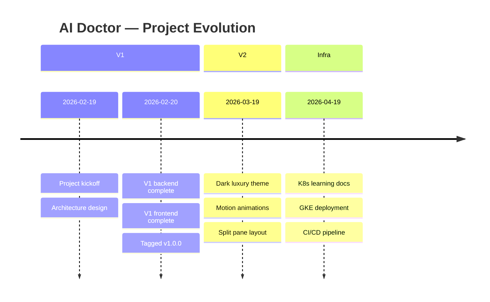
```mermaid
timeline
  title AI Doctor — Project Evolution
  section V1
    2026-02-19 : Project kickoff
             : Architecture design
    2026-02-20 : V1 backend complete
             : V1 frontend complete
             : Tagged v1.0.0
  section V2
    2026-03-19 : Dark luxury theme
             : Motion animations
             : Split pane layout
  section Infra
    2026-04-19 : K8s learning docs
             : GKE deployment
             : CI/CD pipeline
```

### Key syntax rules

- `section` groups events
- Date/label on left, events on right separated by `:`
- Multiple events per date — each on a new line starting with `:`

---

## 14. ZenUML (Mermaid Live Editor only)

**When to use:** Code-like alternative to `sequenceDiagram` — uses `{}` blocks, `if/else`, method call syntax. Only renders in [Mermaid Live Editor](https://mermaid.live).

Since ZenUML doesn't render on GitHub or VS Code, here's the equivalent auth flow as a standard sequence diagram:

```mermaid
sequenceDiagram
  actor Doctor
  participant FE as Frontend
  participant BE as Backend
  participant DB as PostgreSQL

  Doctor->>FE: login(email, password)
  FE->>BE: POST /auth/login
  BE->>DB: findUser(email)
  DB-->>BE: user

  alt valid credentials
    BE-->>FE: 200 {token: jwt}
  else invalid credentials
    BE-->>FE: 401 Unauthorized
  end

  FE-->>Doctor: Login result
```

### ZenUML syntax reference (for Mermaid Live Editor)

- `@Actor`, `@Boundary`, `@Control`, `@Database` — stereotypes
- `Caller -> Receiver.method(args)` — method call syntax
- `if/else`, `while`, `try/catch` — control flow with `{}` blocks
- `return value` — response arrows

---

## 15. XY Chart

**When to use:** Performance benchmarks, response time charts, cost over time.

### Full example: API response times

```mermaid
xychart-beta
  title "Briefing Generation — P95 Latency (ms)"
  x-axis ["Jan", "Feb", "Mar", "Apr", "May", "Jun"]
  y-axis "Latency (ms)" 0 --> 5000
  bar [3200, 2800, 2100, 1800, 1500, 1200]
  line [3200, 2800, 2100, 1800, 1500, 1200]
```

### Key syntax rules

- `x-axis ["label1", "label2"]` — categorical x axis
- `y-axis "title" min --> max` — numeric y axis with range
- `bar [...]` and `line [...]` — data series
- Currently in beta (`xychart-beta`)

---

## 16. Sankey Diagram

**When to use:** Cost flow visualization, traffic distribution, resource allocation.

### Full example: Request traffic flow

```mermaid
sankey-beta
  Load Balancer,Frontend,6000
  Load Balancer,API Backend,4000
  API Backend,PostgreSQL,3500
  API Backend,Claude API,500
  API Backend,Cache Hit,1500
```

### Key syntax rules

- CSV-like format: `source,target,value`
- No quotes needed for simple labels
- Values determine flow width
- Currently in beta (`sankey-beta`)

---

## 17. User Journey

**When to use:** UX flow mapping, deployment experience, developer onboarding.

### Full example: Doctor using AI briefing

```mermaid
journey
  title Doctor Generates a Briefing
  section Login
    Open app: 5: Doctor
    Enter credentials: 3: Doctor
    Dashboard loads: 4: Doctor
  section Patient Review
    Select patient: 5: Doctor
    View history: 4: Doctor
  section AI Briefing
    Click Generate: 5: Doctor, Admin
    Wait for AI: 2: Doctor, Admin
    Read briefing: 5: Doctor, Admin
    Review flags: 5: Doctor, Admin
```

### Key syntax rules

- `TaskName: score: actors` — score is 1-5 (satisfaction)
- `section` groups related tasks
- Lower scores show as "pain points" (red)
- Multiple actors can be comma-separated

---

## 18. Kanban

**When to use:** Board views, task tracking, deployment status.

### Full example: Infra migration board

```mermaid
kanban
  column1["Backlog"]
    task1["Set up monitoring"]
    task2["Configure alerts"]
    task3["Write runbooks"]

  column2["In Progress"]
    task4["Deploy backend to GKE"]
    task5["Configure TLS certs"]

  column3["Review"]
    task6["Load test results"]

  column4["Done"]
    task7["Provision cluster"]
    task8["Set up Artifact Registry"]
    task9["Create Cloud SQL instance"]
```

### Key syntax rules

- `columnId["Label"]` declares a column
- `taskId["Label"]` declares a task card inside the column
- Indentation under column = task belongs to that column

---

## 19. Packet Diagram

**When to use:** Network packet structure, protocol headers, binary formats.

### Full example: HTTP/2 frame header

```mermaid
packet-beta
  0-23: "Length (24 bits)"
  24-31: "Type (8 bits)"
  32-39: "Flags (8 bits)"
  40-40: "R"
  41-71: "Stream Identifier (31 bits)"
  72-103: "Frame Payload ..."
```

### Key syntax rules

- `start-end: "label"` — bit range with label
- Bit ranges are 0-indexed
- Currently in beta (`packet-beta`)

---

## Appendix: Theming & Styling

### Inline styling on nodes

```mermaid
graph LR
  A["Healthy"] --> B["Degraded"] --> C["Down"]

  style A fill:#22c55e,color:#fff
  style B fill:#f59e0b,color:#000
  style C fill:#ef4444,color:#fff
```

### CSS classes

```mermaid
graph LR
  classDef healthy fill:#22c55e,color:#fff
  classDef warning fill:#f59e0b,color:#000
  classDef critical fill:#ef4444,color:#fff

  A["Pod 1"]:::healthy --> LB["Load Balancer"]
  B["Pod 2"]:::warning --> LB
  C["Pod 3"]:::critical --> LB
```

### Theme initialization (at top of mermaid block)

```mermaid
%%{init: {'theme': 'forest'}}%%
graph LR
  A["Service A"] --> B["Service B"]
```

Available themes: `default`, `dark`, `forest`, `neutral`, `base`

### Theme variable overrides

```mermaid
%%{init: {
  'theme': 'base',
  'themeVariables': {
    'primaryColor': '#1e293b',
    'primaryTextColor': '#f8fafc',
    'lineColor': '#94a3b8',
    'secondaryColor': '#334155'
  }
}}%%
graph LR
  A["Frontend"] --> B["Backend"] --> C["Database"]
```

### Key styling rules

- `style nodeId fill:#hex,stroke:#hex,color:#hex` — per-node
- `classDef name prop:val` + `nodeId:::name` — reusable classes
- `%%{init: {...}}%%` — must be the FIRST line in the mermaid block
- `linkStyle N stroke:#hex` — style the Nth edge (0-indexed)

---

## Quick Reference Card

| Diagram Type | Declaration | Best For |
|-------------|-------------|----------|
| Flowchart | `graph LR` | Architecture layouts, data flows |
| Sequence | `sequenceDiagram` | Request/response, auth flows |
| Architecture | `architecture-beta` | Cloud infra with icons (Mermaid Live only) |
| Block | `block-beta` | Infrastructure layouts |
| C4 Context | `C4Context` | System-level views |
| C4 Container | `C4Container` | Container-level views |
| State | `stateDiagram-v2` | CI/CD states, pod lifecycle |
| ER | `erDiagram` | Database schemas |
| Gitgraph | `gitGraph` | Branch strategy |
| Gantt | `gantt` | Deployment timelines |
| Pie | `pie` | Cost breakdowns |
| Quadrant | `quadrantChart` | Decision matrices |
| Mindmap | `mindmap` | Concept mapping |
| Timeline | `timeline` | Version history |
| ZenUML | `zenuml` | Code-like sequence diagrams (Mermaid Live only) |
| XY Chart | `xychart-beta` | Performance charts |
| Sankey | `sankey-beta` | Flow/cost visualization |
| User Journey | `journey` | UX flow mapping |
| Kanban | `kanban` | Task boards |
| Packet | `packet-beta` | Protocol headers |

---

## Common Mistakes

Real errors found while writing the infra-arch docs:

| Mistake | Fix |
|---------|-----|
| `graphLR` | `graph LR` (space after diagram type) |
| `gitgraph` | `gitGraph` (capital G) |
| `# comment` | `%% comment` (Mermaid uses `%%`, not `#`) |
| `A[Cloud Run (BE)]` | `A["Cloud Run (BE)"]` (quote labels with special chars) |
| `service lb["Label"]` | `service lb(icon)[Label]` (architecture-beta needs icon type) |
| Branch names with `/` | Use hyphens: `fe-v2` not `fe/v2` |
| Missing `end` after subgraph | Every `subgraph` needs a matching `end` |
| Spaces in node IDs | Use camelCase or hyphens: `myNode`, `my-node` |
| Using beta diagrams on GitHub | Stick to universal tier (see top of doc) |
